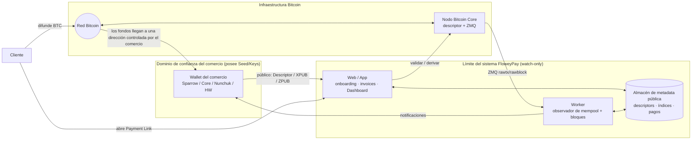

# 02 — Arquitectura de alto nivel

> Parte de la Especificación de Arquitectura Funcional (ARCH-004). Anterior: [01 — Resumen ejecutivo](./01-executive-summary.md).

---

## 2.1 Actores

| Actor | Rol |
|---|---|
| **Comercio (Merchant)** | Posee la wallet/Seed; incorpora material público; crea Payment Links; consulta el Dashboard; es dueño de su recuperación. |
| **Cliente (Customer)** | Paga un invoice enviando BTC a la dirección derivada. |
| **FloweyPay Web/App** | Onboarding, normalización y validación de descriptors, creación de invoices, derivación de direcciones, página pública de pago, Dashboard, notificaciones. |
| **FloweyPay Worker** | Observa la red Bitcoin (mempool + bloques) y dirige las transiciones de estado del pago. |
| **Nodo Bitcoin Core** | Valida descriptors, deriva direcciones, observa rangos de Descriptor, provee los feeds de mempool/bloques. |
| **Red Bitcoin** | Propaga y confirma transacciones; fuente última de verdad de los fondos. |

## 2.2 Responsabilidades

- **FloweyPay Web** — superficies de comercio/cliente; normalización del Descriptor a `wpkh([fp/84h/coin_typeh/accounth]xpub/0/*)#checksum`; verificación de Address #0; reserva atómica de índice; ciclo de vida del invoice; rate lock y expiración.
- **FloweyPay Worker** — suscripción a los feeds ZMQ de Bitcoin Core; matching de outputs entrantes contra las direcciones observadas; acumulación de montos recibidos; avance de confirmaciones; expiración de invoices vencidos; agendado de notificaciones.
- **Bitcoin Core** — autoridad del Descriptor (valida checksums, deriva direcciones, observa rangos adelantados a la asignación según ARCH-002).

> **Almacén de seguridad de asignación (ARCH-005 — diseño aprobado, implementación pendiente).** Además del almacén de metadata pública, el modelo target incorpora un **Durable High-Water Mark (HWM)** por wallet version con un **ciclo de persistencia independiente** del rollback ordinario de la DB, más un **Allocation Ledger** en la DB operativa. El HWM es lo que garantiza que un índice asignado nunca se reutilice tras una restauración. Ver [ARCH-005](./ARCH-005-index-reconciliation-recovery.md).

## 2.3 Interacciones y límites

## 2.4 Límites de confianza (Trust Boundaries)

- **Dominio de confianza del comercio** — Seed y Private Keys. FloweyPay nunca cruza este límite.
- **Límite de FloweyPay** — contiene solo datos públicos. Un compromiso total de FloweyPay **no puede** mover fondos; el peor caso es exposición de privacidad y disrupción del servicio.
- **Límite de la infraestructura Bitcoin** — el nodo es la autoridad de validación/Descriptor y la red es la autoridad de liquidación.

**Propiedad clave:** el único dato que cruza de Comercio → FloweyPay es **material de clave pública**. Nada que regrese de FloweyPay es necesario para gastar fondos.

---

**Siguiente:** [03 — Onboarding del comercio](./03-merchant-onboarding.md)
