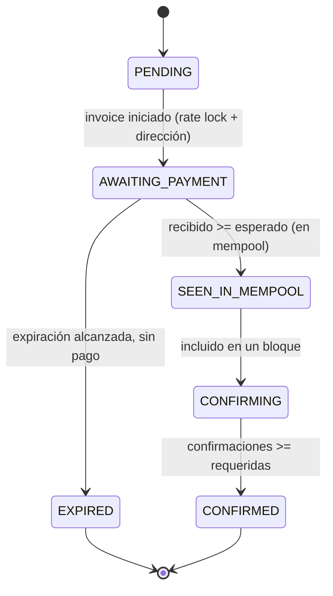

# 06 — Procesamiento Bitcoin

> Parte de la Especificación de Arquitectura Funcional (ARCH-004). Anterior: [05 — Flujo de pago del cliente](./05-customer-payment-flow.md).

---

## 6.1 Detección en mempool

Bitcoin Core transmite transacciones crudas por **ZMQ (rawtx)**. El Worker decodifica los outputs, extrae direcciones y las compara contra el conjunto de direcciones de invoice observadas.

> **Invariante de lookahead (ARCH-005 D7 — diseño aprobado).** El monitoring de Bitcoin Core debe cubrir siempre más allá del cursor de asignación seguro: `monitored_range_end ≥ safe_next_index + configurable_lookahead`. El valor de lookahead es configuración, no una constante. Una wallet version no puede alcanzar `READY` si su rango de monitoring no está validado. Ver [ARCH-005](./ARCH-005-index-reconciliation-recovery.md#d7--descriptor-monitoring--lookahead). Hoy el Worker hace matching por dirección exacta; el monitoring por rango de descriptor está pendiente.

## 6.2 Detección y acumulación del Worker

Ante una coincidencia, el Worker registra el output (txid, vout, monto, confirmaciones) y actualiza el total recibido cacheado del invoice. Cuando el monto recibido cruza el umbral esperado, el invoice sale de `AWAITING_PAYMENT`.

## 6.3 Confirmación

Bitcoin Core transmite nuevos bloques por **ZMQ (rawblock)**. El Worker incrementa las confirmaciones por transacción detectada; el conteo de confirmaciones a nivel de invoice es el **mínimo** entre sus transacciones contribuyentes. Cuando confirmaciones ≥ requeridas (por defecto 1), el invoice alcanza `CONFIRMED`.

## 6.4 Transiciones de estado del pago

Enum fuente de verdad (`payment_status`): `PENDING, AWAITING_PAYMENT, SEEN_IN_MEMPOOL, CONFIRMING, CONFIRMED, EXPIRED`. Solo `AWAITING_PAYMENT` es expirado por el Worker; los pagos ya vistos (*seen*) no se expiran.

Diagrama de secuencia: ver [13 — Diagramas de secuencia § Procesamiento del Worker](./13-sequence-diagrams.md#134-procesamiento-del-worker).

---

**Siguiente:** [07 — Dashboard del comercio](./07-merchant-dashboard.md)
