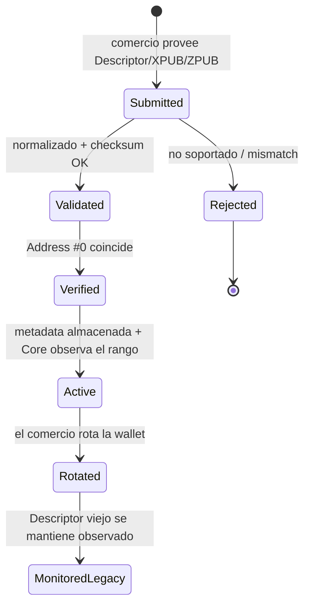
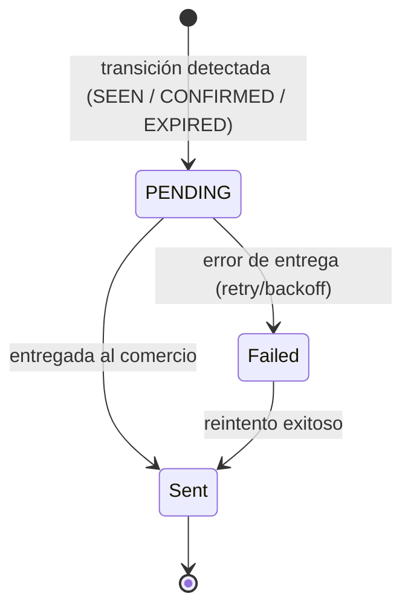
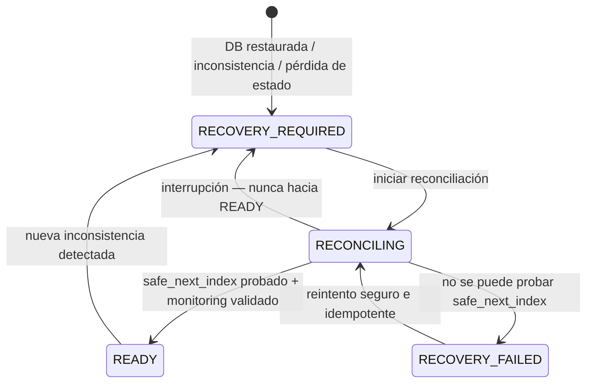

# 12 — Flujo operativo

> Parte de la Especificación de Arquitectura Funcional (ARCH-004). Anterior: [11 — Modelo de seguridad](./11-security-model.md).

---

## 12.1 Ciclo de vida de la wallet

## 12.2 Ciclo de vida del pago

Ver el diagrama de estados completo en [06 — Procesamiento Bitcoin § 6.4](./06-bitcoin-processing.md#64-transiciones-de-estado-del-pago). Estados terminales: `CONFIRMED`, `EXPIRED`. Solo `AWAITING_PAYMENT` está sujeto a expiración.

## 12.3 Ciclo de vida de notificaciones

> **ARCH-006 (diseño aprobado).** El target añade eventos de Late Payment idempotentes (`LATE_PAYMENT_DETECTED`, `LATE_PAYMENT_CONFIRMED`) por el mismo pipeline, intencionalmente mínimos ([ARCH-006 D10](./ARCH-006-late-payments-reconciliation.md#d10--late-payment-notifications)). Su implementación permanece pendiente.

## 12.4 Ciclo de vida de recuperación (Backup reconciliation — ARCH-005)

> Diseño **aprobado** en [ARCH-005](./ARCH-005-index-reconciliation-recovery.md) (D1–D10); **implementación pendiente**. Reemplaza el modelo preliminar de ARCH-002.11.

La reconciliación opera **por wallet version** mediante una **Recovery State Machine** (`READY / RECOVERY_REQUIRED / RECONCILING / RECOVERY_FAILED`). Solo una wallet version `ACTIVE` con `recovery_state == READY` puede asignar nuevos índices.

**Regla (never-reuse):** los índices de derivación son forward-only y nunca se reciclan, incluso tras un rollback de base de datos, **incluso si el índice nunca fue fondeado**.

> **La fórmula preliminar no es suficiente.** El modelo `next_index = max(DB, índice fondeado on-chain, registros de pago) + 1` **no basta por sí solo**: la blockchain y Bitcoin Core **no pueden probar** que un índice **no fondeado** fue asignado históricamente. La protección real contra la reutilización de índices asignados-pero-no-fondeados proviene del **Durable High-Water Mark (HWM)** por wallet version, no de las magnitudes on-chain. Si no puede probarse un `safe_next_index`, la asignación se **bloquea** (fail-closed). Ver [ARCH-005 § 5](./ARCH-005-index-reconciliation-recovery.md#5-modelo-de-reconciliación).

---

## Observaciones consolidadas (no bloqueantes; no son rediseños)

1. **Brecha de custodia:** el código actual asigna direcciones desde una wallet compartida de Bitcoin Core (`getnewaddress`); el modelo non-custodial por Descriptor/derivación aún no está implementado en el esquema ni en el Worker.
2. **No existen tablas de merchant-wallet / Descriptor / índice de derivación** todavía; la persistencia de metadata de ARCH-002 está pendiente.
3. **El Worker hace matching por dirección exacta**; el monitoring por rango de Descriptor / consciente del Gap de ARCH-002 está pendiente.
4. **No existe implementación de suscripción/facturación** (la sección [10](./10-business-model.md) es solo posicionamiento).
5. **ARCH-005 no está implementado:** no existen aún **Allocation Ledger**, **Durable HWM**, **Recovery State Machine** ni **motor de reconciliación**. El diseño está **aprobado**; su implementación precede a habilitar la asignación non-custodial en producción (D10). Ver [ARCH-005 § 9](./ARCH-005-index-reconciliation-recovery.md#9-brecha-de-implementación-actual-current-implementation-gap).

Estas observaciones se registran conforme a la instrucción de documentar inconsistencias como observaciones, sin rediseñar la arquitectura aprobada.

---

**Siguiente:** [13 — Diagramas de secuencia](./13-sequence-diagrams.md)
