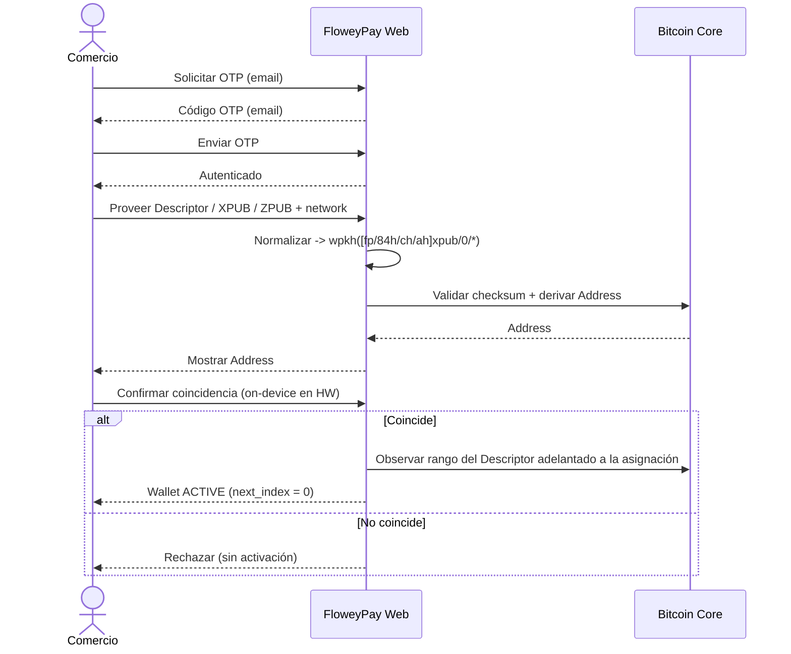
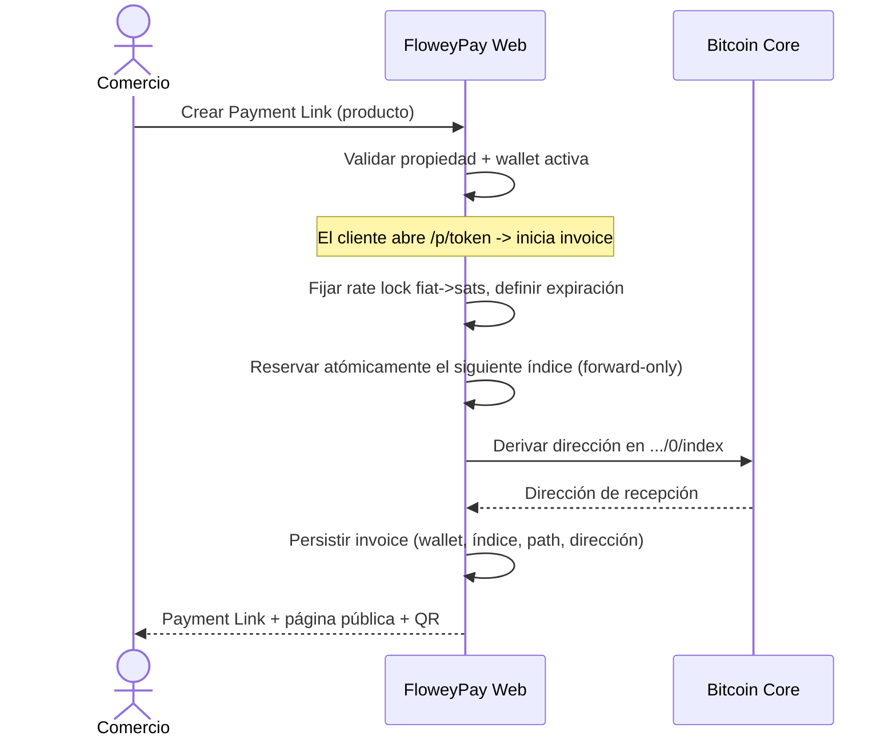
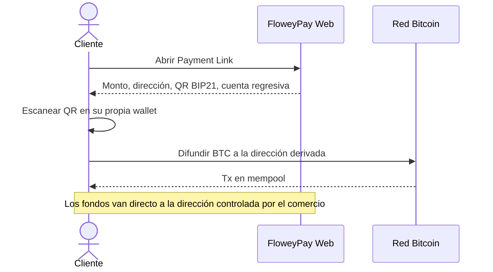
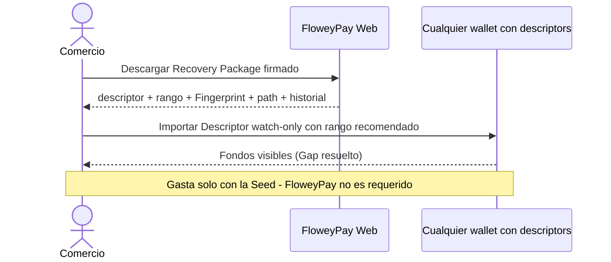

# 13 — Diagramas de secuencia

> Parte de la Especificación de Arquitectura Funcional (ARCH-004). Anterior: [12 — Flujo operativo](./12-operational-flow.md).

Este documento agrupa todos los diagramas de secuencia funcionales del sistema.

---

## 13.1 Onboarding del comercio



Referencia: [03 — Onboarding del comercio](./03-merchant-onboarding.md).

## 13.2 Creación de pago



Referencia: [04 — Creación de Payment Link](./04-payment-link-creation.md).

## 13.3 Pago del cliente



Referencia: [05 — Flujo de pago del cliente](./05-customer-payment-flow.md).

## 13.4 Procesamiento del Worker

```mermaid
sequenceDiagram
    participant C as Bitcoin Core
    participant Wk as FloweyPay Worker
    participant DB as Almacén público
    participant M as Comercio
    C-->>Wk: ZMQ rawtx (mempool)
    Wk->>Wk: Decodificar outputs, matchear direcciones observadas
    Wk->>DB: Acumular recibido; si >= esperado -> SEEN_IN_MEMPOOL
    Wk-->>M: Notificar (seen)
    C-->>Wk: ZMQ rawblock (nuevo bloque)
    Wk->>DB: +confirmaciones -> CONFIRMING -> CONFIRMED
    Wk-->>M: Notificar (confirmed)
    Note over Wk,DB: AWAITING_PAYMENT vencido -> EXPIRED (notificar)
```

Referencia: [06 — Procesamiento Bitcoin](./06-bitcoin-processing.md).

## 13.5 Wallet Recovery



Referencia: [08 — Wallet Recovery](./08-wallet-recovery.md).

## 13.6 Wallet Rotation

```mermaid
sequenceDiagram
    actor M as Comercio
    participant W as FloweyPay Web
    participant C as Bitcoin Core
    M->>W: Rotar a nueva wallet (nuevo Descriptor)
    W->>C: Verificar Address #0 (nuevo Descriptor)
    C-->>W: Address #0
    M->>W: Confirmar coincidencia
    W->>W: Nueva wallet ACTIVE (next_index=0); append historial de rotación
    W->>C: Seguir observando el Descriptor VIEJO (pagos tardíos)
    Note over W,C: Nuevos invoices -> wallet nueva; direcciones viejas aún observadas
```

Referencia: [09 — Wallet Rotation](./09-wallet-rotation.md).

## 13.7 Reconciliación de índices tras restauración (ARCH-005 — diseño aprobado)

> Diseño **aprobado**; implementación **pendiente**. Detalle en [ARCH-005](./ARCH-005-index-reconciliation-recovery.md).

```mermaid
sequenceDiagram
    participant Ops as Operador / trigger
    participant W as FloweyPay
    participant HWM as Durable HWM independiente
    participant DB as Allocation Ledger / DB operativa
    participant C as Bitcoin Core
    Ops->>W: Restore de DB / inconsistencia detectada
    W->>W: recovery_state = RECOVERY_REQUIRED, bloquea asignación
    W->>HWM: Leer highest_ever_allocated_index
    W->>DB: Leer Allocation Ledger + registros de pago
    W->>C: Consultar índice fondeado / rango monitoreado
    alt safe_next_index probado
        W->>C: Validar monitored_range_end ≥ safe_next_index + lookahead
        C-->>W: Rango validado o ampliar/rescan
        W->>W: Safety Range Burning opcional
        W->>W: recovery_state = READY
        Note over W: Solo ACTIVE + READY reanuda asignación
    else no se puede probar safe_next_index
        W->>W: recovery_state = RECOVERY_FAILED, fail-closed
        Note over W: Reintento idempotente; nunca hacia READY sin prueba
    end
```

Referencia: [ARCH-005 — Index Reconciliation & Backup Recovery](./ARCH-005-index-reconciliation-recovery.md), [12 — Flujo operativo § 12.4](./12-operational-flow.md#124-ciclo-de-vida-de-recuperación-backup-reconciliation--arch-005).

---

**Siguiente:** [14 — Decisiones de arquitectura](./14-architecture-decisions.md)
