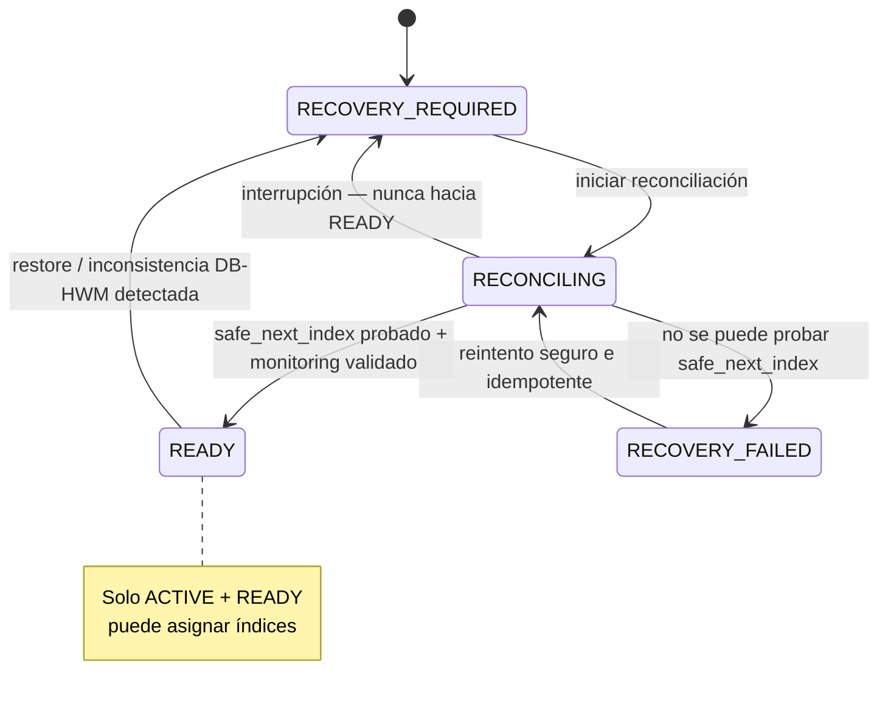
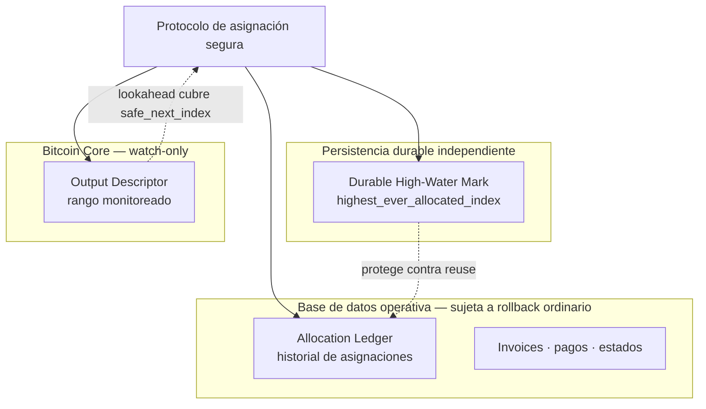
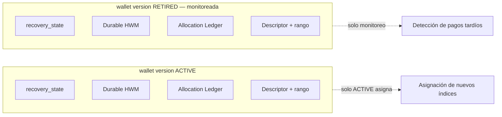
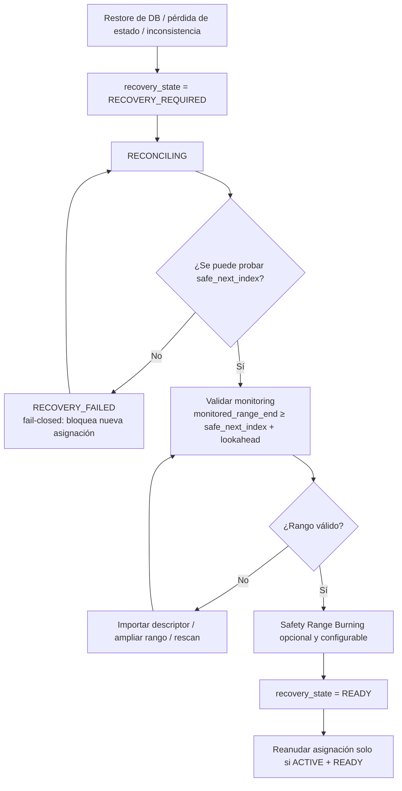

# ARCH-005 — Index Reconciliation & Backup Recovery

> Documento de decisión de arquitectura. Índice formal en [ADR.md § ARCH-005](./ADR.md#arch-005--index-reconciliation--backup-recovery). Relacionado con [ARCH-002](./14-architecture-decisions.md) (derivación) y [ARCH-003](./14-architecture-decisions.md) (Recovery Package).

- **Estado del diseño:** **Aprobado** (decisiones D1–D10 revisadas y aprobadas por los owners del proyecto).
- **Estado de implementación:** **Pendiente**. La arquitectura descrita aquí es el **target aprobado**, no la implementación actual (ver [§ 9](#9-brecha-de-implementación-actual-current-implementation-gap)).
- **Prioridad:** P0.

> **Distinción obligatoria.** El **diseño** de ARCH-005 está aprobado. La **implementación** puede permanecer pendiente. Este documento separa explícitamente la **arquitectura target aprobada**, la **implementación actual** y el **trabajo futuro de implementación**.

---

## 1. Problema

FloweyPay deriva **una dirección de recepción única por invoice** con índices de derivación **forward-only** que **nunca** se reutilizan ([ARCH-002](./14-architecture-decisions.md)). La reutilización de un índice mezclaría pagos no relacionados, filtraría privacidad y podría dirigir fondos de un cliente a la dirección esperada por otro.

El riesgo aparece cuando la base de datos operativa pierde estado o se revierte (restauración de backup, rollback, corrupción, recreación del nodo). Tras esa pérdida, FloweyPay debe poder probar **cuál es el siguiente índice seguro** para cada wallet antes de volver a asignar direcciones.

### 1.1 Por qué la fórmula preliminar no es suficiente

El modelo preliminar proponía:

```text
next_index = max(
  estado en DB,
  registros de pago,
  índice fondeado más alto on-chain
) + 1
```

Esta fórmula **no es suficiente por sí sola**. La razón es fundamental:

> La blockchain y Bitcoin Core **no pueden probar** que un índice de derivación **no fondeado** fue asignado históricamente.

Un índice puede haber sido **asignado** (entregado a un cliente en un invoice) y sin embargo **nunca fondeado** —porque la creación del invoice falló, la dirección nunca recibió BTC, o el pago nunca llegó a la red. Ese índice es invisible para la cadena. Si tras un rollback la DB perdió el registro de esa asignación, `max(...)` lo omitiría y FloweyPay podría **reasignarlo**, violando la regla de nunca reutilizar.

Por lo tanto, el modelo de reconciliación debe apoyarse en **evidencia durable de asignación**, no solo en evidencia on-chain.

---

## 2. Invariantes

1. **Never-reuse.** Un índice asignado nunca vuelve a asignarse, aunque nunca haya sido fondeado.
2. **Monotonicidad durable.** El `highest_ever_allocated_index` por wallet version nunca decrece.
3. **Visibilidad diferida.** Una dirección derivada **no** se hace visible externamente hasta que el avance del **Durable High-Water Mark (HWM)** esté durablemente confirmado.
4. **Fail-closed.** Si no se puede probar un `safe_next_index`, se **bloquea** la asignación de nuevas direcciones; se sacrifica disponibilidad, no seguridad de asignación.
5. **Aislamiento por wallet version.** El dominio de reconciliación es la **wallet version**, no el comercio globalmente.
6. **Solo ACTIVE + READY asigna.** Únicamente una wallet `lifecycle == ACTIVE` con `recovery_state == READY` puede asignar índices nuevos.
7. **Lookahead de monitoring.** `monitored_range_end ≥ safe_next_index + configurable_lookahead`.
8. **HWM nunca retrocede.** Ninguna evidencia auxiliar (incl. Recovery Package) puede mover el HWM ni el `safe_next_index` hacia atrás.

---

## 3. Escenarios de falla

| # | Escenario | Riesgo sin ARCH-005 |
|---|---|---|
| 1 | Restauración de backup de la DB a un punto anterior | El contador de índices retrocede; se reasignan índices ya emitidos. |
| 2 | Índice asignado pero nunca fondeado, registro perdido en rollback | La cadena no lo prueba; `max(...)` lo omite y se reutiliza. |
| 3 | Inconsistencia DB / HWM | Estado ambiguo; no se puede probar `safe_next_index`. |
| 4 | Pérdida/recreación del estado de Bitcoin Core | Se pierde el rango monitoreado; pagos no detectados. |
| 5 | Descriptor faltante o inválido | No se puede validar ni derivar de forma segura. |
| 6 | Rango de monitoring insuficiente | Pagos más allá del rango observado no se detectan. |
| 7 | Reconciliación interrumpida | Transición prematura a READY dejaría estado inseguro. |
| 8 | Imposibilidad de probar `safe_next_index` | Cualquier asignación sería una apuesta, no una prueba. |

---

## 4. Decisiones aprobadas (D1–D10)

### D1 — Durable Allocation Record

FloweyPay mantiene evidencia **durable y monotónica**, **por wallet version**, del índice de derivación más alto asignado históricamente. Esta evidencia **sobrevive de forma independiente** a un rollback ordinario de la base de datos operativa. Un índice asignado **nunca** es reutilizable, aunque la creación del invoice falle, la dirección nunca se fondee o el pago nunca llegue a la blockchain.

### D2 — Allocation Ledger + Durable High-Water Mark

Dos mecanismos complementarios por wallet version:

1. **Allocation Ledger** — almacenado en la base de datos operativa. Propósito: trazabilidad de asignaciones, historial de auditoría y relación entre índices de derivación y eventos operativos.
2. **Durable High-Water Mark (HWM)** — almacenado con un **ciclo de vida de persistencia durable independiente** del rollback ordinario de la DB operativa. Representa `highest_ever_allocated_index`. Propiedades: **monotónico**, **nunca decrece**, **ciclo de recuperación independiente**.

Una dirección derivada **NO** debe hacerse visible externamente hasta que el avance del HWM correspondiente esté durablemente confirmado.

> La **tecnología/proveedor** de almacenamiento del HWM **no** la decide ARCH-005; es una decisión de implementación/infraestructura.

### D3 — Safety Range Burning

Tras una recuperación exitosa, FloweyPay **PUEDE** quemar (*burn*) un rango adicional configurable de índices antes de reanudar la asignación. Es **solo defensa en profundidad**. El Safety Range Burning:

- **NO** reemplaza al HWM,
- **NO** resuelve un estado de asignación histórico incierto,
- **NO** puede usarse para eludir el comportamiento fail-closed.

El margen es **configurable**; la arquitectura **no** define un valor numérico fijo.

### D4 — Fail-Closed Recovery Policy

Si FloweyPay **no puede probar** un `safe_next_index` para una wallet version, la **asignación de nuevas direcciones DEBE bloquearse**. El sistema sacrifica disponibilidad antes que seguridad de asignación.

Operaciones que pueden continuar cuando es seguro: monitoreo de direcciones existentes, detección de pagos, procesamiento de confirmaciones, actualización de estados de pagos existentes, notificaciones, operaciones de solo lectura del Dashboard, y operaciones de health/admin/recovery.

La falla se aísla al **menor alcance seguro**, idealmente la wallet version afectada. El Safety Range Burning **NO** debe convertir incertidumbre en certeza.

### D5 — Reconciliation per Wallet Version

El dominio de reconciliación es la **wallet version**, **no** el comercio globalmente. Cada wallet version mantiene de forma independiente: Output Descriptor, cursor de derivación, Allocation Ledger, Durable HWM, rango de descriptor monitoreado y estado de recuperación.

Solo la wallet version **ACTIVE** puede asignar direcciones nuevas. Las wallet versions históricas/retiradas permanecen **monitoreadas** por invoices previamente emitidos y posibles pagos tardíos. La política de negocio de Late Payment se define en [ARCH-006](./ARCH-006-late-payments-reconciliation.md) (diseño aprobado, D1–D12): este monitoring por wallet version es precisamente lo que **habilita** la detección de Late Payments a versiones RETIRED (ARCH-006 D12). **Index reconciliation** (este documento, seguridad de asignación / never-reuse) y **payment reconciliation** (ARCH-006, qué ocurrió con los BTC recibidos) son concerns separados y no deben conflarse.

### D6 — Recovery State Machine

Cada wallet version mantiene un estado de seguridad de recuperación independiente:

`READY`, `RECOVERY_REQUIRED`, `RECONCILING`, `RECOVERY_FAILED`.

Solo `wallet.lifecycle == ACTIVE` **AND** `wallet.recovery_state == READY` puede asignar direcciones nuevas. `READY` solo se alcanza mediante una reconciliación exitosa. La recuperación es **fail-closed** e **idempotente**. Una reconciliación interrumpida **nunca** transiciona automáticamente a `READY`; tras una interrupción debe poder ejecutarse de nuevo de forma segura.

Triggers típicos: restauración de backup de DB, inconsistencia DB/HWM, pérdida/recreación del estado de Bitcoin Core, Descriptor faltante/inválido, rango de monitoring insuficiente, recuperación interrumpida, imposibilidad de probar `safe_next_index`.



### D7 — Descriptor Monitoring / Lookahead

El monitoring de Bitcoin Core debe cubrir **siempre más allá** del cursor de asignación seguro. Invariante arquitectónica:

```text
monitored_range_end ≥ safe_next_index + configurable_lookahead
```

El valor exacto de lookahead es **configuración**, no una constante arquitectónica. Una wallet version **NO** puede transicionar a `READY` si el rango de monitoring de descriptor requerido no está validado. La recuperación puede requerir: importación de descriptor, ampliación del rango de monitoring, rescan y validación.

### D8 — Recovery Package

El **Recovery Package** ([ARCH-003](./14-architecture-decisions.md)) es evidencia de recuperación **condicional/auxiliar**. **NO** es automáticamente autoritativo para el estado de asignación. Debe considerar: versión, timestamp/checkpoint, firma y frescura (*freshness*).

Un Recovery Package **stale** (desactualizado) puede aún aportar evidencia útil para **avanzar** un cursor, pero **NUNCA** debe mover el HWM ni el `safe_next_index` **hacia atrás**. Si no se puede reconstruir el estado de asignación autoritativo: **FAIL CLOSED**.

### D9 — Backup Strategy

La información de backup/recovery se clasifica por propósito:

| Clase | Contenido | Propiedad |
|---|---|---|
| **Fund Safety** | Seed, Private Keys | Propiedad del comercio. FloweyPay **no** es requerido para gastar/recuperar fondos. |
| **Address Allocation Safety** | Durable HWM, wallet versions, Descriptors, Allocation Ledger, metadata de derivación requerida | Crítica para nunca reutilizar índices. |
| **Service Recovery** | Comercios, invoices, pagos, estados, configuración, estado de notificaciones | Datos operativos. |
| **Reconstructable Information** | Información on-chain | Redescubrible vía Descriptor + Bitcoin Core + rescan. |

El **Durable HWM** DEBE tener un ciclo de vida de recuperación **independiente** del backup transaccional ordinario de la DB, cuyo rollback es precisamente lo que protege. ARCH-005 **no** selecciona el proveedor de almacenamiento concreto.

### D10 — Implementation Order

Las garantías de asignación/recuperación deben existir **ANTES** de habilitar la derivación de direcciones non-custodial en producción. Precedencia arquitectónica de implementación:

1. Modelo de persistencia de wallet version.
2. Allocation Ledger.
3. Mecanismo de Durable HWM.
4. Protocolo de asignación seguro/atómico.
5. Descriptor monitoring + lookahead configurable.
6. Recovery State Machine.
7. Motor de reconciliación (reconciliation engine).
8. Procedimientos de backup/recovery.
9. Suite de tests de falla/recuperación.
10. Habilitar la asignación de direcciones non-custodial en producción.

El número/orden exacto de PRs o tickets puede variar según dependencias de implementación. La invariante obligatoria es:

> **NUNCA** habilitar la asignación non-custodial en producción antes de que las garantías de never-reuse, reconciliación y fail-closed estén **implementadas y probadas**.

---

## 5. Modelo de reconciliación

El modelo debe distinguir explícitamente entre magnitudes que la fórmula preliminar mezclaba:

| Magnitud | Qué representa | Fuente |
|---|---|---|
| **highest allocated index** | Índice más alto **asignado** históricamente | Durable HWM + Allocation Ledger |
| **highest persisted operational index** | Índice más alto persistido en la DB operativa | Base de datos operativa |
| **highest invoice-associated index** | Índice más alto asociado a un invoice | Registros de invoice/pago |
| **highest funded / on-chain index** | Índice más alto con fondos on-chain | Bitcoin Core + descriptor |
| **Durable HWM** | `highest_ever_allocated_index` monotónico durable | Persistencia durable independiente |
| **descriptor monitored range** | Rango observado por Bitcoin Core | Bitcoin Core |

El **Durable HWM** es lo que provee la protección contra la **reutilización de índices asignados-pero-no-fondeados**. Las magnitudes on-chain y operativas son insumos complementarios, pero **no sustituyen** al HWM.

> Este documento **no** define una fórmula de implementación más allá de las decisiones aprobadas. El `safe_next_index` se **prueba** a partir de la evidencia durable; si no puede probarse, aplica fail-closed (D4).

### 5.1 Relación entre almacenes



### 5.2 Aislamiento por wallet version



---

## 6. Ciclo de vida de reconciliación (Backup Restore / Reconciliation)



---

## 7. Comportamiento ante crash / recuperación

- La reconciliación es **idempotente**: puede ejecutarse de nuevo tras una interrupción sin producir estado inseguro.
- Una interrupción durante `RECONCILING` **nunca** transiciona a `READY`; regresa a `RECOVERY_REQUIRED` para reejecutarse.
- La **visibilidad diferida** garantiza que una dirección no se expone hasta que el avance del HWM esté durablemente confirmado; un crash entre la derivación y la confirmación del HWM no filtra un índice reutilizable.

---

## 8. Precedencia de implementación (resumen)

El orden de D10 asegura que las garantías de seguridad existan **antes** de habilitar la derivación non-custodial en producción. Ver [D10](#d10--implementation-order) y [15 — Roadmap futuro](./15-future-roadmap.md).

---

## 9. Brecha de implementación actual (Current Implementation Gap)

> Estas observaciones se basan en inspección del repositorio y se documentan **sin** rediseñar la arquitectura aprobada.

- El código actual asigna direcciones desde una **única wallet compartida de Bitcoin Core** vía `getnewaddress` (`apps/web/app/api/_lib/bitcoinRpc.ts`), es decir, opera hoy de forma **custodial**.
- **No existen** en el esquema ([`packages/db/prisma/schema.prisma`](../../packages/db/prisma/schema.prisma)) ni en el código las tablas/mecanismos de: **wallet version**, **Allocation Ledger**, **Durable HWM**, **Recovery State Machine** ni **motor de reconciliación**.
- El Worker realiza matching por **dirección exacta**; el descriptor monitoring por rango con lookahead está pendiente.

En consecuencia, la arquitectura aprobada de ARCH-005 **aún no está implementada**. Este documento describe el **target aprobado**; la implementación permanece **pendiente** y precede obligatoriamente a la habilitación de la asignación non-custodial en producción (D10).

---

**Relacionado:** [ADR.md](./ADR.md) · [DECISIONS.md](./DECISIONS.md) · [12 — Flujo operativo](./12-operational-flow.md) · [08 — Wallet Recovery](./08-wallet-recovery.md) · [13 — Diagramas de secuencia](./13-sequence-diagrams.md) · [15 — Roadmap futuro](./15-future-roadmap.md).
