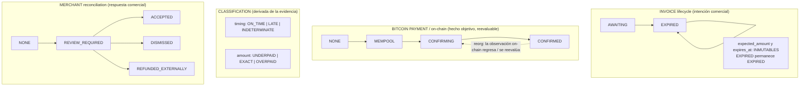
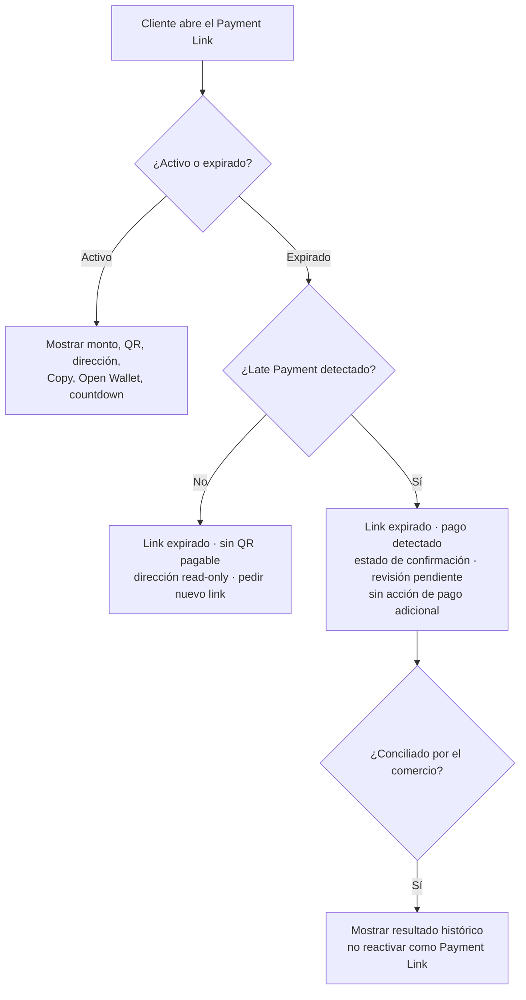
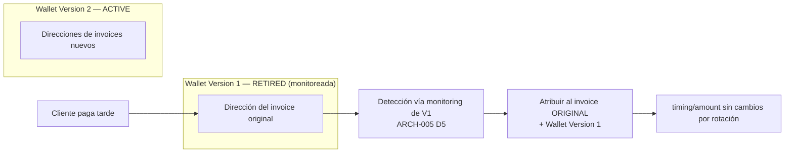

# ARCH-006 — Late Payments & Reconciliation

> Documento de decisión de arquitectura. Índice formal en [ADR.md § ARCH-006](./ADR.md#arch-006--late-payment-policy). Relacionado con [ARCH-002](./14-architecture-decisions.md) (derivación por invoice), [ARCH-005](./ARCH-005-index-reconciliation-recovery.md) (reconciliación de índices por wallet version) y con el flujo funcional ARCH-004 ([05](./05-customer-payment-flow.md), [06](./06-bitcoin-processing.md), [07](./07-merchant-dashboard.md), [09](./09-wallet-rotation.md)).

- **Estado del diseño:** **Aprobado** (decisiones D1–D12 revisadas y aprobadas por los owners del proyecto).
- **Estado de implementación:** **Pendiente**. La arquitectura descrita aquí es el **target aprobado**, no la implementación actual (ver [§ 19](#19-brecha-de-implementación-actual-current-implementation-gap)).
- **Prioridad:** P0.

> **Distinción obligatoria.** El **diseño** de ARCH-006 está aprobado. La **implementación** permanece pendiente. Este documento separa explícitamente la **arquitectura target aprobada**, la **implementación actual** y el **trabajo futuro de implementación**. Ninguna afirmación de este documento debe leerse como "el manejo de Late Payments ya está implementado".

> **Nota sobre nombres.** Identificadores como `LATE`, `ON_TIME`, `INDETERMINATE`, `EXACT`, `UNDERPAID`, `OVERPAID`, `REVIEW_REQUIRED`, `LATE_PAYMENT_DETECTED` son **placeholders conceptuales** para ilustrar el modelo de dominio. Los nombres exactos de enums, columnas y eventos son **decisiones de implementación**, no constantes arquitectónicas.

---

## 1. Problema

FloweyPay fija a cada invoice una expiración (`btc_expires_at`, derivada del rate lock). Cuando la expiración se alcanza sin pago, el invoice pasa a `EXPIRED`. Sin embargo, FloweyPay es **non-custodial**: los BTC van **directamente** a una dirección controlada por el comercio, derivada por invoice ([ARCH-002](./14-architecture-decisions.md)). La dirección sigue siendo válida en la red Bitcoin después de la expiración.

Por lo tanto, un cliente **puede** enviar BTC a la dirección de un invoice ya expirado, y esa transacción es válida e irreversible. Ante un **Late Payment** (pago tardío), FloweyPay:

- **no puede** rechazar un pago on-chain ya difundido,
- **no puede** revertir la transacción,
- **no puede** firmar un reembolso,
- **no puede** mover los fondos del comercio,
- **no puede** decidir por sí mismo que ese pago satisface comercialmente el invoice expirado.

El problema es cómo **detectar, representar, conciliar, comunicar y operar** estos pagos sin (a) mentir sobre el historial del invoice, ni (b) tomar una decisión comercial que le corresponde al comercio.

## 2. Alcance

**Dentro de alcance (MVP, diseño aprobado):**

- Detectar y **registrar** pagos que llegan a direcciones de invoices expirados (hoy se descartan; ver [§ 19](#19-brecha-de-implementación-actual-current-implementation-gap)).
- Separar el ciclo de vida del **invoice** del ciclo de vida del **pago Bitcoin** y de la **conciliación** del comercio.
- Clasificar cada pago por **timing** y **amount** de forma ortogonal.
- Soportar **N transacciones por invoice**.
- Exponer una superficie de **conciliación/atención** para el comercio con acciones auditables.
- Ajustar el **comportamiento del Payment Link expirado** para no incentivar pagos tardíos.
- Definir la **política de notificaciones** de Late Payment (idempotente y mínima).
- Definir la **atribución por wallet version** de un Late Payment.

**Fuera de alcance (explícitamente diferido):** ver [§ 18](#18-límite-del-mvp-mvp-boundary).

## 3. Principio arquitectónico central

> FloweyPay **registra objetivamente lo que ocurrió en Bitcoin**, **preserva lo que ocurrió con el invoice**, y **deja la interpretación comercial al comercio**.

De este principio se derivan tres dominios independientes que **nunca** deben colapsarse en uno solo:

1. **Invoice lifecycle** — la solicitud comercial de pago (la fija FloweyPay junto con el comercio).
2. **Bitcoin payment / on-chain lifecycle** — hechos objetivos de red/cadena (los fija la cadena, los observa el Worker).
3. **Merchant reconciliation** — la respuesta comercial del comercio (la fija exclusivamente el comercio).

## 4. Decisiones aprobadas (D1–D12)

### D1 — Separar Invoice y Bitcoin Payment lifecycles

El ciclo de vida del invoice y el ciclo de vida del pago Bitcoin son **dimensiones independientes**. Un Late Payment **NO** se modela mutando `EXPIRED → PAID`; hacerlo destruiría información histórica (la expiración real, el rate lock vencido, el momento real de llegada, la ausencia de decisión comercial). El modelo conceptual debe distinguir al menos: **Invoice lifecycle**, **Bitcoin payment / on-chain lifecycle**, **payment timing classification**, **payment amount classification** y **merchant reconciliation**. Los nombres exactos de esquema/enum son de implementación.

### D2 — Payment arrival time

La clasificación `ON_TIME` vs `LATE` se determina con la **evidencia de first-seen más temprana y confiable** disponible desde el nodo Bitcoin de FloweyPay, comparada contra `expires_at` del invoice. **NO** se usan como reloj de llegada comercial: el block timestamp, el timestamp de confirmación, ni el tiempo de finalización de recovery de FloweyPay. Una transacción vista en mempool **antes** de la expiración pero confirmada **después** es `ON_TIME`. Confirmación y llegada son conceptos separados.

### D3 — Indeterminate timing

Si FloweyPay **no puede** determinar de forma confiable cuándo llegó una transacción (por downtime del nodo, recovery, rescan, o evidencia de first-seen ausente/no confiable), el timing debe clasificarse como **`INDETERMINATE`** (o su equivalente de implementación). **NO** debe clasificarse automáticamente como `LATE` ni como `ON_TIME`. Estos pagos requieren **revisión del comercio**. El recovery debe permanecer **observation-neutral**: nunca fabrica lateness por el hecho de que FloweyPay estuviera offline.

### D4 — Exact late payment

Cuando un invoice expirado recibe **exactamente** el monto BTC esperado: el invoice **permanece `EXPIRED`** (su historial de expiración es inmutable) y el pago Bitcoin se registra por separado. Conceptualmente: `timing = LATE`, `amount = EXACT`, `reconciliation = REVIEW_REQUIRED`. La UI **PUEDE** presentar una etiqueta derivada/compuesta como **"Expired · Late payment received"**, pero **NUNCA** debe reescribir el invoice como si se hubiera pagado a tiempo.

### D5 — No automatic commercial acceptance

FloweyPay **NO** acepta comercialmente un Late Payment de forma automática, **ni siquiera** cuando el monto recibido coincide exactamente con el invoice original. **`EXACT` no implica `ACCEPTED`.** El comercio decide si el Late Payment satisface la obligación comercial. Para el MVP, los Late Payments **requieren conciliación del comercio**.

### D6 — Multiple Bitcoin transactions per invoice

Un invoice puede recibir **N transacciones** Bitcoin (p. ej. `TX1 = parcial` + `TX2 = remanente`, o `TX1 = total` + `TX2 = adicional`). El BTC recibido se **acumula** sobre los outputs atribuibles. La arquitectura **NO** debe asumir `un invoice = una transacción`. La conciliación debe **preservar el conjunto** de transacciones contribuyentes.

### D7 — Late-payment monitoring horizon

La detectabilidad de Late Payments sigue el **tiempo de monitoring de la wallet version** definido por [ARCH-005](./ARCH-005-index-reconciliation-recovery.md). Para el MVP: las wallet versions **ACTIVE** y **RETIRED** permanecen monitoreadas, y **NO** existe una política automática de decommission por tiempo. **No** se introducen límites arbitrarios (30/60/90 días). Una política futura de decommission/archivado puede definirse por separado si la escala operativa lo exige.

### D8 — Expired Payment Link must not remain payable

Al expirar un Payment Link, FloweyPay debe **dejar de incentivar activamente el pago**. La página expirada **NO** debe exponer: QR pagable, acción "Open Wallet" activa, ni acción de pago "Copy Address" activa. La dirección Bitcoin **PUEDE** permanecer visible como información **read-only** histórica/de soporte. Se instruye al cliente a **solicitar un nuevo Payment Link** al comercio. Si se detecta un Late Payment, la página del cliente puede comunicar que el link estaba expirado, que se detectó un pago y que puede haber revisión del comercio pendiente — **sin** incentivar pagos adicionales.

### D9 — Refunds in MVP

FloweyPay **NO** ejecuta reembolsos Bitcoin: no firma transacciones de reembolso, no mueve BTC y no requiere private keys del comercio. Para el MVP, FloweyPay **PUEDE** registrar que el comercio realizó un reembolso **externamente** (anotación / record-only). **No** hay workflow de reembolso on-chain en el MVP de ARCH-006. La automatización de reembolsos queda **explícitamente diferida**.

### D10 — Late Payment notifications

Las notificaciones de Late Payment deben ser **idempotentes** e **intencionalmente pequeñas**. Eventos primarios al comercio: **`LATE_PAYMENT_DETECTED`** y **`LATE_PAYMENT_CONFIRMED`** (nombres de implementación pueden variar). Se informa al comercio cuando (1) se detecta el **primer** Late Payment de un invoice y (2) ese Late Payment alcanza el estado de confirmación requerido. **No** se genera spam por cada transacción contribuyente; el detalle parcial/sobrepago/múltiples-transacciones vive principalmente en el Dashboard / vista de conciliación.

### D11 — Blockchain reorganization vs commercial reconciliation

El estado on-chain y la conciliación del comercio son **independientes**. Si un Late Payment previamente confirmado **pierde** confirmación por una reorganización de la cadena: se **actualiza/revierte** el estado de observación on-chain, se **devuelve el caso a atención/revisión** del comercio cuando sea necesario, y se **preserva** en el historial de auditoría la decisión de conciliación previa del comercio. **NO** se borra ni reescribe silenciosamente la decisión histórica del comercio. No se sobre-diseña una política de deep-reorg para el MVP.

### D12 — Wallet version attribution

Todo Late Payment permanece atribuible a: su **invoice original**, su **dirección derivada** y la **wallet version** desde la que esa dirección fue derivada. Ejemplo: invoice creado con **Wallet Version 1**; el comercio rota a **Wallet Version 2**; V1 queda **RETIRED** pero monitoreada; el cliente paga tarde la dirección vieja → el Late Payment se detecta, se asocia al invoice original y se atribuye a **Wallet Version 1**. La rotación de wallet **no** cambia la clasificación de timing ni de amount. Esto **depende** de que el monitoring por wallet version de [ARCH-005](./ARCH-005-index-reconciliation-recovery.md) esté implementado. La entidad de persistencia `MerchantWalletVersion` que hace posible esta atribución permanente —incluidas las versiones `RETIRED`, que nunca se borran— se diseña en [DB-001](./DB-001-merchant-wallet-wallet-versions.md) (diseño aprobado; implementación pendiente).

---

## 5. Separación de dominios / modelo de estado

Colapsar los dominios es exactamente la causa raíz del error `EXPIRED → PAID`. El modelo aprobado mantiene dimensiones **ortogonales** (nombres ilustrativos):

Invariante clave: **el `status` del invoice permanece `EXPIRED` para siempre.** La "lateness" y la "aceptación" viven en las dimensiones de pago/clasificación/conciliación, no mutando el estado del invoice. La UI puede **componer** una presentación ("Expired · Late payment · pendiente de revisión") sin falsear el historial.

La dimensión on-chain es un **hecho objetivo pero reevaluable**: una reorganización de la cadena hace que la observación de un pago **confirmado** pueda **regresar y reevaluarse** (no es un estado terminal permanente). Esa reevaluación ocurre en la dimensión de pago; **no borra el historial de conciliación del comercio** (dimensión independiente), que se preserva para reanudar la atención cuando corresponda (ver [§ 16](#16-rbf--conflictos--reorg), D11).

## 6. Definición de Late Payment

Un **Late Payment** es una transacción Bitcoin válida que acredita la dirección derivada de un invoice, cuyo **tiempo de llegada de negocio** cae **después** de `expires_at` de ese invoice.

El reloj de negocio es la **evidencia de first-seen más temprana y confiable** (D2). **No** se usa el block timestamp: `nTime` es fijado por el minero, solo débilmente monotónico (regla median-time-past), y refleja minería, no intención del cliente. Casos límite mempool/confirmación:

| Caso | Situación | Clasificación |
|---|---|---|
| A | Visto en mempool antes de expirar, confirmado después | **ON_TIME** (first-seen < expiración) |
| B | Primer avistamiento después de expirar | **LATE** |
| C | Visto antes de expirar, desaparece del mempool, confirma después | **ON_TIME** (por first-seen más temprano, idempotente por txid) |
| D | RBF (fee-bump) | timing según el first-seen del reemplazo; no se trata el fee-bump como nueva obligación (ver [§ 16](#16-rbf--conflictos--reorg)) |
| E | Conflicto / doble gasto | no se considera liquidado hasta que confirme la tx superviviente (ver [§ 16](#16-rbf--conflictos--reorg)) |
| F | first-seen ausente/no confiable (recovery, offline, rescan) | **INDETERMINATE** → revisión del comercio (D3) |

## 7. Clasificación de timing

`ON_TIME | LATE | INDETERMINATE`, determinada por D2/D3. La magnitud del retraso (5 min, 1 h, 1 día, 30 días, meses) **no** crea estados distintos: todos son `LATE`. La edad solo afecta la **presentación** y, opcionalmente, la supresión de notificaciones muy antiguas ([§ 13](#13-notificaciones-d10)). El horizonte de detectabilidad lo fija el monitoring de la wallet version (D7), no un temporizador.

## 8. Clasificación de amount

`UNDERPAID | EXACT | OVERPAID`, **independiente** del timing. El `expected_amount` del invoice es **inmutable**; el `received` es la suma acumulada de outputs atribuibles.

- **Underpayment tardío:** `expected = 100,000`, `received = 60,000` → `timing = LATE`, `amount = UNDERPAID`, `remaining = 40,000`, `reconciliation = REVIEW_REQUIRED`.
- **Acumulación:** una segunda tx de `40,000` → `received = 100,000`, `amount = EXACT` (el `expected` no se reescribe).
- **Overpayment tardío:** `expected = 100,000`, `received = 120,000` → `amount = OVERPAID`, `excess = 20,000`. FloweyPay **registra** el excedente pero **no** lo reembolsa automáticamente (D9).

## 9. Múltiples transacciones (D6)

La conciliación opera sobre el **conjunto** de transacciones contribuyentes, no sobre una sola. La representación debe exponer todas las txs (txid, vout, monto, confirmaciones, first-seen) atribuidas al invoice, y un total acumulado. Un campo de conveniencia "txid principal" es lossy y **no** sustituye al conjunto.

## 10. Merchant reconciliation (MVP)

Acciones mínimas del comercio (etiquetas/nombres de implementación abiertos):

| Acción | Significado |
|---|---|
| **ACCEPT** | El comercio reconoce que el Late Payment satisface comercialmente la obligación. |
| **DISMISS / LEAVE UNRESOLVED** | El comercio no lo acepta como cumplimiento. |
| **ADD NOTE** | El comercio registra contexto de conciliación. |
| **RECORD EXTERNAL REFUND** | Anotación opcional (record-only) de que reembolsó fuera de FloweyPay (D9). |

Toda acción de conciliación debe ser **auditable**, preservando al menos: **acción**, **actor**, **timestamp** y **nota/contexto** cuando exista. La conciliación **agrega** historial; **NUNCA** reescribe hechos históricos del invoice (D4). Las acciones que implican firmar o mover BTC quedan **fuera** de FloweyPay (non-custodial).

## 11. Experiencia del cliente (D8)

| Estado | Cliente ve | QR/dirección |
|---|---|---|
| Activo | página completa + countdown | **QR pagable** |
| Expirado — sin pago | "Payment Link expirado; solicita uno nuevo" | **sin QR pagable**; dirección read-only opcional |
| Expirado — Late Payment detectado | link expirado + pago detectado + estado + revisión pendiente | **sin nueva acción de pago** |
| Expirado — conciliado | resultado histórico | solo información |

## 12. Merchant Dashboard

Se aprueba conceptualmente una **cola/superficie de atención** dedicada para Late Payments. Para el MVP debe exponer lo suficiente para decidir **sin** convertir a FloweyPay en software contable. Campos mínimos a considerar: identificador del invoice, `expected_amount`, `expires_at`, `first_seen_at`, `received`, `remaining`/`excess`, **transacciones contribuyentes**, estado de confirmación, **timing**, **amount**, **wallet version**, estado de conciliación, decisión del comercio, actor/timestamp de la decisión y notas. El diseño de UI exacto es trabajo de implementación.

## 13. Notificaciones (D10)

Eventos primarios idempotentes: `LATE_PAYMENT_DETECTED` (una vez, en el primer Late Payment del invoice) y `LATE_PAYMENT_CONFIRMED` (una vez, al alcanzar la confirmación requerida). El detalle de parcial/sobrepago/múltiples-txs vive en el Dashboard, **no** en notificaciones por tx. Se reutiliza el primitivo de idempotencia existente (unicidad por `(payment, event)`; ver [§ 17](#17-auditabilidad--idempotencia)). No se notifica al cliente por defecto (no hay cuenta de cliente y no se incentiva el comportamiento).

## 14. Wallet Rotation (D12)

Un Late Payment a una dirección de una wallet version **RETIRED** se detecta gracias a que [ARCH-005 D5](./ARCH-005-index-reconciliation-recovery.md#d5--reconciliation-per-wallet-version) mantiene monitoreadas las versiones históricas. La atribución conserva invoice original + wallet version. La detectabilidad depende de que ese monitoring esté implementado.

## 15. Comportamiento de recovery / offline (D3)

La clasificación de timing depende de la **evidencia de la transacción** (first-seen), **nunca** del tiempo de observación o de finalización de recovery de FloweyPay. Si `wallet.recovery_state = RECONCILING` o Bitcoin Core estuvo temporalmente indisponible y la tx se descubre en rescan sin first-seen confiable, se clasifica `INDETERMINATE → REVIEW_REQUIRED`. El recovery es **observation-neutral**. Esta es una garantía de corrección P0: la conciliación de pagos **no** debe marcar como tardíos pagos ordinarios solo porque FloweyPay estuvo offline.

## 16. RBF / conflictos / reorg

Consideraciones de corrección, sin sobre-diseñar el MVP:

- **RBF:** preservar el linaje/evidencia de la transacción cuando sea posible; **no** tratar automáticamente un fee-bump como una nueva obligación comercial.
- **Conflicto / doble gasto:** **no** tratar una transacción en conflicto como liquidada; el timing se toma del first-seen de la tx superviviente una vez que confirma.
- **Reorg:** el estado on-chain puede regresar (`CONFIRMED → REORG_REVERTED`), pero el historial de conciliación del comercio **no desaparece** (D11); el caso vuelve a atención cuando corresponda. Los mecanismos exactos de deep-reorg son trabajo futuro.

## 17. Auditabilidad / idempotencia

**Hechos históricos inmutables** (mínimo):

- **Invoice:** expected amount, timestamp de creación, timestamp de expiración, wallet version original, dirección derivada original.
- **Observaciones Bitcoin:** txid, atribución vout/output, monto, first-seen más temprano confiable (cuando exista), evolución de confirmaciones.
- **Clasificación:** timing y amount.
- **Conciliación:** acción del comercio, actor, timestamp, notas.

Un comercio que acepta un Late Payment **NO** debe hacer que el sistema parezca que el invoice original se pagó **antes** de expirar.

**Idempotencia.** Observaciones repetidas de la misma transacción (mempool, reinicio del Worker, rescan, tras confirmación, durante conciliación) **no** deben duplicar registros de pago/output, registros de Late Payment, notificaciones ni acciones de conciliación. El repositorio ya provee primitivos aplicables: unicidad `(payment_id, txid, vout_index)` en `payment_btc_txs` y unicidad `(payment_id, event)` en `payment_notifications`, más upsert idempotente en el acumulador de pagos. ARCH-006 **extiende** esa disciplina a la clasificación, a los eventos de Late Payment y a las acciones de conciliación (aceptar dos veces es un no-op). Esto describe primitivos existentes; **no** implica que ARCH-006 ya esté implementado.

## 18. Límite del MVP (MVP boundary)

ARCH-006 **NO** debe expandir FloweyPay hacia: software de reembolso custodial, gestión de disputas/chargebacks, ERP del comercio, software contable, contabilidad fiscal, ni adjudicación comercial automática.

**Explícitamente diferido:** ejecución de reembolsos on-chain; firma automática de reembolsos; gestión de disputas; aceptación automática de Late Payments; buckets de edad arbitrarios; política de decommission de wallet versions; workflows complejos de deep-reorg.

## 19. Brecha de implementación actual (Current Implementation Gap)

Estado **verificado** contra el repositorio (solo lectura; **no** se modificó código). Separar: **implementación actual** vs **arquitectura aprobada** vs **trabajo futuro de ARCH-006**.

| Área | Implementación actual (verificada) | Target aprobado (ARCH-006) |
|---|---|---|
| Detección de Late Payment | El matching del Worker **descarta** transacciones a un invoice ya `EXPIRED` (solo matchea `AWAITING_PAYMENT` no expirado, o `SEEN_IN_MEMPOOL` / `CONFIRMING`) en `apps/worker/src/handlers/rawtxHandler.ts`. | Detectar y **registrar** el Late Payment; nunca descartarlo. |
| Payment Link expirado | La página del cliente aún renderiza el QR y la dirección; solo deshabilita "Copy" y marca el link "Open Wallet" como `aria-disabled` (sin bloquear el `href`) en `apps/web/app/pay/[paymentId]/BtcPaymentLinkClient.tsx`. | Sin QR pagable ni acciones de pago activas; dirección read-only (D8). |
| Modelo de wallet | Direcciones desde una **única wallet compartida** de Bitcoin Core (`getnewaddress`), custodial hoy. | Derivación non-custodial por wallet version (ARCH-002/005). |
| Monitoring por wallet version | No implementado (ARCH-005 pendiente). | Requerido para detectar Late Payments a versiones RETIRED (D12). |
| Eventos de notificación | Solo `SEEN_IN_MEMPOOL`, `CONFIRMED`, `EXPIRED` (enum `payment_notification_event`). | Añadir eventos de Late Payment (D10). |
| Conciliación del comercio | No existe cola/estado de conciliación de Late Payment. | Cola de atención + acciones auditables (§10, §12). |
| Timing/amount | `payment_btc_txs` (N txs por invoice), `btc_received_sats` acumulado y received/remaining/overpaid computados **ya existen** y son reutilizables. | Añadir dimensiones ortogonales de timing/amount y clasificación (§7–§8). |

> **No se corrige ninguna de estas brechas en este documento.** Su resolución es trabajo de implementación posterior, gobernado por [§ 20](#20-implicaciones-de-implementación--trabajo-futuro).

## 20. Implicaciones de implementación / trabajo futuro

Tareas de implementación que **probablemente** se deriven de ARCH-006 (no se implementan aquí; el orden/número exacto de PRs puede variar):

1. Dejar de descartar transacciones a direcciones de invoices expirados en el matching del Worker.
2. Añadir columnas/estados de Late Payment y el concepto de conciliación (reutilizando `payment_btc_txs` y `btc_received_sats`).
3. Capturar y persistir un first-seen confiable como reloj de timing; clasificar `ON_TIME | LATE | INDETERMINATE`.
4. Cola de atención + acciones `ACCEPT / DISMISS / ADD NOTE / RECORD EXTERNAL REFUND` con auditoría (actor/timestamp).
5. Nuevos eventos de notificación idempotentes de Late Payment.
6. Ocultar el QR pagable y deshabilitar acciones de pago en el Payment Link expirado.
7. Manejo de reorg → devolver a revisión preservando la decisión previa.
8. Atribución por wallet version del Late Payment.

Dependencias materiales: (a) el monitoring por wallet version de [ARCH-005](./ARCH-005-index-reconciliation-recovery.md) (para detectar pagos a versiones RETIRED) y (b) la habilitación de la derivación non-custodial. Estas dependencias **no** cambian las conclusiones de política de ARCH-006 (en ambos modelos FloweyPay no puede revertir, reembolsar ni mover fondos por software).

---

## Relación con ARCH-005 (no confundir dominios)

ARCH-006 depende materialmente de ARCH-005, pero son **concerns separados** que **no** deben conflarse:

- **Index reconciliation (ARCH-005)** — protege la **seguridad de asignación de direcciones** (never-reuse del índice de derivación). Su dominio es la wallet version, con Durable HWM, Allocation Ledger y fail-closed.
- **Payment reconciliation (ARCH-006)** — representa **qué ocurrió con los BTC recibidos** contra los invoices (timing, amount, respuesta comercial).

La conciliación de Late Payment **no** debe interferir con la reconciliación del índice de derivación, y viceversa. ARCH-005 D5 ya requiere que las wallet versions históricas permanezcan monitoreadas; ese monitoring por descriptor es precisamente lo que **habilita** la detección de Late Payments contra invoices históricos.

---

**Relacionado:** [ADR.md § ARCH-006](./ADR.md#arch-006--late-payment-policy) · [ARCH-005](./ARCH-005-index-reconciliation-recovery.md) · [05 — Flujo de pago del cliente](./05-customer-payment-flow.md) · [06 — Procesamiento Bitcoin](./06-bitcoin-processing.md) · [07 — Dashboard del comercio](./07-merchant-dashboard.md) · [09 — Wallet Rotation](./09-wallet-rotation.md) · [15 — Roadmap futuro](./15-future-roadmap.md).
