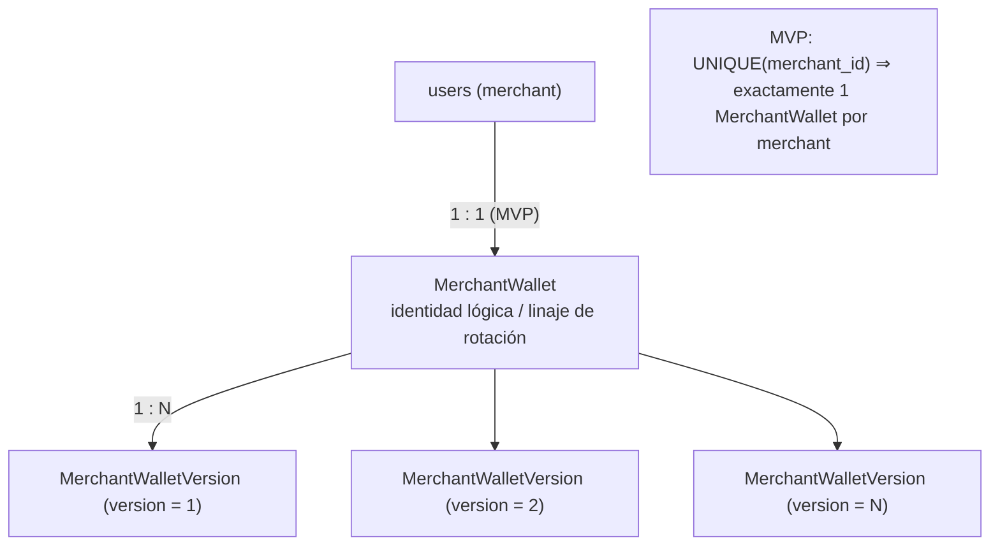
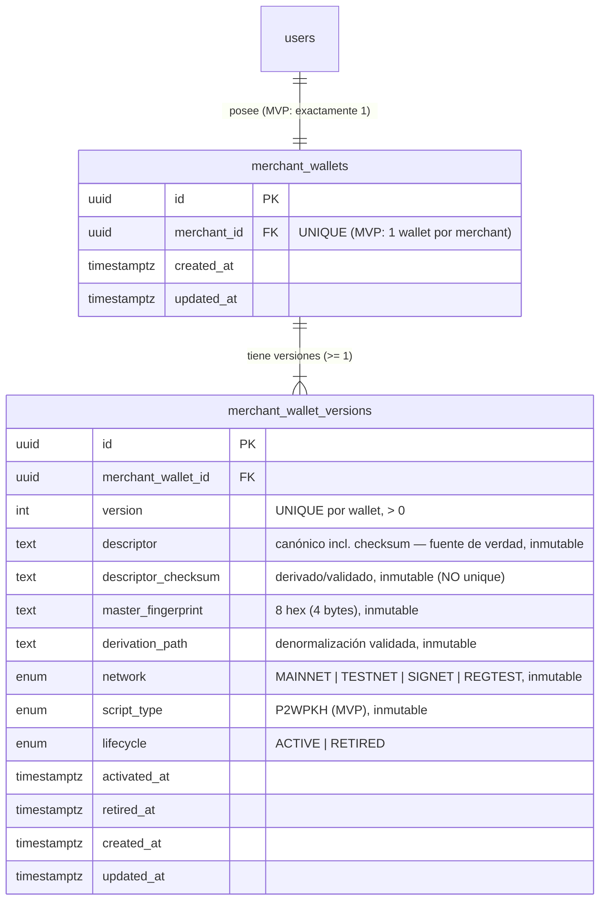
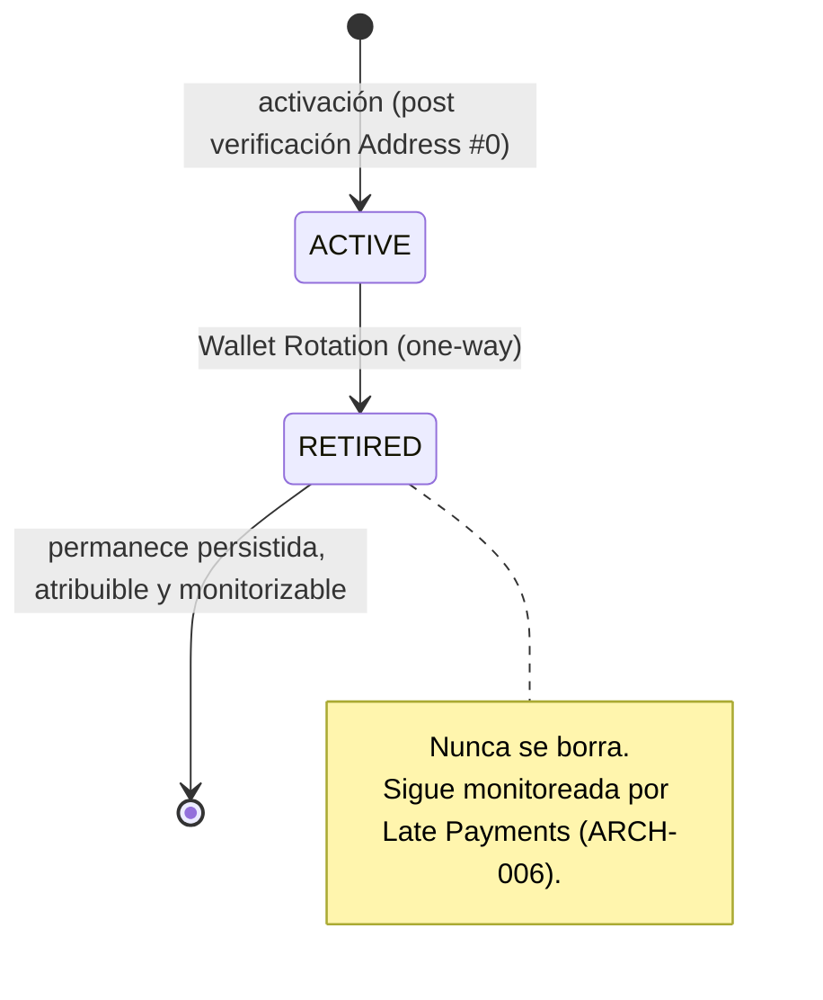
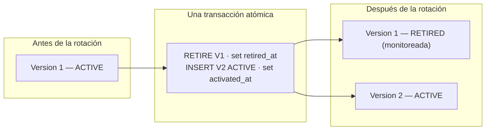
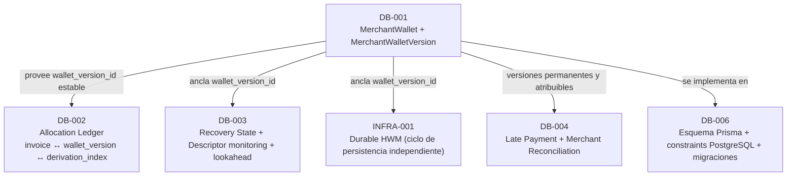

# DB-001 — Merchant Wallet + Wallet Versions

> Documento de diseño de persistencia de base de datos. Consolida las decisiones **D1–D16**, aprobadas por los owners del proyecto. Construye sobre las decisiones aprobadas [ARCH-001](./14-architecture-decisions.md) … [ARCH-006](./ARCH-006-late-payments-reconciliation.md) y **no** las rediseña.

- **Estado del diseño:** **Aprobado** (D1–D16). *(Aprobado (diseño); implementación pendiente.)*
- **Estado de implementación:** **Pendiente**. La implementación (esquema Prisma, constraints PostgreSQL, migraciones) pertenece a **DB-006**.
- **Área:** Database. **Prioridad:** P0.

> **Distinción obligatoria.** El **diseño** de DB-001 está aprobado. La **implementación** permanece pendiente. Este documento separa explícitamente la **arquitectura target aprobada**, la **implementación actual** y el **trabajo futuro de implementación**. Ninguna afirmación de este documento debe leerse como "las tablas `MerchantWallet` / `MerchantWalletVersion` ya existen en el esquema Prisma".

---

## 1. Propósito / problema

FloweyPay es **non-custodial**: nunca almacena Seeds ni Private Keys, nunca firma, y solo persiste material **público** de la wallet del comercio para derivar y monitorear direcciones de recepción ([ARCH-001](./14-architecture-decisions.md)). La representación canónica watch-only es el **Output Descriptor** BIP84 validado por checksum.

La idea preliminar de modelar la relación como un simple `merchant ↔ xpub` es insuficiente para la arquitectura aprobada, que requiere:

- material público de wallet (Output Descriptor canónico, Fingerprint, Derivation Path, network, script type),
- **Wallet Rotation** con atribución histórica,
- un ciclo de vida por versión de wallet (`ACTIVE` / `RETIRED`),
- versiones **retiradas** que permanecen atribuibles y monitorizables ([ARCH-005 D5](./ARCH-005-index-reconciliation-recovery.md#d5--reconciliation-per-wallet-version), [ARCH-006 D12](./ARCH-006-late-payments-reconciliation.md#d12--wallet-version-attribution)),
- un ancla estable (`wallet_version_id`) que tareas posteriores (DB-002/003/004, INFRA-001) puedan referenciar.

DB-001 diseña **exactamente** esa fundación de persistencia: las entidades **`MerchantWallet`** y **`MerchantWalletVersion`**. No implementa asignación de índices, recovery state, Durable HWM ni Late Payments (ver [§ 15](#15-límites-explícitos-con-db-002003004006-e-infra-001)).

## 2. Alcance

**Dentro de alcance (DB-001, diseño aprobado):**

- La entidad **`MerchantWallet`** (identidad lógica estable / linaje de rotación).
- La entidad **`MerchantWalletVersion`** (identidad de derivación pública inmutable + ciclo de vida).
- Material canónico del Descriptor y metadata de derivación validada (Fingerprint, Derivation Path, network, script type).
- Ciclo de vida por versión: `ACTIVE` / `RETIRED`, y timestamps de activación/retiro.
- Invariantes de inmutabilidad, unicidad y cardinalidad.
- La operación conceptual de **Wallet Rotation** atómica.

**Fuera de alcance (diferido explícitamente):** ver [§ 15](#15-límites-explícitos-con-db-002003004006-e-infra-001). En particular: Allocation Ledger e índices de derivación (DB-002), Recovery State y monitoring metadata (DB-003), Durable HWM (INFRA-001), Late Payment y conciliación (DB-004), y el esquema Prisma + constraints + migraciones (DB-006).

## 3. Relación con ARCH-001 … ARCH-006

| ARCH | Qué aporta a DB-001 |
|---|---|
| [ARCH-001](./14-architecture-decisions.md) | Non-custodial; **Output Descriptor** canónico BIP84 como fuente de verdad; solo **P2WPKH / BIP84**; verificación de Address #0 previa a la activación. |
| [ARCH-002](./14-architecture-decisions.md) | Persistencia de metadata de la wallet; **Wallet Rotation**; una dirección por invoice (la asignación de índices es DB-002, no DB-001). |
| [ARCH-003](./08-wallet-recovery.md) | **Recovery Package** (Descriptor, Fingerprint, Derivation Path, network, historial de rotación); el comercio siempre posee Seed/Keys. |
| [ARCH-004](./14-architecture-decisions.md) | Especificación funcional que enmarca onboarding, rotación y recuperación. |
| [ARCH-005](./ARCH-005-index-reconciliation-recovery.md) | El **dominio de reconciliación es la wallet version** (D5). DB-001 provee el ancla `MerchantWalletVersion.id`; **no** persiste cursor/HWM/recovery_state. Paso 1 de [D10](./ARCH-005-index-reconciliation-recovery.md#d10--implementation-order) ("Modelo de persistencia de wallet version") = DB-001. |
| [ARCH-006](./ARCH-006-late-payments-reconciliation.md) | La atribución de Late Payments requiere que cada versión sea **permanente y atribuible** (D12). DB-001 garantiza que las versiones `RETIRED` no se borran. |

DB-001 **no** reabre ni redefine ninguna decisión ARCH; solo materializa el modelo de persistencia que esas decisiones presuponen.

## 4. Implementación actual vs diseño target

> Verificado en modo solo lectura contra [`packages/db/prisma/schema.prisma`](../../packages/db/prisma/schema.prisma). **No** se modificó el esquema.

| Área | Implementación actual (verificada) | Diseño target DB-001 (aprobado) |
|---|---|---|
| Origen de direcciones | Una **única wallet compartida** de Bitcoin Core vía `getnewaddress` (custodial hoy). | Derivación non-custodial por **wallet version** a partir del Descriptor del comercio (habilitada tras ARCH-005/DB-002). |
| Persistencia de dirección | `payments.btc_address` como string suelto, sin linaje de wallet. | Direcciones atribuibles a una `MerchantWalletVersion` (relación diseñada en **DB-002**, no en DB-001). |
| Merchant ↔ wallet | No existe entidad de wallet; el merchant es `users` (referenciado como `creator_id`). | `users` → **`MerchantWallet`** → **`MerchantWalletVersion`**. |
| Descriptor | No se persiste ningún Output Descriptor. | `descriptor` canónico (incl. checksum) como fuente de verdad. |
| Versionado / rotación | No existe. | Versiones inmutables + `ACTIVE`/`RETIRED` + rotación atómica. |
| Allocation Ledger / HWM / recovery state | No existen. | **Fuera de DB-001** (DB-002 / INFRA-001 / DB-003). |

> **No se afirma que estas estructuras ya existan.** DB-001 es **diseño target aprobado**; la implementación (DB-006) permanece pendiente.

## 5. Modelo de datos conceptual aprobado





> **Modelo conceptual, no implementación.** Los nombres de tablas/columnas/enums son ilustrativos; la forma exacta en Prisma/PostgreSQL es trabajo de **DB-006**.

## 6. MerchantWallet

Representa la **identidad lógica estable** de la wallet de un comercio y el **linaje de Wallet Rotation**. Sobrevive a las rotaciones: las versiones aparecen y se retiran, pero la identidad lógica permanece. Es también el ancla natural del *historial de rotación* que exige el Recovery Package ([ARCH-003](./08-wallet-recovery.md#81-recovery-package-arch-003)).

| Campo | Descripción |
|---|---|
| `id` | UUID. Identidad estable de la wallet lógica, independiente de la rotación. |
| `merchant_id` | FK → `users(id)`. Propiedad del comercio. **MVP:** `UNIQUE(merchant_id)` (D2). |
| `created_at` / `updated_at` | Auditoría. |

Deliberadamente **no** contiene Descriptor, network ni script type: esos datos son por versión y cambian en la rotación.

## 7. MerchantWalletVersion

Representa la **identidad de derivación pública inmutable** de cada versión de la wallet, más su ciclo de vida.

| Campo | Descripción |
|---|---|
| `id` | UUID. Ancla estable referenciada por DB-002/003/004 e INFRA-001. |
| `merchant_wallet_id` | FK → `merchant_wallets(id)`. Pertenencia al linaje. |
| `version` | Entero secuencial por wallet, `> 0`, legible por humanos (D9). `UNIQUE(merchant_wallet_id, version)`. |
| `descriptor` | **Output Descriptor** canónico BIP84 **incluyendo checksum**. Fuente de verdad (D4). `UNIQUE(descriptor)` global (D13). |
| `descriptor_checksum` | Checksum derivado/validado del Descriptor; metadata de conveniencia/auditoría (D4). **No** es un identificador único (**no** `UNIQUE`). |
| `master_fingerprint` | Master Fingerprint de 4 bytes (8 caracteres hex en minúsculas). Validado contra la key-origin del Descriptor (D5). |
| `derivation_path` | Derivation Path BIP84 (`m/84'/coin_type'/account'/0/*`) como denormalización validada; el Descriptor sigue siendo la fuente de verdad (D6). |
| `network` | `MAINNET` / `TESTNET` / `SIGNET` / `REGTEST`. Validado contra el coin type del Descriptor (D7). |
| `script_type` | `P2WPKH` únicamente en el MVP (D8). |
| `lifecycle` | `ACTIVE` / `RETIRED` (D10). |
| `activated_at` | Timestamp de activación. |
| `retired_at` | Timestamp de retiro (solo cuando `RETIRED`). |
| `created_at` / `updated_at` | Auditoría. |

**No pertenecen a DB-001** (ver [§ 15](#15-límites-explícitos-con-db-002003004006-e-infra-001)): `recovery_state` (DB-003), `next_index` / cursor / `highest_ever_allocated_index` / Durable HWM (DB-002 / INFRA-001), y cualquier estado de Late Payment / conciliación (DB-004).

## 8. Descriptor como fuente de verdad canónica

- El **Output Descriptor** canónico BIP84 **incluyendo su checksum** es la **única fuente de verdad** de la identidad de derivación (D4). Forma canónica:

  ```text
  wpkh([fingerprint/84h/coin_typeh/accounth]xpub/0/*)#checksum
  ```

- `descriptor_checksum` se persiste como metadata **derivada y validada** (conveniencia y auditoría). **No** se documenta como identificador único: **no existe** `UNIQUE(descriptor_checksum)` (D4/D13).
- **XPUB / ZPUB** pueden ser **entradas de onboarding**, pero **no** son fuentes de verdad autoritativas separadas; toda entrada se normaliza al Descriptor canónico ([ARCH-001](./14-architecture-decisions.md), [03 § 3.3](./03-merchant-onboarding.md#33-validación-del-descriptor)).
- **Unicidad (D13):** el Descriptor canónico completo es **globalmente único** — `UNIQUE(descriptor)`. Un Descriptor previamente registrado en FloweyPay **no** debe convertirse silenciosamente en una nueva `MerchantWalletVersion` de otro comercio ni en una rotación posterior. Esto protege contra reutilización accidental / errores de pegado y contra problemas de privacidad/corrección.
- **Consistencia mutua (D6):** al crear/validar la versión, `descriptor`, `master_fingerprint`, `derivation_path`, `network` y `script_type` deben ser **mutuamente consistentes** con el Descriptor. No se crean autoridades independientes en conflicto.

## 9. Versionado y ciclo de vida

- **Identidad dual (D9):** cada versión tiene un `id` UUID (identidad de máquina/referencia estable) y un `version` entero secuencial (`> 0`, legible por humanos), único por wallet (`UNIQUE(merchant_wallet_id, version)`).
- **Ciclo de vida (D10):** solo dos estados — **`ACTIVE`** y **`RETIRED`**. **No** se introducen `PENDING_VERIFICATION`, `DISABLED` ni `ARCHIVED` en esta etapa. La verificación de Address #0 ocurre **antes** de persistir/activar la versión permanente ([03 § 3.4](./03-merchant-onboarding.md#34-verificación-de-address-0-obligatoria--arch-001)); si el onboarding requiere estado temporal, se diseñará por separado sin contaminar el ciclo de vida permanente.
- **Transición unidireccional:** `ACTIVE → RETIRED` es de una sola vía. Una versión `RETIRED` no vuelve a `ACTIVE`.
- **Persistencia histórica:** las versiones `RETIRED` permanecen persistidas, **atribuibles** y **monitorizables** ([ARCH-005 D5](./ARCH-005-index-reconciliation-recovery.md#d5--reconciliation-per-wallet-version), [ARCH-006 D12](./ARCH-006-late-payments-reconciliation.md#d12--wallet-version-attribution)).



## 10. Wallet Rotation atómica

La rotación crea una **nueva versión**; nunca sobrescribe la identidad de derivación de una versión existente. Operación conceptual, dentro de **una** transacción de base de datos:

1. Bloquear / serializar el dominio de rotación del `MerchantWallet`.
2. La versión existente `N` transiciona `ACTIVE → RETIRED`.
3. Se fija `retired_at`.
4. Se inserta la versión `N+1` como `ACTIVE`.
5. Se fija `activated_at`.
6. Commit atómico.

El **índice parcial único** de PostgreSQL (D3) garantiza que a lo sumo exista **una** versión `ACTIVE` por wallet; en el commit solo hay una fila `ACTIVE`, por lo que nunca se expone un estado intermedio inválido.



> **No implementar.** Esta operación es conceptual; el código y la transacción pertenecen a la implementación (DB-006 y las tareas de derivación non-custodial). Ver también [09 — Wallet Rotation](./09-wallet-rotation.md).

## 11. Inmutabilidad

Una vez **activada** una versión, su **identidad de derivación** es **inmutable** (I5):

- `descriptor`
- `descriptor_checksum`
- `master_fingerprint`
- `derivation_path`
- `network`
- `script_type`
- `version`
- `merchant_wallet_id`

Solo pueden cambiar: `lifecycle` (`ACTIVE → RETIRED`, una vía), `retired_at` y `updated_at`. La **Wallet Rotation crea una nueva versión** en lugar de mutar la identidad de derivación de una versión existente (I6). El mecanismo de enforcement (aplicación y/o trigger PostgreSQL) es trabajo de **DB-006**.

## 12. Invariantes de base de datos

- **I1.** Una `MerchantWalletVersion` pertenece exactamente a una `MerchantWallet`.
- **I2.** Una `MerchantWallet` pertenece exactamente a un merchant.
- **I3.** MVP permite exactamente **una** `MerchantWallet` lógica por merchant (`UNIQUE(merchant_id)`).
- **I4.** A lo sumo **una** `MerchantWalletVersion` `ACTIVE` por `MerchantWallet`.
- **I5.** Tras la activación, la identidad de derivación es inmutable (`descriptor`, `descriptor_checksum`, `master_fingerprint`, `derivation_path`, `network`, `script_type`, `version`, `merchant_wallet_id`).
- **I6.** La Wallet Rotation crea una **nueva** versión; nunca muta la identidad de derivación de una versión existente.
- **I7.** La transición de ciclo de vida es unidireccional: `ACTIVE → RETIRED`.
- **I8.** Las versiones `RETIRED` permanecen persistidas, atribuibles y monitorizables.
- **I9.** Nunca se persiste material de Seed ni Private Key.
- **I10.** El Descriptor canónico es la fuente de verdad; la demás metadata de derivación se valida contra él.
- **I11.** `version > 0` y único por `MerchantWallet`.
- **I12.** El Descriptor canónico completo es globalmente único (`UNIQUE(descriptor)`).
- **I13.** DB-001 no contiene cursor/índice de asignación ni Durable HWM.
- **I14.** DB-001 no contiene `recovery_state`.
- **I15.** DB-001 no contiene estado de Late Payment / conciliación.
- **I16.** Las versiones de wallet históricas/usadas no se borran físicamente (hard delete).

### 12.1 Consistencia de timestamps y valores (conceptual)

Restricciones conceptuales que DB-006 materializará (a nivel de aplicación y/o `CHECK`/índices de PostgreSQL, sin sobre-especificar aquí):

- `version > 0`.
- `descriptor` no vacío.
- Validación de formato de `master_fingerprint` (8 caracteres hex en minúsculas).
- `RETIRED` implica `retired_at IS NOT NULL`.
- `ACTIVE` implica `retired_at IS NULL`.
- `retired_at >= activated_at`.
- `network` válido y consistente con el coin type del Descriptor.
- `script_type = 'P2WPKH'` en el MVP.

## 13. Seguridad / privacidad

El material Descriptor / XPUB es **público** pero **sensible a la privacidad**: su compromiso puede exponer todo el historial de direcciones y facturación del comercio ([11 — Modelo de seguridad § 11.5](./11-security-model.md#115-modelo-de-privacidad)). Política MVP aprobada (D16):

- Cifrado de infraestructura / disco **en reposo**.
- **Backups cifrados**.
- Acceso a la base de datos con **privilegio mínimo**.
- Acceso de servicios **restringido**.
- **Nunca** registrar (log) el Descriptor / XPUB completo.
- **Excluir** de telemetría.
- Evitar exponer el material completo en respuestas de API genéricas.
- **Redactar** la salida de diagnóstico donde sea práctico (p. ej. Fingerprint + últimos caracteres).

El **cifrado a nivel de columna** del Descriptor queda **diferido**; podrá reconsiderarse más adelante como endurecimiento de seguridad. **No** se diseña dentro de DB-001.

## 14. Estrategia de datos legacy

- Los pagos existentes creados con la **wallet compartida** de Bitcoin Core **no** deben representarse mediante una wallet version sintética sin Descriptor (D14). Introducir una versión sin Descriptor violaría las invariantes estrictas de DB-001 (`descriptor` no vacío, `P2WPKH`, unicidad).
- La futura atribución en **DB-002** debe permitir `wallet_version_id = NULL`, con semántica explícita: **"pago creado antes de que existiera la atribución de wallet non-custodial"**.
- Esto mantiene las invariantes de DB-001 estrictas y la migración **aditiva primero**.
- **DB-001 no modifica `Payment`** (la relación se diseña en DB-002). La migración concreta pertenece a **DB-006**.

## 15. Límites explícitos con DB-002/003/004/006 e INFRA-001



| Tarea | Posee (fuera de DB-001) |
|---|---|
| **DB-002** | Allocation Ledger; relación `invoice ↔ wallet_version ↔ derivation_index`; el FK de `Payment` a la wallet version; semántica de `wallet_version_id = NULL` legacy. |
| **DB-003** | `recovery_state` (`READY / RECOVERY_REQUIRED / RECONCILING / RECOVERY_FAILED`); metadata de descriptor monitoring y lookahead. |
| **INFRA-001** | Durable HWM (`highest_ever_allocated_index`) con ciclo de persistencia **independiente** del rollback de la DB operativa. |
| **DB-004** | Persistencia de Late Payment y de conciliación del comercio (timing/amount, acciones auditables). |
| **DB-006** | Esquema Prisma, constraints PostgreSQL (incl. el índice parcial único), triggers de inmutabilidad y migraciones. |

DB-001 **solo** provee el `wallet_version_id` estable que estas tareas referencian. No debe duplicar ni pre-resolver ninguna de ellas.

## 16. Brecha de implementación actual (Current Implementation Gap)

Estado **verificado** contra el repositorio (solo lectura; **no** se modificó código ni esquema). Hoy FloweyPay todavía:

- obtiene direcciones desde **una única wallet compartida** de Bitcoin Core usando `getnewaddress`,
- almacena `btc_address` directamente en `Payment`,
- **no** tiene tabla `MerchantWallet`,
- **no** tiene tabla `MerchantWalletVersion`,
- **no** persiste ningún Output Descriptor,
- **no** tiene atribución por wallet version,
- **no** tiene Allocation Ledger,
- **no** tiene Durable HWM,
- **no** tiene recovery state.

Esto es **implementación actual**. DB-001 es **diseño target aprobado**. **No** debe afirmarse que estas estructuras de base de datos ya están implementadas.

## 17. Implicaciones de implementación / trabajo futuro

Trabajo de implementación que **probablemente** se derive de DB-001 (no se implementa aquí; el orden/número exacto de PRs puede variar), gobernado por **DB-006** y por el orden de [ARCH-005 D10](./ARCH-005-index-reconciliation-recovery.md#d10--implementation-order):

1. Materializar `merchant_wallets` y `merchant_wallet_versions` en el esquema Prisma.
2. Añadir el **índice parcial único** de PostgreSQL para la invariante de una sola versión `ACTIVE` (I4).
3. Añadir los `CHECK`/validaciones de consistencia (§ 12.1) y el enforcement de inmutabilidad (§ 11).
4. Migración **aditiva** que no toque `Payment` (la atribución es DB-002).

Precede obligatoriamente a la habilitación de la asignación de direcciones non-custodial en producción (ARCH-005 D10). DB-001 es el **paso 1** de esa precedencia ("Modelo de persistencia de wallet version").

## 18. Tabla de decisiones aprobadas D1–D16

| # | Decisión | Resumen aprobado |
|---|---|---|
| **D1** | Table topology | Dos entidades: `MerchantWallet` (identidad lógica / linaje de rotación) → `MerchantWalletVersion` (identidad de derivación pública inmutable). |
| **D2** | MVP wallet cardinality | Exactamente **una** `MerchantWallet` por merchant (`UNIQUE(merchant_id)`); multi-wallet **no** es parte del MVP. |
| **D3** | Active version invariant | A lo sumo **una** versión `ACTIVE` por wallet; DB-enforced con índice parcial único (`WHERE lifecycle = 'ACTIVE'`); la app sola no basta. Implementación en DB-006. |
| **D4** | Canonical wallet material | El **Output Descriptor** canónico BIP84 **incl. checksum** es la fuente de verdad; `descriptor_checksum` es metadata derivada/validada, **no** identificador único. |
| **D5** | Master fingerprint | Persistido independientemente; 8 hex (4 bytes); validado contra la key-origin del Descriptor; inmutable tras activación. |
| **D6** | Derivation path | Persistido como denormalización validada; el Descriptor es la fuente de verdad; `descriptor`/`fingerprint`/`derivation_path`/`network`/`script_type` mutuamente consistentes. |
| **D7** | Network | Persistido explícitamente (`MAINNET/TESTNET/SIGNET/REGTEST`); validado contra el coin type; errores cross-network fallan validación. |
| **D8** | Script type | Persistido explícitamente; **P2WPKH** únicamente en MVP; sin Taproot/Multisig/Lightning. |
| **D9** | Wallet version identity | `id` UUID + `version` entero secuencial (`> 0`, `UNIQUE(merchant_wallet_id, version)`); rotación crea `N+1`; nunca se sobrescribe. |
| **D10** | Lifecycle | Solo `ACTIVE` / `RETIRED`; sin `PENDING_VERIFICATION`/`DISABLED`/`ARCHIVED`; `ACTIVE → RETIRED` one-way; `RETIRED` permanece atribuible/monitorizable. |
| **D11** | Recovery state | **No** pertenece a DB-001; DB-001 provee `MerchantWalletVersion.id` como ancla; DB-003 diseña `READY/RECOVERY_REQUIRED/RECONCILING/RECOVERY_FAILED` + monitoring. |
| **D12** | Derivation index / cursor / HWM | DB-001 **no** persiste `next_index`/`next_address_index`/`last_allocated_index`/`derivation_cursor`/`address_count`/`highest_ever_allocated_index`/Durable HWM; pertenecen a DB-002/INFRA-001. |
| **D13** | Descriptor uniqueness | Descriptor canónico completo **globalmente único** (`UNIQUE(descriptor)`); **no** `UNIQUE(descriptor_checksum)`. |
| **D14** | Legacy payment attribution | Los pagos legacy no se representan con una wallet version sintética sin Descriptor; DB-002 permitirá `wallet_version_id = NULL` con semántica explícita; DB-001 no modifica `Payment`. |
| **D15** | Deletion policy | Las versiones permanentes/usadas nunca se borran; `RETIRED` reemplaza al borrado; `MerchantWallet` permanece si tiene historial de versiones. |
| **D16** | Descriptor security / encryption | MVP: cifrado en reposo/backups, privilegio mínimo, acceso restringido, no loguear/telemetrizar/exponer el Descriptor completo, redacción de diagnósticos; cifrado a nivel de columna **diferido**. |

---

**Relacionado:** [README.md](./README.md) · [ADR.md](./ADR.md) · [DECISIONS.md](./DECISIONS.md) · [CHANGELOG.md](./CHANGELOG.md) · [14 — Decisiones de arquitectura](./14-architecture-decisions.md) · [15 — Roadmap futuro](./15-future-roadmap.md) · [16 — Glosario](./16-glossary.md) · [ARCH-005](./ARCH-005-index-reconciliation-recovery.md) · [ARCH-006](./ARCH-006-late-payments-reconciliation.md) · [03 — Onboarding](./03-merchant-onboarding.md) · [08 — Wallet Recovery](./08-wallet-recovery.md) · [09 — Wallet Rotation](./09-wallet-rotation.md).
