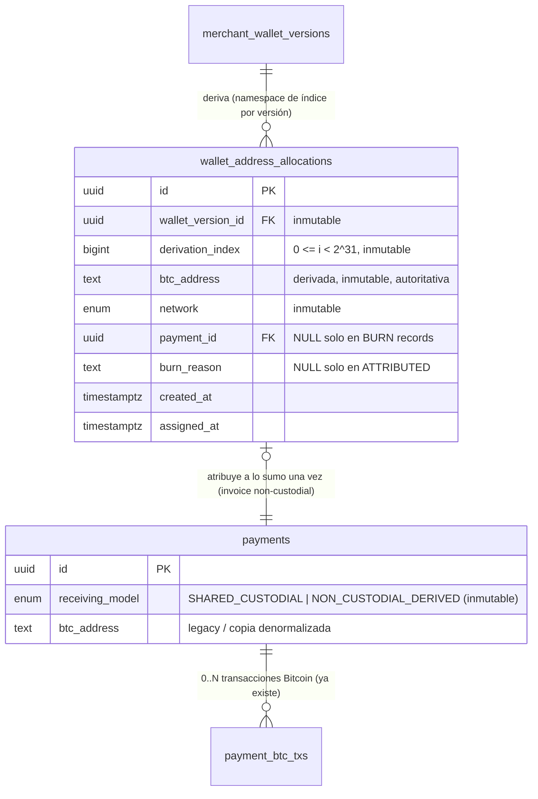
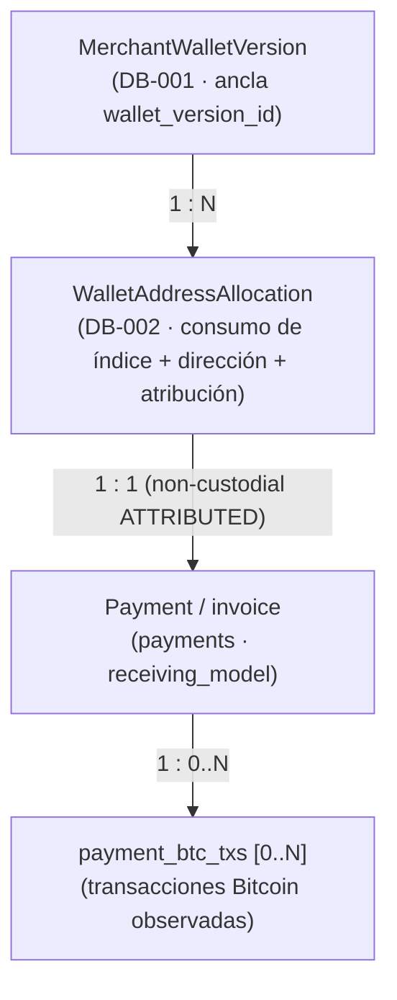
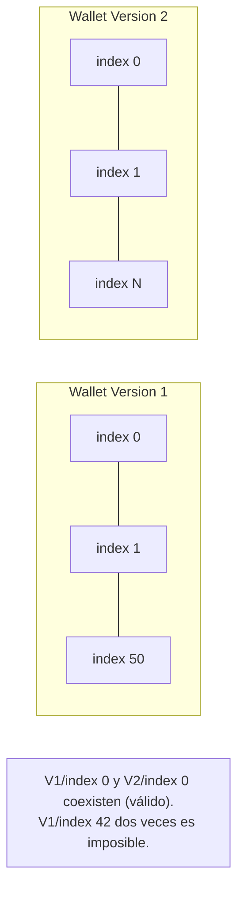
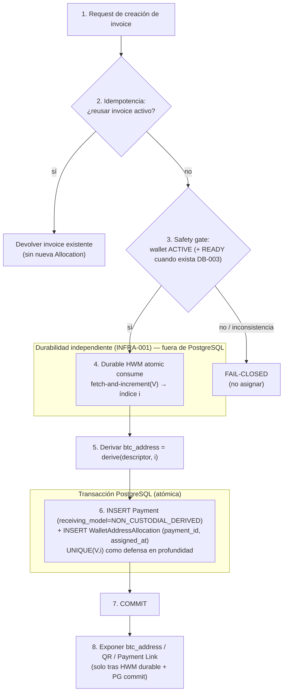
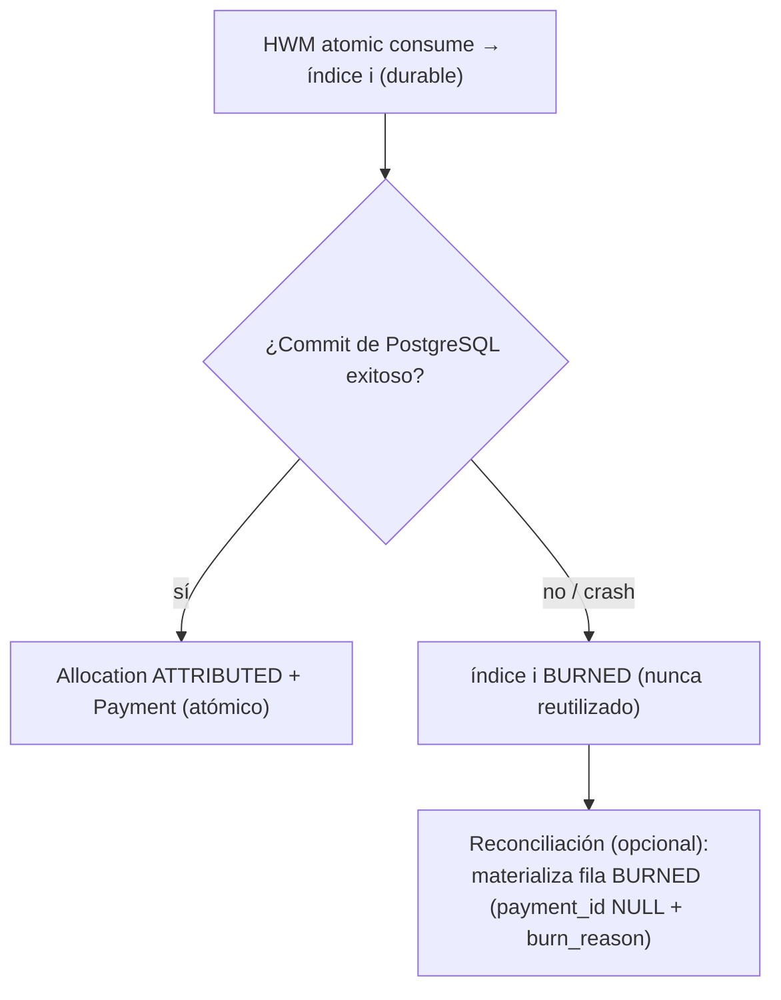
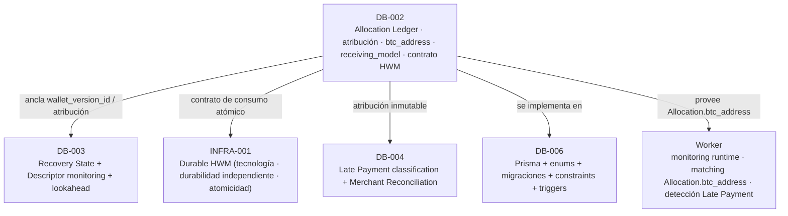

# DB-002 — Allocation Ledger

> Documento de diseño de persistencia de base de datos. Consolida las decisiones **D1–D17**, aprobadas por los owners del proyecto. Construye sobre las decisiones aprobadas [ARCH-001](./14-architecture-decisions.md) … [ARCH-006](./ARCH-006-late-payments-reconciliation.md) y sobre [DB-001](./DB-001-merchant-wallet-wallet-versions.md), y **no** las rediseña.

- **Estado del diseño:** **Aprobado** (D1–D17). *(Aprobado (diseño); implementación pendiente.)*
- **Estado de implementación:** **Pendiente**. La implementación (esquema Prisma, constraints PostgreSQL, migraciones, triggers de inmutabilidad) pertenece a **DB-006**. La tecnología del **Durable HWM** pertenece a **INFRA-001**.
- **Área:** Database. **Prioridad:** P0.

> **Distinción obligatoria.** El **diseño** de DB-002 está aprobado. La **implementación** permanece pendiente. Este documento separa explícitamente la **arquitectura target aprobada**, la **implementación actual** y el **trabajo futuro de implementación**. Ninguna afirmación de este documento debe leerse como "la tabla `WalletAddressAllocation`, el campo `receiving_model`, el **Durable HWM** o su operación atómica ya existen".

---

## 1. Propósito / problema

DB-002 diseña la persistencia operativa de la relación:

```text
invoice/payment  ↔  wallet_version  ↔  derivation_index  ↔  btc_address
```

FloweyPay es **non-custodial** y deriva **una dirección de recepción única por invoice** con índices de derivación **forward-only** que **nunca** se reutilizan ([ARCH-002](./14-architecture-decisions.md)). [DB-001](./DB-001-merchant-wallet-wallet-versions.md) diseñó la fundación de identidad de wallet (`MerchantWallet` → `MerchantWalletVersion`) pero **deliberadamente no** persiste ningún cursor, `next_index`, `last_allocated_index` ni **Durable HWM** ([DB-001 D12](./DB-001-merchant-wallet-wallet-versions.md#18-tabla-de-decisiones-aprobadas-d1d16)).

DB-002 posee ahora el **Allocation Ledger**: la evidencia operativa y de auditoría en PostgreSQL de **qué índice de derivación fue consumido, para qué wallet version, con qué dirección derivada y atribuido a qué invoice**.

### 1.1 Principio de seguridad central

> Un índice de derivación que alguna vez fue **durablemente consumido** para una Wallet Version **NUNCA** debe volver a asignarse. Nunca.

Un índice **saltado/quemado (burned)** es aceptable. Un índice **reutilizado** no lo es. Por lo tanto:

> **SAFETY > INDEX DENSITY.**

La expiración de un invoice, su cancelación, un fallo, un rollback de PostgreSQL, una restauración de backup, un reintento, una **Wallet Rotation** o una recuperación **NUNCA** deben volver a poner un índice consumido a disposición para reasignación.

## 2. Alcance

**Dentro de alcance (DB-002, diseño aprobado):**

- La entidad conceptual **`WalletAddressAllocation`**: consumo irrevocable de índice de derivación + dirección derivada + atribución al invoice.
- La relación `Payment ↔ MerchantWalletVersion ↔ derivation_index`.
- La autoridad de persistencia de `btc_address` para el modelo non-custodial.
- El discriminador conceptual `receiving_model` de `Payment` (`SHARED_CUSTODIAL` / `NON_CUSTODIAL_DERIVED`).
- Las invariantes operativas de asignación (never-reuse, inmutabilidad, append-only).
- El **contrato** del **Durable HWM** (no su tecnología).
- La semántica de crash y fail-closed del protocolo de asignación.

**Fuera de alcance (diferido explícitamente):** ver [§ 25](#25-límites-de-alcance). En particular: `recovery_state` y descriptor monitoring/lookahead (DB-003), la **tecnología** del Durable HWM y su durabilidad independiente (INFRA-001), la clasificación de Late Payment y la conciliación del comercio (DB-004), y el esquema Prisma + enums + constraints + triggers + migraciones (DB-006).

## 3. Relación con ARCH-005 / ARCH-006 y DB-001

| Fuente | Qué aporta / restringe a DB-002 |
|---|---|
| [DB-001 D1/D9](./DB-001-merchant-wallet-wallet-versions.md) | Ancla estable `MerchantWalletVersion.id`; las versiones `RETIRED` nunca se borran. DB-002 referencia `MerchantWalletVersion.id`; **no** mueve campos de asignación hacia `MerchantWalletVersion`. |
| [DB-001 D12](./DB-001-merchant-wallet-wallet-versions.md) | DB-001 **no** persiste índice/cursor/HWM; DB-002 posee el Allocation Ledger operativo, INFRA-001 el Durable HWM. |
| [DB-001 D14](./DB-001-merchant-wallet-wallet-versions.md) | Los pagos legacy no reciben una wallet version sintética sin Descriptor; DB-002 los distingue con `receiving_model = SHARED_CUSTODIAL` y `WalletAddressAllocation` ausente. |
| [ARCH-005 D1/D2](./ARCH-005-index-reconciliation-recovery.md#d2--allocation-ledger--durable-high-water-mark) | **Allocation Ledger** (DB operativa, auditoría) y **Durable HWM** (durabilidad independiente) son **complementarios**; el ledger **no** es la autoridad de recuperación. |
| [ARCH-005 D4](./ARCH-005-index-reconciliation-recovery.md#d4--fail-closed-recovery-policy) | **Fail-closed**: sin `safe_next_index` probado, se bloquea la asignación. |
| [ARCH-005 D5/D6](./ARCH-005-index-reconciliation-recovery.md#d5--reconciliation-per-wallet-version) | Dominio de reconciliación = wallet version; solo `ACTIVE` (+ `READY` cuando exista DB-003) asigna. |
| [ARCH-006 D6/D12](./ARCH-006-late-payments-reconciliation.md#d12--wallet-version-attribution) | N transacciones por invoice; cada Late Payment permanece atribuible a invoice original + dirección derivada + wallet version original. DB-002 provee esa **atribución inmutable**; **no** clasifica Late Payments. |

DB-002 **no** reabre ni redefine ninguna decisión ARCH ni DB-001; solo materializa el Allocation Ledger que esas decisiones presuponen.

## 4. Implementación actual vs diseño target

> Verificado en modo solo lectura contra el repositorio. **No** se modificó código, esquema ni migraciones.

| Área | Implementación actual (verificada) | Diseño target DB-002 (aprobado) |
|---|---|---|
| Origen de direcciones | `getnewaddress("invoice","bech32")` sobre una **única wallet compartida** de Bitcoin Core ([`bitcoinRpc.ts`](../../apps/web/app/api/_lib/bitcoinRpc.ts)). | Derivación non-custodial `derive(descriptor, i)` por wallet version; índice consumido vía **Durable HWM** atómico. |
| Persistencia de dirección | `payments.btc_address` (string, nullable, no único). | `WalletAddressAllocation.btc_address` **autoritativa**; `payments.btc_address` como copia denormalizada / legacy. |
| Consumo de índice | No existe índice de derivación; la wallet compartida gestiona sus claves internamente. | `WalletAddressAllocation.derivation_index` con `UNIQUE(wallet_version_id, derivation_index)` + **Durable HWM** monotónico. |
| Atribución a wallet version | No existe. | FK `WalletAddressAllocation.wallet_version_id → MerchantWalletVersion.id`. |
| Discriminador de custodia | No existe; todos los pagos usan la wallet compartida. | `payments.receiving_model` (`SHARED_CUSTODIAL` / `NON_CUSTODIAL_DERIVED`), inmutable. |
| Idempotencia de creación de invoice | Reutiliza el invoice activo del `payment_link` en la ventana de rate lock; `pg_advisory_xact_lock` por `(payment_link, ventana)` ([`start/route.ts`](../../apps/web/app/api/public/payment-links/%5Btoken%5D/start/route.ts)). | Se conserva; la unicidad de índice **concurrente** proviene del consumo atómico del HWM, con `UNIQUE(V,index)` como defensa en profundidad. |
| Matching del Worker | Coincidencia por **dirección exacta** contra `payments.btc_address` ([`rawtxHandler.ts`](../../apps/worker/src/handlers/rawtxHandler.ts), [`watchlist.ts`](../../apps/worker/src/watchlist.ts)). | Migrará (tarea Worker) a `WalletAddressAllocation.btc_address → Payment`, preservando la detección de Late Payments a versiones `RETIRED`. |
| Quema implícita de direcciones | El código actual **ya** puede quemar una dirección: `getnewaddress` tiene éxito y luego la creación/persistencia del `Payment` falla o se descarta por la reutilización del invoice activo (la dirección obtenida por RPC no se persiste). | DB-002 formaliza esa quema: tras consumir el HWM, un índice no completado queda **BURNED** y nunca se reutiliza. |

> **No se afirma que estas estructuras ya existan.** DB-002 es **diseño target aprobado**; la implementación (DB-006 / INFRA-001) permanece pendiente.

## 5. Qué significa "Allocation Ledger" (D15)

**Allocation Ledger** significa: **una fila terminal e inmutable por índice de derivación consumido**, representada en PostgreSQL. **No** es un log de eventos ni un sistema event-sourced; **no** hay múltiples eventos de ciclo de vida por asignación.

- Cada fila es un **hecho terminal**: `ATTRIBUTED` o `BURNED` (ver [§ 9](#9-semántica-attributed-vs-burned)).
- La reconciliación **PUEDE añadir** una fila `BURNED` permanente para un índice que el **Durable HWM** prueba como consumido pero que no tiene atribución de `Payment` sobreviviente en PostgreSQL.
- El ledger aporta **trazabilidad y auditoría** operativa; la **autoridad durable** de never-reuse es el **Durable HWM** (ARCH-005 D2), no el ledger.

## 6. Modelo de datos conceptual aprobado



Relación conceptual de extremo a extremo:



> **Modelo conceptual, no implementación.** Los nombres de tablas/columnas/enums son ilustrativos; la forma exacta en Prisma/PostgreSQL es trabajo de **DB-006**.

## 7. Campos de `WalletAddressAllocation`

| Campo | Descripción |
|---|---|
| `id` | UUID. Identidad estable de la fila de asignación. |
| `wallet_version_id` | FK → `MerchantWalletVersion.id` (DB-001). Namespace de índice + atribución permanente (sobrevive a la rotación). **Inmutable** (D16). |
| `derivation_index` | Índice de derivación non-hardened. Representación conceptual **BigInt**; `0 <= derivation_index < 2^31` (D5). **Inmutable** (D16). |
| `btc_address` | Dirección de recepción derivada determinísticamente de `descriptor` + `derivation_index`. **Autoritativa** para el modelo non-custodial (D7); re-derivable para verificación/recovery. **Inmutable** (D16). |
| `network` | `MAINNET` / `TESTNET` / `SIGNET` / `REGTEST`. Denormalizada para matching y validación. **Inmutable** (D16). |
| `payment_id` | FK → `payments.id`. Presente en asignaciones `ATTRIBUTED`; **`NULL` únicamente** en un **BURN record** materializado por reconciliación (D3/D4). Escrito en el `INSERT` atómico e **inmutable** después (D16). |
| `burn_reason` | Motivo de la quema. Presente **únicamente** en filas `BURNED`; `NULL` en `ATTRIBUTED` (D4). Escrito en el `INSERT` de reconciliación e **inmutable** después (D16). |
| `created_at` | Timestamp de creación de la fila (commit; conceptualmente posterior al avance del HWM). |
| `assigned_at` | Timestamp de atribución. En el path atómico normal coincide con `created_at`; para filas `BURNED` es `NULL`/no aplica. |

**Constraints conceptuales** (materializadas por DB-006; **no** implementadas aún):

```sql
CHECK (derivation_index >= 0 AND derivation_index < 2147483648)

CHECK ( (payment_id IS NOT NULL) <> (burn_reason IS NOT NULL) )   -- XOR: ATTRIBUTED xor BURNED

UNIQUE (wallet_version_id, derivation_index)   -- never-reuse por wallet version (D6)
UNIQUE (payment_id)                            -- a lo sumo una Allocation por invoice
UNIQUE (btc_address)                           -- unicidad de dirección (D8)

FOREIGN KEY (wallet_version_id) REFERENCES merchant_wallet_versions(id)
FOREIGN KEY (payment_id)        REFERENCES payments(id)
```

> **No se afirma que estos constraints estén implementados.** Son diseño target; la materialización (incl. triggers de inmutabilidad) pertenece a DB-006.

## 8. `Payment.receiving_model` (D14)

Se extiende conceptualmente `Payment` con un discriminador **inmutable** de modelo de recepción:

| Valor | Semántica |
|---|---|
| `SHARED_CUSTODIAL` | Modelo de recepción **legacy/actual válido** desde la wallet compartida de Bitcoin Core. La `WalletAddressAllocation` **puede estar ausente** y la `MerchantWalletVersion` **puede estar ausente**; `payments.btc_address` **permanece autoritativa** para ese pago legacy. **Estado válido y esperado.** |
| `NON_CUSTODIAL_DERIVED` | Pago non-custodial derivado por wallet version. Requiere **exactamente una** `WalletAddressAllocation`. Si falta la Allocation ⇒ estado **inválido/incompleto** que exige error/reconciliación. |

`receiving_model` es el discriminador explícito que evita depender permanentemente de `created_at < cutover` para distinguir *legacy* de *corrupción* (D14). La **semántica** pertenece a DB-002; la **columna/enum/migración física** pertenece a DB-006. Los pagos legacy **no** reciben una `MerchantWalletVersion` sintética sin Descriptor, preservando [DB-001 D14](./DB-001-merchant-wallet-wallet-versions.md#18-tabla-de-decisiones-aprobadas-d1d16).

## 9. Semántica `ATTRIBUTED` vs `BURNED`

**No** se introduce una máquina de estados de reserva. No existen estados `RESERVED` / `PENDING` / `ASSIGNING`. Toda fila **committeada** del Allocation Ledger es un **hecho terminal** de exactamente una forma:

| Forma | `payment_id` | `burn_reason` | Significado |
|---|---|---|---|
| **`ATTRIBUTED`** | `NOT NULL` | `NULL` | Índice consumido y atribuido a un invoice; escrito **atómicamente** con el `Payment` (ver [§ 12](#12-protocolo-de-asignación-normal)). |
| **`BURNED`** | `NULL` | `NOT NULL` | Índice consumido probado por el **Durable HWM** pero sin atribución sobreviviente; **materializado solo por reconciliación**. Permanente. |

Invariante XOR: `CHECK ((payment_id IS NOT NULL) <> (burn_reason IS NOT NULL))`.

- En el **path normal**, una Allocation committeada **nunca** existe temporalmente sin atribución de `Payment`: Allocation y `Payment` se committean juntos (D3). El estado transitorio previo al commit es invisible bajo MVCC y desaparece en el rollback.
- Una Allocation `BURNED` **nunca** puede convertirse luego en `ATTRIBUTED`; un `Payment` **nunca** puede moverse de una Allocation a otra (D9/D16).

## 10. Namespace de índice de derivación y constraints (D5/D6)

- **Rango:** `derivation_index` es un índice non-hardened de la receive chain BIP84 (`0/*`); dominio válido `0 <= i < 2^31`. Representación conceptual **BigInt** para evitar ambigüedad en el límite superior; la representación Prisma/PostgreSQL final es de **DB-006**.
- **Never-reuse fundamental:** `UNIQUE(wallet_version_id, derivation_index)` (D6). El namespace de índices pertenece a una wallet version específica.



## 11. Autoridad de la dirección (D7/D8/D9)

- `WalletAddressAllocation.btc_address` es la **fuente autoritativa** de la dirección para pagos `NON_CUSTODIAL_DERIVED`, derivada de `derive(descriptor, derivation_index)` y **re-derivable** para verificación/recovery.
- `payments.btc_address` se **retiene** durante la transición para: pagos `SHARED_CUSTODIAL` legacy, compatibilidad hacia atrás y migración del Worker/API. Para pagos non-custodial es a lo sumo una **copia denormalizada de lectura**; **no** debe convertirse en una segunda fuente de verdad independiente. Su deprecación/eliminación eventual puede ocurrir **después** de que los consumidores en runtime migren. **DB-002 no la elimina** (D9).
- **Unicidad (D8):** `UNIQUE(btc_address)` para el modelo de red aprobado (los prefijos bech32 HRP ya codifican la red). La validación debe además garantizar compatibilidad de la dirección con la network y el Descriptor de la wallet version. Esto es integridad/defensa; la garantía primaria de never-reuse es `UNIQUE(wallet_version_id, derivation_index)`.

## 12. Protocolo de asignación normal

Orden de seguridad aprobado. La mecánica transaccional exacta puede refinarse en implementación, pero **el orden de seguridad debe conservarse**.



1. **Idempotencia.** Si la request lógica ya posee/reutiliza un invoice válido existente, se devuelve; **no** hay nueva asignación.
2. **Safety gate.** La wallet version debe estar `ACTIVE`; cuando exista DB-003, `recovery_state` debe ser `READY`. Cualquier inconsistencia HWM/reconciliación no resuelta ⇒ **fail-closed**.
3. **Durable HWM atomic consume.** La operación atómica durable e independiente por wallet version avanza el HWM y devuelve un índice único `i`. En ese momento **`i` queda irrevocablemente consumido**.
4. **Derivación.** `btc_address = derive(descriptor, i)` (determinística, sin secretos).
5. **Transacción PostgreSQL.** Persistir **atómicamente** el `Payment` (`receiving_model = NON_CUSTODIAL_DERIVED`) y la `WalletAddressAllocation` con `payment_id` y `assigned_at`. Allocation y atribución se hacen visibles **juntas**.
6. **Commit.**
7. **Exposición.** **Solo después** de la durabilidad del HWM **y** el commit de PostgreSQL se expone `btc_address` / QR / respuesta del Payment Link al cliente ([ARCH-005](./ARCH-005-index-reconciliation-recovery.md) visibilidad diferida).

Si los pasos 4–6 fallan tras el consumo del HWM, **el índice queda quemado (BURNED)** y **nunca** se reutiliza; la reconciliación **puede** materializar más tarde la fila `BURNED` faltante.

## 13. Contrato del Durable HWM (vs INFRA-001) (D10/D12)

DB-002 define **únicamente el contrato**. La **tecnología/proveedor** la selecciona y diseña **INFRA-001** (DB-002 **no** elige Redis, DynamoDB, otra base PostgreSQL, filesystem, KV en la nube, etc.).

El **Durable HWM** debe proveer, **por wallet version**:

- una operación de consumo **atómica y monotónica**, conceptualmente equivalente a **fetch-and-increment** o **compare-and-set**, que avance el HWM y devuelva un índice único consumido;
- **monotonicidad** (`highest_ever_allocated_index` nunca decrece);
- **durabilidad independiente** del rollback/restore ordinario de la base de datos operativa;
- **seguridad ante concurrencia** (callers concurrentes reciben índices distintos);
- **detección de fallos** y semántica de disponibilidad compatible con **fail-closed**.

El avance del HWM ocurre **ANTES** del commit de PostgreSQL y **ANTES** de que la dirección sea visible. Esto crea deliberadamente el modo de falla seguro: **HWM avanzado + commit de PostgreSQL fallido = índice quemado/saltado**, nunca reutilizado.

> **Precisión documental.** Una Allocation committeada en el índice `i` es **esperada por el protocolo aprobado** para implicar `HWM(V) >= i`, porque el consumo del HWM precede al commit de PostgreSQL. Sin embargo, **PostgreSQL NO es prueba autoritativa del estado del Durable HWM**. Tras corrupción, restore, intervención manual o inconsistencia, debe consultarse el **Durable HWM** real. Si PostgreSQL y el HWM discrepan: **FAIL-CLOSED / RECOVERY_REQUIRED**. No se persiste `hwm_confirmed_at` ni ningún campo de PostgreSQL que pudiera confundirse con prueba autoritativa del HWM (D17).

## 14. Magnitudes formales: `ledger_max` / `HWM` / `safe_next_index` / `candidate_index` (D11)

| Magnitud | Definición | Autoridad |
|---|---|---|
| `ledger_max(V)` | `MAX(derivation_index)` de las filas de Allocation para la wallet version `V`, o `-1` si no hay filas. | **Solo observabilidad/reconciliación.** Puede quedar rezagada tras un restore de PostgreSQL. **No** es autoridad de asignación. |
| `HWM(V)` | `highest_ever_allocated_index` durablemente consumido para `V` en el mecanismo durable independiente. | **Autoritativa**, monotónica, de consumo irreversible. |
| `safe_next_index(V)` | Siguiente índice probado seguro por la reconciliación de [ARCH-005](./ARCH-005-index-reconciliation-recovery.md). En operación `READY` sana corresponde al siguiente índice por encima del HWM autoritativo; en recovery puede además contemplar **Safety Range Burning** y evidencia reconciliada. | Autoritativa tras reconciliación. |
| `candidate_index` | Índice devuelto/aprobado por el mecanismo de asignación seguro. **Operación normal:** el consumo atómico del HWM devuelve `HWM_before_consume + 1` (y con ello el HWM avanza a ese mismo valor). **Recovery:** proviene de `safe_next_index` y debe consumirse durablemente según el protocolo del HWM antes de usarse. | Derivada del HWM/reconciliación. |

**No** se documenta `MAX(ledger.index) + 1` como autoridad de asignación (D11).

**Semántica temporal del consumo.** El candidato debe compararse contra el HWM autoritativo **antes** de su consumo. Tras el consumo atómico, el HWM **ya** avanzó hasta el candidato, de modo que `candidate_index == HWM_after_consume` (no `>`). La operación es **un único consumo atómico monotónico** (fetch-and-increment o CAS equivalente); **no** son un `GET` y luego un `SET` separados.

```text
Antes del consumo:
    candidate_index     >   HWM_before_consume     (NUNCA <= al HWM autoritativo ANTES de su consumo)

Consumo atómico normal (una sola operación monotónica):
    candidate_index     =   HWM_before_consume + 1
    HWM_after_consume   =   candidate_index

Invariantes de dominancia:
    HWM(V)              >=  ledger_max(V)           (en estado consistente)
    ledger_max(V)   >   HWM(V)   ⇒  inconsistencia ⇒ FAIL-CLOSED / RECOVERY_REQUIRED
```

Si el ledger de PostgreSQL aparenta ir **por delante** del HWM autoritativo, es una inconsistencia: la asignación **debe** fallar en cerrado y entrar en manejo de recovery/reconciliación. **No** se repara silenciosamente confiando en PostgreSQL.

## 15. Concurrencia (D12)

- La **unicidad autoritativa** de índices asignados concurrentemente proviene de la **operación atómica de consumo del HWM por wallet version**; callers concurrentes reciben índices **distintos**.
- PostgreSQL además impone `UNIQUE(wallet_version_id, derivation_index)` como **defensa en profundidad**. Una violación de unicidad aquí indica bug / estado inconsistente / doble escritura / problema de reconciliación, y **NUNCA** se maneja reutilizando el índice.
- Un `pg_advisory_xact_lock` por wallet version **puede** usarse luego como mecanismo de reducción de contención / serialización operativa (como el patrón ya presente en [`start/route.ts`](../../apps/web/app/api/public/payment-links/%5Btoken%5D/start/route.ts)), pero **no** es el mecanismo fundamental de never-reuse.

## 16. Matriz de crash / fallo

| # | Ventana | HWM | Filas PostgreSQL | Resultado del índice | ¿Reuso? |
|---|---|---|---|---|---|
| **A** | Antes del consumo del HWM | sin avanzar | ninguna | Nada consumido; reintento seguro. | No |
| **B** | HWM consumido, antes del commit PG | avanzado a `i` | ninguna (rollback) | **BURNED**; la reconciliación puede materializar la fila `BURNED`. | **No** |
| **C** | Commit PG exitoso | avanzado | Allocation + Payment atómicos | Atribuido; el reintento reutiliza el `Payment` vía idempotencia. | No |
| **D** | Restore de PostgreSQL pierde filas de Allocation | no retrocede | `ledger_max` decrece | La asignación **permanece fail-closed / `RECOVERY_REQUIRED`**; la reconciliación de [ARCH-005](./ARCH-005-index-reconciliation-recovery.md) prueba `safe_next_index`, el candidato seguro se consume durablemente según el protocolo del HWM, y la asignación se reanuda **solo** al estar `READY`. El **Durable HWM no retrocede** (`HWM >= ledger_max`); los índices faltantes en PostgreSQL siguen permanentemente consumidos/quemados. **No** se reanuda con `candidate = HWM+1` de forma inmediata. | **No** |
| **E** | HWM indisponible | — | — | **FAIL-CLOSED**; no se asigna. | No |
| **F** | Ledger de PostgreSQL por delante del HWM | — | ledger adelantado | Imposible bajo el orden aprobado sano; se trata como inconsistencia/corrupción ⇒ **FAIL-CLOSED / RECOVERY_REQUIRED**. | No |
| **G** | Callers concurrentes | fetch-and-increment | índices distintos | La operación atómica del HWM devuelve índices distintos; `UNIQUE(V,index)` como defensa en profundidad. | No |



Toda ambigüedad de durabilidad se resuelve hacia **burn / fail-closed**, nunca hacia el reuso.

## 17. Comportamiento fail-closed (D4/D10/D11)

La asignación de nuevas direcciones **DEBE** detenerse (fail-closed) cuando:

- el **Durable HWM** está indisponible o su avance atómico no puede confirmarse;
- la wallet version no está `ACTIVE` (o, cuando exista DB-003, `recovery_state != READY`);
- el ledger de PostgreSQL aparenta ir por delante del HWM, o HWM y PostgreSQL discrepan;
- existe cualquier resultado ambiguo de asignación/HWM.

Coherente con [ARCH-005 D4](./ARCH-005-index-reconciliation-recovery.md#d4--fail-closed-recovery-policy): se sacrifica disponibilidad antes que seguridad de asignación. Las operaciones de solo lectura, el monitoreo de direcciones existentes y la detección de pagos pueden continuar cuando es seguro.

## 18. Wallet Rotation

Cada wallet version posee un **namespace de índice de derivación independiente** (ver [§ 10](#10-namespace-de-índice-de-derivación-y-constraints-d5d6)). Las Allocations permanecen **permanentemente atadas a la wallet version original**; la **Wallet Rotation nunca migra Allocations históricas**. Las versiones `RETIRED` permanecen atribuibles/monitorizables conforme a [ARCH-005 D5](./ARCH-005-index-reconciliation-recovery.md#d5--reconciliation-per-wallet-version) y [ARCH-006 D12](./ARCH-006-late-payments-reconciliation.md#d12--wallet-version-attribution). `UNIQUE(wallet_version_id, derivation_index)` modela correctamente esta separación de namespaces.

## 19. Pagos legacy

| Dimensión | Legacy / implementación actual | Target non-custodial |
|---|---|---|
| `receiving_model` | `SHARED_CUSTODIAL` | `NON_CUSTODIAL_DERIVED` |
| `WalletAddressAllocation` | **Ausente** (válido) | **Requerida** |
| `MerchantWalletVersion` | Ausente | Requerida |
| Dirección autoritativa | `payments.btc_address` | `WalletAddressAllocation.btc_address` |

Los pagos legacy **no** reciben wallet versions sintéticas descriptor-less (preserva [DB-001 D14](./DB-001-merchant-wallet-wallet-versions.md#18-tabla-de-decisiones-aprobadas-d1d16)) y **no** dependen permanentemente de una fecha de cutover: `receiving_model` es el discriminador explícito. `NON_CUSTODIAL_DERIVED` + Allocation ausente ⇒ estado inválido/incompleto que exige error/reconciliación.

## 20. Múltiples transacciones Bitcoin

Se conserva la separación de dominios aprobada:

```text
Payment/invoice
    ↓ (exactamente una)
WalletAddressAllocation
    ↓ (exactamente una)
dirección de recepción derivada
    ↓ (cero o muchas)
transacciones Bitcoin que pagan esa dirección
```

**No** se crea una Allocation por transacción Bitcoin. El historial de transacciones Bitcoin permanece en [`payment_btc_txs`](../../packages/db/prisma/schema.prisma) (unicidad `(payment_id, txid, vout_index)`, ya existente) con `btc_received_sats` acumulado. Una Allocation/dirección puede recibir **cero o muchas** transacciones (ARCH-006 D6).

## 21. Atribución de Late Payments

DB-002 **no** posee la clasificación ni la conciliación de Late Payments (eso es DB-004). Provee **únicamente la atribución inmutable**:

```text
Payment  →  WalletAddressAllocation  →  MerchantWalletVersion (original)  →  derivation_index  →  btc_address
```

Un Late Payment a una dirección de una wallet version `RETIRED` permanece atribuible al `Payment`/Allocation original. **No** se añaden estados de Late Payment a `WalletAddressAllocation`; la separación de dominios de [ARCH-006](./ARCH-006-late-payments-reconciliation.md) se preserva.

## 22. Inmutabilidad / política append-only (D13/D16)

- `WalletAddressAllocation` es **efectivamente append-only**. Una Allocation **NUNCA** se borra porque su `Payment` expiró, se canceló, falló, su Payment Link expiró, su dirección no recibió BTC, o su wallet version pasó a `RETIRED`. El ciclo de vida del invoice **NUNCA** libera un índice (D13).
- **Identidad inmutable** (D16): `wallet_version_id`, `derivation_index`, `btc_address` y `network` nunca se reasignan tras el `INSERT`. Para `ATTRIBUTED`, `payment_id` se escribe en el `INSERT` atómico y es inmutable; para `BURNED`, `payment_id` permanece `NULL` para siempre y `burn_reason` se escribe en el `INSERT` e inmutable. Una Allocation `BURNED` nunca puede atarse luego a un `Payment`; un `Payment` nunca se mueve de una Allocation a otra.
- DB-006 debe imponer la inmutabilidad crítica a nivel de base de datos donde sea práctico (triggers/CHECK). DB-002 **solo** documenta la invariante.

## 23. Seguridad / privacidad (D17)

Las direcciones Bitcoin derivadas son **públicas** pero **metadata sensible a la privacidad**. Se aplican los mismos principios proporcionales aprobados para el material público de wallet ([DB-001 § 13](./DB-001-merchant-wallet-wallet-versions.md#13-seguridad--privacidad), [11 — Modelo de seguridad](./11-security-model.md)):

- acceso a la DB con **privilegio mínimo**;
- infraestructura/**backups cifrados**;
- evitar logging innecesario y fugas por telemetría;
- restringir la exposición masiva de direcciones (evitar volcados en respuestas de API genéricas);
- **redactar** salida de diagnóstico donde sea práctico.

**No** se requiere cifrado a nivel de columna en DB-002. Además: **no** se persiste `hwm_confirmed_at` ni otro campo de PostgreSQL que pudiera confundirse con prueba autoritativa del estado del Durable HWM; el HWM permanece autoritativo de forma independiente.

## 24. Invariantes de base de datos

- **I1.** `(wallet_version_id, derivation_index)` es único.
- **I2.** Una vez que el HWM consume un índice, ese índice nunca es reutilizable.
- **I3.** La identidad de la Allocation es inmutable (`wallet_version_id`, `derivation_index`, `btc_address`, `network`).
- **I4.** La expiración/cancelación/fallo de un invoice nunca libera un índice.
- **I5.** La Wallet Rotation nunca mueve Allocations históricas.
- **I6.** Un `Payment` `NON_CUSTODIAL_DERIVED` tiene exactamente una Allocation de recepción.
- **I7.** Una Allocation `ATTRIBUTED` tiene exactamente un `Payment`.
- **I8.** Una Allocation `BURNED` no tiene `Payment` y tiene `burn_reason`.
- **I9.** Una Allocation `BURNED` nunca puede volverse `ATTRIBUTED`.
- **I10.** Una Allocation/dirección puede recibir cero o muchas transacciones Bitcoin.
- **I11.** Los pagos legacy `SHARED_CUSTODIAL` pueden legítimamente no tener Allocation.
- **I12.** `NON_CUSTODIAL_DERIVED` + Allocation faltante es inválido/incompleto.
- **I13.** El Allocation Ledger de PostgreSQL **no** es la autoridad de recuperación.
- **I14.** El Durable HWM **nunca** se espeja en PostgreSQL como estado autoritativo.
- **I15.** El `candidate_index` **nunca** se selecciona desde `MAX(ledger)+1`.
- **I16.** Cualquier estado de durabilidad ambiguo se resuelve hacia burn/fail-closed, nunca hacia el reuso.
- **I17.** La dirección se expone al cliente solo tras la durabilidad del HWM y la persistencia exitosa en PostgreSQL.
- **I18.** Las filas de Allocation nunca se borran (hard delete) como parte del ciclo de vida normal.

## 25. Límites de alcance



| Tarea | Posee (fuera de DB-002) |
|---|---|
| **DB-003** | `recovery_state`; metadata de descriptor monitoring y lookahead. |
| **INFRA-001** | Tecnología/proveedor del Durable HWM; su operación atómica; durabilidad independiente; despliegue/HA. |
| **DB-004** | Clasificación de Late Payment (timing/amount) y persistencia de conciliación del comercio. |
| **DB-006** | Modelos Prisma, enums, migraciones PostgreSQL, índices únicos/parciales, triggers, CHECK, migración física legacy. |
| **Worker** | Monitoring runtime; migración del matching de `Payment.btc_address` a `Allocation.btc_address`; comportamiento de detección de Late Payment. |

DB-002 **no** resuelve ninguna de esas tareas.

## 26. Brecha de implementación actual (Current Implementation Gap)

Estado **verificado** contra el repositorio (solo lectura; **no** se modificó código ni esquema). Hoy FloweyPay todavía:

- obtiene direcciones con `getnewaddress` desde una **única wallet compartida** de Bitcoin Core ([`bitcoinRpc.ts`](../../apps/web/app/api/_lib/bitcoinRpc.ts));
- obtiene la dirección **antes** de crear el `Payment` (fuera de la transacción de creación), en [`start/route.ts`](../../apps/web/app/api/public/payment-links/%5Btoken%5D/start/route.ts), y persiste `payments.btc_address` como fuente actual de la dirección;
- **no** tiene tabla `WalletAddressAllocation`;
- **no** tiene atribución `wallet_version ↔ derivation_index`;
- **no** tiene **Durable HWM** ni operación atómica de consumo;
- **no** tiene `receiving_model`;
- empareja transacciones en el Worker contra `payments.btc_address` por dirección exacta ([`rawtxHandler.ts`](../../apps/worker/src/handlers/rawtxHandler.ts), [`watchlist.ts`](../../apps/worker/src/watchlist.ts)), descartando pagos a invoices `EXPIRED`;
- **puede ya quemar** direcciones implícitamente cuando `getnewaddress` tiene éxito pero la persistencia del `Payment` falla o se descarta por la reutilización del invoice activo.

Esto es **implementación actual**. DB-002 es **diseño target aprobado**. **No** debe afirmarse que estas estructuras ya están implementadas.

## 27. Implicaciones de implementación / trabajo futuro

Trabajo de implementación que **probablemente** se derive de DB-002 (no se implementa aquí; el orden/número exacto de PRs puede variar), gobernado por **DB-006** e **INFRA-001** y por el orden de [ARCH-005 D10](./ARCH-005-index-reconciliation-recovery.md#d10--implementation-order):

1. Materializar `wallet_address_allocations` y el enum/columna `receiving_model` en el esquema Prisma (DB-006).
2. Añadir constraints: `UNIQUE(wallet_version_id, derivation_index)`, `UNIQUE(payment_id)`, `UNIQUE(btc_address)`, el `CHECK` XOR de `ATTRIBUTED`/`BURNED`, el `CHECK` de rango del índice, y los FKs (DB-006).
3. Añadir triggers de inmutabilidad de la identidad de derivación y de `payment_id`/`burn_reason` (DB-006).
4. Diseñar e implementar el **Durable HWM** con operación atómica de consumo y durabilidad independiente (INFRA-001).
5. Implementar el protocolo de asignación seguro (HWM-consume → derive → PG commit → exponer).
6. Migrar el Worker del matching por `payments.btc_address` a `WalletAddressAllocation.btc_address → Payment`, preservando la detección de Late Payments a versiones `RETIRED`.
7. Migración **aditiva** de `Payment` (añadir `receiving_model`; los pagos existentes = `SHARED_CUSTODIAL`; **sin** wallet versions sintéticas).

Precede obligatoriamente a la habilitación de la asignación de direcciones non-custodial en producción (ARCH-005 D10).

## 28. Tabla de decisiones aprobadas D1–D17

| # | Decisión | Resumen aprobado |
|---|---|---|
| **D1** | Allocation semantics | `WalletAddressAllocation` = **consumo irrevocable** de índice de derivación por wallet version; en el path exitoso la atribución al `Payment` se escribe **atómicamente** con la Allocation; consumido por el HWM, el índice nunca se reutiliza aunque la transacción PG falle. |
| **D2** | Entity name | Entidad conceptual **`WalletAddressAllocation`** (atribución de wallet version + consumo de índice + dirección derivada + atribución al invoice). **No** es un registro de transacción Bitcoin; una Allocation/dirección puede recibir muchas transacciones. |
| **D3** | Allocation sin Payment | En el path normal, una Allocation committeada **no** existe sin atribución de `Payment` (atómicas). La reconciliación **puede** materializar una Allocation sin `Payment` cuando el HWM prueba el consumo pero no sobrevive atribución: es un **BURN record** permanente (`payment_id = NULL` + `burn_reason`). |
| **D4** | Terminal outcome model | Sin máquina de estados de reserva (`RESERVED`/`PENDING`/`ASSIGNING`). Toda fila committeada es terminal: **`ATTRIBUTED`** (`payment_id NOT NULL`, `burn_reason NULL`) **XOR** **`BURNED`** (`payment_id NULL`, `burn_reason NOT NULL`). `CHECK ((payment_id IS NOT NULL) <> (burn_reason IS NOT NULL))`. |
| **D5** | Derivation index type/range | Representación conceptual **BigInt**; `0 <= derivation_index < 2^31` (receive chain non-hardened BIP84). Representación Prisma/PostgreSQL final = DB-006. |
| **D6** | Never-reuse constraint | `UNIQUE(wallet_version_id, derivation_index)`. El namespace de índices pertenece a una wallet version; `V1/index 0` y `V2/index 0` coexisten; `V1/index 42` dos veces es imposible. |
| **D7** | BTC address persistence | Persistir `btc_address` en la Allocation; derivada de `descriptor` + `derivation_index`; **autoritativa** para el modelo non-custodial; re-derivable para verificación/recovery. |
| **D8** | BTC address uniqueness | `UNIQUE(btc_address)` para el modelo de red aprobado; validación de compatibilidad con network/Descriptor de la wallet version. |
| **D9** | `Payment.btc_address` transition | Retener para legacy/compatibilidad/migración del Worker/API; para `NON_CUSTODIAL_DERIVED` la autoridad es `Allocation.btc_address`; `Payment.btc_address` es a lo sumo copia denormalizada, **no** segunda fuente de verdad; **no** se elimina en DB-002. |
| **D10** | Durable HWM ordering | El HWM provee una operación **atómica monotónica** de consumo por wallet version (fetch-and-increment/CAS); el avance del HWM precede al commit PG y a la visibilidad de la dirección; crea el modo seguro burn/skip; la tecnología es de INFRA-001. |
| **D11** | Candidate index / HWM dominance | **No** usar `MAX(ledger.index)+1` como fuente. `ledger_max` es solo observabilidad y puede rezagarse tras restore. Normal: `candidate = previous_HWM + 1`. Recovery: `candidate = safe_next_index`. `candidate` nunca `<= HWM`; `ledger_max > HWM` ⇒ inconsistencia ⇒ fail-closed. |
| **D12** | Concurrency | La unicidad autoritativa de índices concurrentes proviene del consumo atómico del HWM por wallet version; `UNIQUE(wallet_version_id, derivation_index)` es defensa en profundidad; una violación aquí nunca se resuelve reutilizando el índice; advisory lock opcional para contención. |
| **D13** | Deletion policy | `WalletAddressAllocation` es efectivamente **append-only**; nunca se borra por expiración/cancelación/fallo/link expirado/sin BTC/`RETIRED`; el ciclo de vida del invoice nunca libera un índice; un BURN es permanente. |
| **D14** | Legacy discriminator | Discriminador inmutable `receiving_model` (`SHARED_CUSTODIAL` / `NON_CUSTODIAL_DERIVED`); `SHARED_CUSTODIAL` + sin Allocation + `Payment.btc_address` = legacy válido; `NON_CUSTODIAL_DERIVED` + Allocation faltante = inválido; sin dependencia permanente de cutover; sin wallet versions sintéticas (preserva DB-001 D14). Semántica DB-002; columna física DB-006. |
| **D15** | Ledger vs event log | Allocation Ledger = **una fila terminal/inmutable por índice consumido**; **no** event-sourced; la reconciliación puede añadir una fila BURN permanente para un índice probado por el HWM y ausente en PostgreSQL. |
| **D16** | Immutability enforcement | Identidad inmutable (`wallet_version_id`, `derivation_index`, `btc_address`, `network`); `payment_id` escrito en el INSERT atómico e inmutable (ATTRIBUTED) o `NULL` para siempre (BURNED); `burn_reason` inmutable; una BURNED nunca se vuelve ATTRIBUTED; un Payment nunca se mueve entre Allocations; enforcement DB-level en DB-006. |
| **D17** | Privacy / security | Direcciones públicas pero privacy-sensitive: privilegio mínimo, backups cifrados, evitar logging/telemetría, restringir exposición masiva, redacción de diagnósticos; sin cifrado de columna requerido; **no** persistir `hwm_confirmed_at` ni ningún campo que se confunda con prueba autoritativa del Durable HWM. |

---

**Relacionado:** [README.md](./README.md) · [ADR.md](./ADR.md) · [DECISIONS.md](./DECISIONS.md) · [CHANGELOG.md](./CHANGELOG.md) · [14 — Decisiones de arquitectura](./14-architecture-decisions.md) · [15 — Roadmap futuro](./15-future-roadmap.md) · [16 — Glosario](./16-glossary.md) · [DB-001 — Merchant Wallet + Wallet Versions](./DB-001-merchant-wallet-wallet-versions.md) · [INFRA-001 — Durable HWM](./INFRA-001-durable-hwm.md) · [ARCH-005](./ARCH-005-index-reconciliation-recovery.md) · [ARCH-006](./ARCH-006-late-payments-reconciliation.md) · [04 — Creación de Payment Link](./04-payment-link-creation.md) · [06 — Procesamiento Bitcoin](./06-bitcoin-processing.md).
