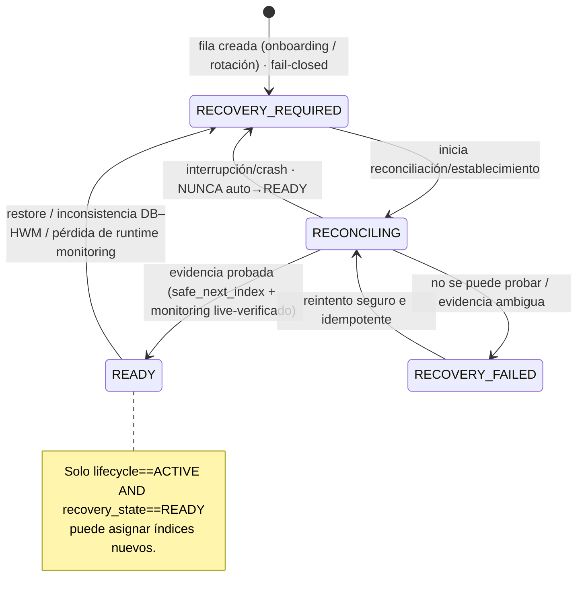
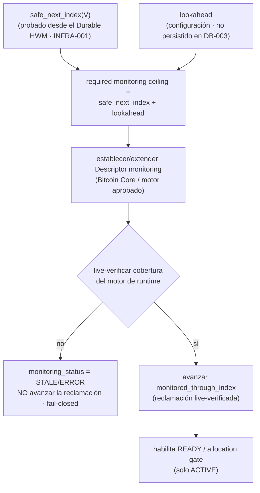
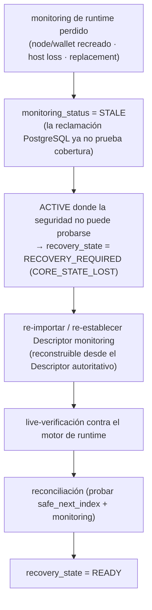
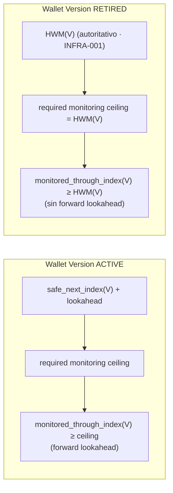
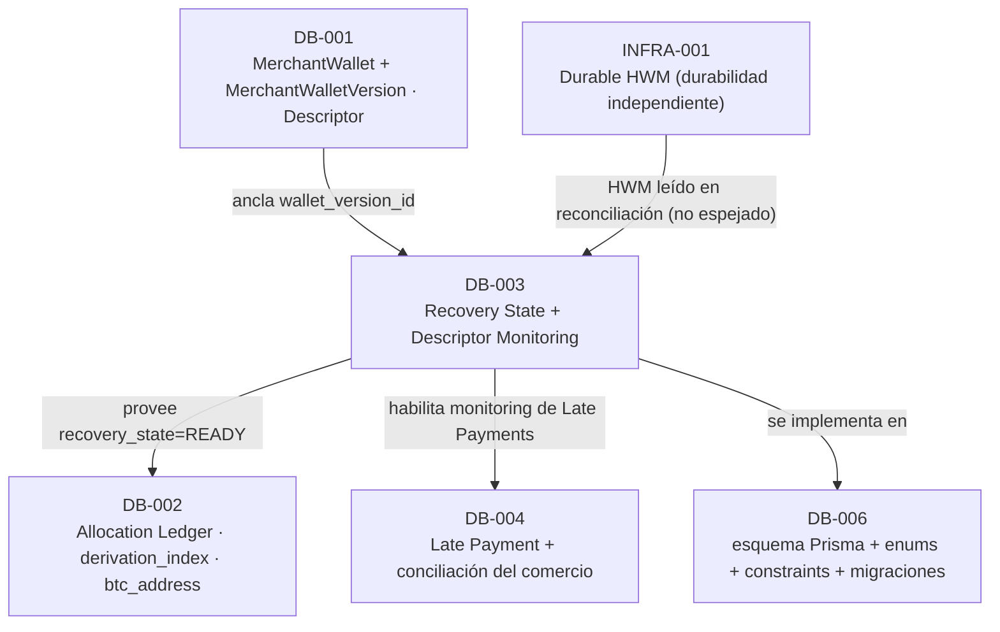

# DB-003 — Recovery State + Descriptor Monitoring Metadata

> Documento de diseño de persistencia de base de datos. Consolida las decisiones **D1–D17**, aprobadas por los owners del proyecto. Construye sobre las decisiones aprobadas [ARCH-001](./14-architecture-decisions.md) … [ARCH-006](./ARCH-006-late-payments-reconciliation.md), [DB-001](./DB-001-merchant-wallet-wallet-versions.md) y [DB-002](./DB-002-allocation-ledger.md), y **no** las rediseña.

- **Estado del diseño:** **Aprobado** (D1–D17). *(Aprobado (diseño); implementación pendiente.)*
- **Estado de implementación:** **Pendiente**. La implementación (esquema Prisma, enums, constraints PostgreSQL, migraciones, triggers) pertenece a **DB-006**. La tecnología del **Durable HWM** pertenece a **INFRA-001**. El motor de reconciliación/establecimiento y las llamadas a Bitcoin Core pertenecen a las tareas de runtime/Worker.
- **Área:** Database. **Prioridad:** P0.

> **Distinción obligatoria.** El **diseño** de DB-003 está aprobado. La **implementación** permanece pendiente. Este documento separa explícitamente la **arquitectura target aprobada**, la **implementación actual** y el **trabajo futuro de implementación**. Ninguna afirmación de este documento debe leerse como "las tablas/modelos `MerchantWalletRecoveryState` / `MerchantWalletDescriptorMonitoring` ya existen en el esquema Prisma" ni como "el motor de reconciliación/monitoring ya está implementado".

---

## 1. Propósito

DB-003 diseña la persistencia mínima P0 necesaria para responder, **por cada `MerchantWalletVersion`**:

1. ¿Es **actualmente segura** la asignación de una nueva dirección derivada?
2. ¿Se requiere **establecimiento de seguridad inicial** o **recovery/reconciliación**?
3. ¿Qué **cobertura de Descriptor monitoring** ha sido **verificada**?
4. Para una Wallet Version **ACTIVE**, ¿el monitoring de runtime está **suficientemente adelantado**?
5. Para una Wallet Version **RETIRED**, ¿el monitoring histórico es **suficientemente completo**?
6. ¿Qué estado operativo **debe sobrevivir** a reinicios de proceso/nodo?
7. ¿Cuándo **debe** FloweyPay **fail-closed**?

DB-003 introduce dos entidades operativas por wallet version: **`MerchantWalletRecoveryState`** (la **compuerta de seguridad de asignación** / *allocation-safety gate*) y **`MerchantWalletDescriptorMonitoring`** (la **reclamación de cobertura de monitoring** / *monitoring-coverage claim*).

DB-003 **no** persiste otro cursor de derivación. DB-003 **no** persiste otro HWM. DB-003 **no** posee el Descriptor canónico (eso es [DB-001](./DB-001-merchant-wallet-wallet-versions.md)).

## 2. Alcance

**Dentro de alcance (DB-003, diseño aprobado):**

- La entidad **`MerchantWalletRecoveryState`**: el `recovery_state` que, combinado con `lifecycle == ACTIVE`, actúa como compuerta de seguridad de asignación ([ARCH-005 D6](./ARCH-005-index-reconciliation-recovery.md#d6--recovery-state-machine)).
- El ciclo de vida de recovery/reconciliación: la máquina de cuatro estados, su metadata mínima de transición (`state_reason`, `state_changed_at`) y la disciplina idempotente/crash-safe.
- La entidad **`MerchantWalletDescriptorMonitoring`**: la **reclamación** re-validable del rango de índices de recepción monitoreado, su `monitoring_status`, timestamps de verificación y último error.
- La persistencia que **soporta** la verificación de la invariante de lookahead ([ARCH-005 D7](./ARCH-005-index-reconciliation-recovery.md#d7--descriptor-monitoring--lookahead)), **sin** persistir `safe_next_index` ni el Durable HWM.

**Fuera de alcance (diferido explícitamente):** ver [§ 26](#26-límites-explícitos-de-alcance). En particular: la tecnología/durabilidad del **Durable HWM** (INFRA-001); el **Allocation Ledger** y `derivation_index` (DB-002); la identidad de wallet y el `descriptor` canónico (DB-001); la clasificación de **Late Payment** y la conciliación del comercio (ARCH-006 → DB-004); el esquema Prisma + enums + constraints + triggers + migraciones (DB-006); el motor de reconciliación en runtime y las llamadas de Bitcoin Core (Worker/runtime).

## 3. Relación con ARCH-005 / ARCH-006 / DB-001 / DB-002 / INFRA-001 / DB-004 / DB-006

| Fuente | Qué aporta / restringe a DB-003 |
|---|---|
| [ARCH-005 D4](./ARCH-005-index-reconciliation-recovery.md#d4--fail-closed-recovery-policy) | **Fail-closed**: sin `safe_next_index` probado, se bloquea la asignación. DB-003 persiste la compuerta que materializa esa política. |
| [ARCH-005 D5](./ARCH-005-index-reconciliation-recovery.md#d5--reconciliation-per-wallet-version) | El dominio de reconciliación es la **wallet version**; solo `ACTIVE` asigna, las `RETIRED` se monitorean. DB-003 es por wallet version. |
| [ARCH-005 D6](./ARCH-005-index-reconciliation-recovery.md#d6--recovery-state-machine) | La **Recovery State Machine** (cuatro estados). DB-003 la persiste sin inventar estados. |
| [ARCH-005 D7](./ARCH-005-index-reconciliation-recovery.md#d7--descriptor-monitoring--lookahead) | Invariante de lookahead: `monitored_range_end ≥ safe_next_index + configurable_lookahead`. DB-003 aporta la reclamación `monitored_through_index`; el `lookahead` es configuración. |
| [ARCH-006 D7/D12](./ARCH-006-late-payments-reconciliation.md#d12--wallet-version-attribution) | Las versiones **RETIRED** permanecen monitoreadas para Late Payments. DB-003 modela su boundary de monitoring histórico. **No** clasifica Late Payments. |
| [DB-001 D10/D11](./DB-001-merchant-wallet-wallet-versions.md#18-tabla-de-decisiones-aprobadas-d1d16) | Ciclo de vida `ACTIVE`/`RETIRED`; DB-001 **defiere** `recovery_state` a DB-003 y provee el ancla `wallet_version_id`. DB-003 **no** añade columnas a `MerchantWalletVersion`. |
| [DB-002 D10/D11/D17](./DB-002-allocation-ledger.md) | El **Durable HWM** es la autoridad de consumo; PostgreSQL **no** es prueba autoritativa del HWM; **no** se persiste `hwm_confirmed_at`. DB-003 refuerza: no persistir HWM ni `safe_next_index`. |
| **INFRA-001** | Provee el **Durable HWM** (`highest_ever_allocated_index`) con durabilidad independiente. DB-003 lo **lee** durante reconciliación; **no** lo espeja. |
| **DB-004** | Posee la clasificación de Late Payment y la conciliación del comercio. DB-003 solo garantiza el **monitoring** que hace observables esos pagos. |
| **DB-006** | Materializa el esquema Prisma, enums, constraints (1:1 PK/FK), triggers e índices de DB-003. |

DB-003 **no** reabre ni redefine ninguna decisión ARCH, DB-001 ni DB-002; solo materializa el modelo de estado operativo que esas decisiones presuponen.

## 4. Implementación actual vs arquitectura target

> Verificado en modo solo lectura contra el repositorio. **No** se modificó código, esquema ni migraciones.

| Área | Implementación actual (verificada) | Diseño target DB-003 (aprobado) |
|---|---|---|
| Origen de direcciones | Una **única wallet compartida** de Bitcoin Core vía `getnewaddress` ([`bitcoinRpc.ts`](../../apps/web/app/api/_lib/bitcoinRpc.ts)); custodial hoy. | Derivación non-custodial por wallet version, con una compuerta de seguridad `recovery_state == READY` antes de asignar. |
| Recovery State | **No existe**; no hay `recovery_state` ni máquina de estados. | `MerchantWalletRecoveryState` con la máquina de cuatro estados. |
| Descriptor monitoring | Matching por **dirección exacta** contra `payments.btc_address` en memoria ([`watchlist.ts`](../../apps/worker/src/watchlist.ts), [`rawtxHandler.ts`](../../apps/worker/src/handlers/rawtxHandler.ts)); sin rango de descriptor ni lookahead. | `MerchantWalletDescriptorMonitoring` con reclamación de cobertura verificada por rango de Descriptor. |
| Motor de reconciliación | **No existe**. | Establecimiento/reconciliación por wallet version, idempotente y fail-closed (runtime; fuera de DB-003). |
| Durable HWM / Allocation Ledger | **No existen** (INFRA-001 / DB-002, diseño-only). | Leídos como autoridad durante reconciliación; **nunca** espejados en DB-003. |

> **No se afirma que estas estructuras ya existan.** DB-003 es **diseño target aprobado**; la implementación (DB-006 / INFRA-001 / runtime) permanece pendiente.

## 5. Modelo conceptual

DB-003 persiste **dos** entidades operativas separadas, cada una **1:1** con `MerchantWalletVersion` (la PK **es** la FK `wallet_version_id`).

```mermaid
erDiagram
    merchant_wallet_versions ||--|| merchant_wallet_recovery_state : "1:1 · allocation-safety gate"
    merchant_wallet_versions ||--|| merchant_wallet_descriptor_monitoring : "1:1 · monitoring-coverage claim"

    merchant_wallet_versions {
        uuid id PK "DB-001 · ancla wallet_version_id"
        enum lifecycle "ACTIVE | RETIRED (DB-001)"
    }
    merchant_wallet_recovery_state {
        uuid wallet_version_id PK_FK "1:1 con la wallet version"
        enum recovery_state "RECOVERY_REQUIRED | RECONCILING | READY | RECOVERY_FAILED"
        enum state_reason "código estructurado"
        timestamptz state_changed_at
        int lock_version "optimista"
        timestamptz reconciliation_started_at "opcional / nullable"
        timestamptz created_at
        timestamptz updated_at
    }
    merchant_wallet_descriptor_monitoring {
        uuid wallet_version_id PK_FK "1:1 con la wallet version"
        enum monitoring_status "PENDING | VERIFIED | STALE | ERROR"
        bigint monitored_through_index "nullable · CLAIM, no autoridad"
        timestamptz last_verified_at "nullable"
        text last_error "opcional · redactado"
        int lock_version "optimista"
        timestamptz created_at
        timestamptz updated_at
    }
```

> **Modelo conceptual, no implementación.** Los nombres de tablas/columnas/enums son ilustrativos; la forma exacta en Prisma/PostgreSQL es trabajo de **DB-006**. `lookahead_size`, `monitored_from_index`, `HWM`, `safe_next_index`, `import_target_through_index` y `reconciliation_run_id` **no** aparecen: por diseño **no** se persisten en P0 (ver [§ 8](#8-modelo-conceptual-merchantwalletdescriptormonitoring), [§ 12](#12-lookahead-es-configuración) y [§ 25](#25-invariantes)).

## 6. Separación: Recovery State vs Descriptor Monitoring

La separación en **dos** entidades es intencional y aprobada (**D1/D2**):

- **`MerchantWalletRecoveryState`** cambia con **poca frecuencia** y controla **si la asignación está permitida**. Es la compuerta de seguridad.
- **`MerchantWalletDescriptorMonitoring`** puede actualizarse **con más frecuencia** y representa **evidencia operativa** de monitoring.
- La metadata de monitoring **nunca** debe convertirse silenciosamente en autoridad de asignación ni en un HWM. Aislar la compuerta de las escrituras de observabilidad evita contención sobre la fila que decide la asignación y evita que un campo de monitoring se lea como prueba autoritativa.

**No** se combinan en una sola tabla/modelo.

## 7. Modelo conceptual `MerchantWalletRecoveryState`

Representa la **compuerta de seguridad de asignación** por wallet version.

| Campo | Descripción | Nullability | Mutabilidad | Autoridad |
|---|---|---|---|---|
| `wallet_version_id` | PK/FK → `MerchantWalletVersion.id`. Una fila por wallet version. | No nulo | Inmutable | Ancla (referencia) |
| `recovery_state` | `RECOVERY_REQUIRED` / `RECONCILING` / `READY` / `RECOVERY_FAILED`. Compuerta de seguridad de asignación. | No nulo | Mutable **solo** vía transiciones aprobadas | **Compuerta** (operativa) |
| `state_reason` | Código **estructurado** (ver [§ 24](#24-seguridad--privacidad)) que contextualiza la transición/estado. Observabilidad/contexto, **no** autoridad independiente. | No nulo | Cambia con la transición | Observabilidad |
| `state_changed_at` | Timestamp de la última transición committeada. | No nulo | Mutable | Observabilidad |
| `lock_version` | Contador monotónico de **concurrencia optimista**. Solo concurrencia operativa. | No nulo | Mutable | Mecanismo |
| `reconciliation_started_at` | **Opcional P0.** Detección de runs colgados. **No** es autoridad de corrección. | Nullable | Mutable | Observabilidad |
| `created_at` / `updated_at` | Auditoría estándar de persistencia. | No nulo | `updated_at` mutable | Observabilidad |

**No pertenecen a P0** (ver [§ 25](#25-invariantes)): `reconciliation_run_id` (diferido a post-MVP como conveniencia de correlación) y cualquier tabla de historial/evento de transiciones (diferida). **Nunca** se persiste aquí un HWM, `safe_next_index`, `ledger_max`, `candidate_index` ni `hwm_confirmed_at`.

## 8. Modelo conceptual `MerchantWalletDescriptorMonitoring`

Representa la **reclamación de cobertura de monitoring** por wallet version — evidencia operativa, **no** prueba durable de que el motor de monitoring en runtime aún tenga esa cobertura.

| Campo | Descripción | Nullability | Mutabilidad | Autoridad |
|---|---|---|---|---|
| `wallet_version_id` | PK/FK → `MerchantWalletVersion.id`. Una fila por wallet version. | No nulo | Inmutable | Ancla (referencia) |
| `monitoring_status` | `PENDING` / `VERIFIED` / `STALE` / `ERROR`. Estado/reclamación de monitoring; **no** prueba de runtime. | No nulo | Mutable | Reclamación (observabilidad) |
| `monitored_through_index` | Índice de recepción más alto cuya cobertura fue **live-verificada** en el momento de la reclamación. **No** es HWM ni cursor de asignación. | Nullable antes del primer establecimiento verificado | Monotónico bajo operación normal | **Reclamación**, no autoridad |
| `last_verified_at` | Timestamp de la última **verificación live** exitosa contra el motor de monitoring. Evidencia operativa / insumo de staleness; **no** autoridad. | Nullable hasta la primera verificación | Mutable | Observabilidad |
| `last_error` | **Opcional P0.** Diagnóstico operativo **redactado/sanitizado**; nunca payload RPC/excepción/secreto crudo. | Nullable | Mutable | Observabilidad |
| `lock_version` | Concurrencia optimista. Solo concurrencia operativa. | No nulo | Mutable | Mecanismo |
| `created_at` / `updated_at` | Auditoría estándar de persistencia. | No nulo | `updated_at` mutable | Observabilidad |

**No se persisten en P0** (ver [§ 12](#12-lookahead-es-configuración) y [§ 19](#19-extensión-del-rango-de-monitoring)): `monitored_from_index` (para la receive chain BIP84 su valor P0 es siempre `0`), `lookahead_size` (configuración), `import_target_through_index` (no requerido para corrección) ni `last_import_at` (observabilidad). **Absolutamente nunca** se persisten aquí: `HWM`, `safe_next_index`, `ledger_max`, `candidate_index`, `hwm_confirmed_at` ni un duplicado del Descriptor canónico.

## 9. Recovery State machine

Se adopta **exactamente** la máquina de cuatro estados de [ARCH-005 D6](./ARCH-005-index-reconciliation-recovery.md#d6--recovery-state-machine) (**D4**): `RECOVERY_REQUIRED`, `RECONCILING`, `READY`, `RECOVERY_FAILED`. **No** se inventan estados (`PENDING`, `DISABLED`, `ARCHIVED`, `INITIALIZING`, `RECOVERING`, etc. están **prohibidos**).



Invariantes de transición:

- **Fail-closed por defecto**: una fila recién creada está en `RECOVERY_REQUIRED`; `READY` **solo** se alcanza mediante un run de establecimiento/reconciliación exitoso.
- Una interrupción durante `RECONCILING` **nunca** transiciona automáticamente a `READY`. En el reinicio, un `RECONCILING` abandonado/interrumpido se normaliza a `RECOVERY_REQUIRED` con `state_reason = RECONCILE_INTERRUPTED` antes de un nuevo intento.
- `READY` **nunca** se infiere de un `READY` previo, de la metadata de monitoring de PostgreSQL, del arranque del nodo, de un `last_verified_at` viejo ni de un `monitoring_status = VERIFIED` viejo cuando la evidencia de runtime se ha vuelto inválida/ambigua.

## 10. Initial safety establishment

Una Wallet Version recién creada **no** está semánticamente "recuperándose de una pérdida". Comienza **fail-closed**:

```text
recovery_state = RECOVERY_REQUIRED
state_reason   = INITIAL_ESTABLISHMENT
```

Se reutilizan los **mismos** cuatro estados de ARCH-005 porque expresan **si** la seguridad de asignación ha sido probada, no **por qué** se necesita la prueba (**D5**). El mecanismo se denomina **establecimiento de seguridad inicial** (*initial safety establishment*) o **reconciliación/establecimiento**, no "recovery" para una wallet nueva.

Antes de la **primera** transición a `READY`, el run de establecimiento debe probar:

1. El **Durable HWM(V)** existe/es legible en su baseline inicial válido (INFRA-001).
2. `safe_next_index(V)` se **prueba** a partir de la evidencia autoritativa de recovery, **no** se asume.
3. La identidad del **Descriptor canónico** ya es válida según el onboarding/verificación de Address #0 de [DB-001](./DB-001-merchant-wallet-wallet-versions.md#9-versionado-y-ciclo-de-vida) (el establecimiento **no** re-verifica identidad).
4. El **Descriptor monitoring** ha sido **live-verificado** hasta el boundary de monitoring ACTIVE requerido ([§ 15](#15-active-monitoring-invariant)).

Solo tras probar toda la evidencia requerida puede committearse `RECONCILING → READY`. **No** se introduce ningún estado adicional para el onboarding.

## 11. Recovery / reconciliación

La **recovery/reconciliación** usa la misma máquina de estados, disparada por eventos distintos del establecimiento inicial. Disparadores típicos (reflejados en `state_reason`): restore de PostgreSQL (`DB_RESTORE`), inconsistencia DB/HWM (`HWM_INCONSISTENCY`), pérdida/recreación del estado de Bitcoin Core (`CORE_STATE_LOST`), rango de monitoring insuficiente (`MONITORING_INSUFFICIENT`), reconciliación interrumpida (`RECONCILE_INTERRUPTED`).

La reconciliación **lee** las fuentes autoritativas (Durable HWM en INFRA-001, Allocation Ledger en DB-002 como evidencia/cross-check) para **probar** `safe_next_index`, valida el monitoring live, y solo entonces transiciona a `READY`. Si no puede probarse, transiciona a `RECOVERY_FAILED` (fail-closed). DB-003 **registra el estado**; **no** resuelve la verdad subyacente del HWM/ledger (eso es INFRA-001/DB-002/motor de reconciliación).

## 12. Allocation-safety gate

Una Wallet Version puede asignar una nueva dirección de recepción derivada **solo** cuando (**D6**):

```text
wallet_version.lifecycle == ACTIVE
AND
recovery_state == READY
```

Esta compuerta es **consumida por el protocolo de asignación de [DB-002 § 12](./DB-002-allocation-ledger.md)** (paso de safety gate). Cualquier ambigüedad **debe fail-closed**. Las versiones **RETIRED** **nunca** asignan, independientemente de su Recovery State.

## 13. Descriptor monitoring semantics

`MerchantWalletDescriptorMonitoring` es una **reclamación de cobertura de monitoring** (**D10**):

- `monitoring_status = VERIFIED` es una **reclamación persistida**. Por sí sola **no** prueba que el nodo Bitcoin Core actualmente en ejecución aún tenga el Descriptor/rango importado.
- La metadata de monitoring es **evidencia operativa**. Donde la seguridad dependa de la cobertura efectiva de runtime, Bitcoin Core / el motor de monitoring actual debe **live-verificarse** ([§ 18](#18-verificación--staleness-de-monitoring)).
- `monitored_through_index` representa el índice de recepción más alto cuya cobertura fue **live-verificada al momento de la reclamación**. Es evidencia operativa, **no** el HWM ni un cursor de asignación.

## 14. Authority model

Terminología a usar de forma consistente:

| # | Concern | Owner | Término recomendado |
|---|---|---|---|
| **A** | Identidad de derivación durable | `MerchantWalletVersion` Descriptor canónico ([DB-001](./DB-001-merchant-wallet-wallet-versions.md)) | **Authoritative derivation identity** |
| **B** | Consumo irreversible durable | Durable HWM (**INFRA-001**) | **Authoritative consumption watermark** |
| **C** | Evidencia de atribución PostgreSQL | Allocation Ledger ([DB-002](./DB-002-allocation-ledger.md)) | **PostgreSQL attribution evidence** — **no** autoritativa para el HWM |
| **D** | Compuerta de seguridad operativa | `MerchantWalletRecoveryState` (DB-003) | **Allocation-safety gate** |
| **E** | Reclamación de monitoring persistida | `MerchantWalletDescriptorMonitoring` (DB-003) | **Persisted monitoring-coverage claim** — evidencia operativa, **no** prueba durable de cobertura de runtime |
| **F** | Cobertura de monitoring efectiva en runtime | Bitcoin Core / motor de monitoring aprobado | **Effective runtime monitoring engine** — debe **live-verificarse**; reconstruible; **no** autoridad durable |

La identidad de recovery durable = **A + B + C** (Descriptor + Durable HWM + Allocation Ledger). **F** es derivada y re-establecible desde **A**; nunca es autoridad durable. Ni la Recovery State (D) ni la metadata de monitoring (E) pueden convertirse silenciosamente en otro HWM autoritativo.

## 15. ACTIVE monitoring invariant

Para una Wallet Version **ACTIVE**, antes de considerar segura la asignación, el monitoring live debe satisfacer la invariante aprobada de [ARCH-005 D7](./ARCH-005-index-reconciliation-recovery.md#d7--descriptor-monitoring--lookahead) (**D7/D13**):

$$\text{monitored\_through\_index}(V)\ \ge\ \text{safe\_next\_index}(V) + \text{lookahead}$$

Esto **debe verificarse contra el motor de monitoring efectivo en runtime**. Una reclamación `VERIFIED` persistida **por sí sola es insuficiente** para establecer `READY`.



## 16. RETIRED monitoring invariant

Para una Wallet Version **RETIRED**, el boundary de monitoring se **deriva en reconciliación** a partir del **Durable HWM autoritativo** (**D7**):

$$\text{monitored\_through\_index}(V)\ \ge\ \text{HWM}(V)$$

- **No** hay requisito de lookahead hacia adelante para RETIRED, porque **nunca** asigna otra dirección.
- El boundary **no** se deriva de `safe_next_index`. La igualdad `HWM(V) = safe_next_index(V) - 1` **no** es válida en general, porque el **Safety Range Burning** de [ARCH-005 D3](./ARCH-005-index-reconciliation-recovery.md#d3--safety-range-burning) puede producir `safe_next_index(V) > HWM(V) + 1`. Por eso el boundary RETIRED se expresa **solo** en términos de `HWM(V)`.
- El boundary **no** se deriva de `MAX(Allocation.derivation_index)` ni de `ledger_max`: PostgreSQL puede ir **por detrás** del Durable HWM tras un restore/crash. `ledger_max` puede usarse **solo** como cross-check de consistencia (`ledger_max ≤ HWM`, de lo contrario fail-closed, [DB-002 D11](./DB-002-allocation-ledger.md)).
- `HWM(V)` se **lee** de INFRA-001 durante reconciliación y se **live-verifica** contra el motor de monitoring; **no** se persiste en DB-003 (**D14**).

Razón de seguridad: los Late Payments solo pueden llegar a direcciones que fueron **realmente expuestas** (allocations `ATTRIBUTED`). Bajo evidencia PostgreSQL **incompleta**, la única cota superior segura de todo índice posiblemente expuesto es `HWM(V)` — nada por encima del HWM fue jamás consumido, derivado ni expuesto. Monitorear hasta `HWM(V)` no puede sub-cubrir la superficie de Late Payments; el costo (monitorear algunos índices quemados/no expuestos) es inocuo para cobertura watch-only.

## 17. Bitcoin Core como effective runtime monitoring engine

Evitar la frase "Bitcoin Core es la verdad de runtime" cuando pueda implicar autoridad arquitectónica durable. Redacción preferida:

> **Bitcoin Core es el *effective runtime monitoring engine*, no una autoridad durable.** Su cobertura actual debe **live-verificarse** y puede **reconstruirse** desde las fuentes durables de FloweyPay reimportando el Descriptor autoritativo sobre el rango requerido.

El modelo de autoridad debe sobrevivir a: reinicio del proceso de Bitcoin Core, recreación de la wallet, reemplazo del nodo, pérdida del host, restore y reimportación del Descriptor. Bitcoin Core **no** es la fuente durable de identidad de wallet ([A](#14-authority-model), DB-001), consumo de índice ([B](#14-authority-model), INFRA-001) ni Recovery State ([D](#14-authority-model), DB-003).



## 18. Verificación / staleness de monitoring

- `monitored_through_index` avanza **únicamente** después de que el motor de monitoring efectivo haya sido verificado como cubriendo el rango reclamado (**D11**). **Nunca** se infiere la cobertura actual de Bitcoin Core solo desde PostgreSQL.
- La recreación de nodo/wallet, el reemplazo de nodo o la pérdida de host pueden invalidar el monitoring de runtime mientras PostgreSQL aún contiene una reclamación de cobertura vieja. En esos casos el monitoring debe volverse `STALE`/`ERROR` y re-establecerse.
- `last_verified_at` es un **insumo de staleness** operativo, **no** autoridad: una reclamación `VERIFIED` con `last_verified_at` antiguo puede requerir re-verificación antes de sustentar `READY`. La política de cadencia de re-verificación es de runtime/Worker, no persistencia de DB-003.

## 19. Extensión del rango de monitoring

La extensión de monitoring es **idempotentemente re-ejecutable** (**D15**). **No** se persiste `import_target_through_index` en P0.

**Procedimiento conceptual ACTIVE:**

1. derivar/reconciliar `safe_next_index` desde las entradas autoritativas;
2. leer el `lookahead` configurado;
3. calcular el ceiling requerido (`safe_next_index + lookahead`);
4. establecer/extender el Descriptor monitoring de forma declarativa;
5. **live-verificar** la cobertura efectiva de runtime;
6. **solo entonces** avanzar `monitored_through_index`.

**Procedimiento conceptual RETIRED:**

1. leer/reconciliar el `HWM(V)` autoritativo;
2. calcular el ceiling requerido = `HWM(V)`;
3. establecer/extender el Descriptor monitoring;
4. **live-verificar** la cobertura;
5. **solo entonces** avanzar `monitored_through_index`.

Si un proceso crashea a mitad de la extensión: tras el reinicio se **recalcula** el ceiling requerido desde las entradas autoritativas + configuración, se **re-ejecuta** la operación de monitoring, se **verifica** y se actualiza la reclamación. **No** se depende de un target en vuelo persistido para la corrección.

> **Requisito arquitectónico vs mecanismo técnico.** El requisito arquitectónico aprobado es: *"la operación de monitoring aprobada debe ser re-ejecutable de forma segura y live-verificable."* Cuando se describa el mecanismo técnico concreto de Bitcoin Core (p. ej. importación/extensión de rango de descriptors), debe distinguirse la **implementación/mecanismo actual** del **requisito de arquitectura**. DB-003 **no** afirma que todo comportamiento de import/range-extension sea universalmente idempotente en toda configuración de Bitcoin Core; exige que la operación aprobada sea re-ejecutable y verificable, y que la reclamación solo avance tras verificación.

## 20. Crash / restart behavior

- Establecimiento/reconciliación es **idempotente**: puede re-ejecutarse tras una interrupción sin producir estado inseguro.
- Un `RECONCILING` interrumpido tras reinicio se **normaliza** a `RECOVERY_REQUIRED` con `state_reason = RECONCILE_INTERRUPTED` **antes** de un nuevo intento; **nunca** salta a `READY`.
- La extensión de monitoring recupera recalculando el ceiling y re-ejecutando la operación de forma idempotente ([§ 19](#19-extensión-del-rango-de-monitoring)); `monitored_through_index` no over-reclama porque solo avanza tras verificación.
- La concurrencia P0 usa `lock_version` (optimista) + advisory lock por wallet version ([§ 23](#23-concurrencia--idempotencia)).

## 21. Restore y node-recreation scenarios

Para cada escenario: implicaciones de estado persistido, ¿asignación permitida?, comportamiento de monitoring, fail-closed y owner de remediación.

| # | Escenario | Estado persistido | ¿Asignación? | Monitoring | Fail-closed | Remediación (owner) |
|---|---|---|---|---|---|---|
| **A** | Startup normal, estado y cobertura consistentes | `READY` | Sí (si ACTIVE) | Continúa; `VERIFIED` | No | — |
| **B** | Nueva Wallet Version — establecimiento inicial | `RECOVERY_REQUIRED` (`INITIAL_ESTABLISHMENT`) → `READY` tras probar evidencia | No hasta `READY` | Se establece + verifica | Sí (por defecto) | Motor de establecimiento (runtime) |
| **C** | PostgreSQL restaurado de backup viejo | `READY → RECOVERY_REQUIRED` (`DB_RESTORE`) | No | Continúa; re-verificar | Sí | Motor de reconciliación |
| **D** | Durable HWM por delante del Allocation Ledger | `→ RECOVERY_REQUIRED` (`HWM_INCONSISTENCY`) | No | Continúa | Sí | Reconciliación (puede burn) |
| **E** | Allocation Ledger aparenta ir por delante del HWM | `→ RECOVERY_REQUIRED` (`HWM_INCONSISTENCY`) | No | Continúa | **Sí** (nunca confiar en PG) | Reconciliación ([DB-002 § 14](./DB-002-allocation-ledger.md)) |
| **F** | Bitcoin Core wallet/nodo recreado | `→ RECOVERY_REQUIRED` (`CORE_STATE_LOST`) | No | `STALE/ERROR`; re-importar | Sí | Monitoring + reconciliación |
| **G** | PG dice `VERIFIED`/`monitored_through=N` pero Bitcoin Core no tiene ese rango | Monitoring `STALE/ERROR`; ACTIVE bloquea `READY` | No hasta re-verificar | Re-importar/rescan | Sí | Verificación de monitoring |
| **H** | Rango ACTIVE por detrás de `safe_next_index + lookahead` | Sigue/regresa a `RECONCILING`; **no** alcanza `READY` | No | Extender rango | Sí | Extensión de monitoring |
| **I** | Rango RETIRED por detrás de `HWM(V)` | Compuerta N/A (RETIRED no asigna); monitoring `STALE` | No (retired) | Extender hasta `HWM(V)` | No (disponibilidad) | Extensión de monitoring |
| **J** | Reconciliación exitosa | `RECONCILING → READY` | Sí (si ACTIVE) | `VERIFIED` | No | — |
| **K** | Reconciliación falla/ambigua | `RECONCILING → RECOVERY_FAILED` | No | Continúa | Sí | Manual + reintento idempotente |
| **L** | Crash durante `RECONCILING` | Al reinicio `→ RECOVERY_REQUIRED` (`RECONCILE_INTERRUPTED`) | No | Continúa | Sí | Re-ejecutar reconciliación |
| **M** | Crash durante extensión de rango | Reclamación no avanzada; recomputar ceiling + re-ejecutar | No (si ACTIVE no probado) | Re-ejecutar idempotente | Sí | Extensión de monitoring |
| **N** | Durable HWM temporalmente no disponible (ACTIVE) | No puede probarse `safe_next_index` → `RECOVERY_REQUIRED`/permanece bloqueado | **No** | `STALE` según aplique | **Sí** | Reconciliación cuando HWM vuelva |
| **O** | Durable HWM temporalmente no disponible (RETIRED) | Compuerta N/A; monitoring `STALE/ERROR` | No (retired) | Degradada; reintentar | No (disponibilidad/observabilidad) | Reconciliar/reintentar; **no** reclamar cobertura falsa |

> **Postura aprobada N/O.** Una Wallet Version RETIRED no puede asignar. Si el Durable HWM está temporalmente no disponible y no puede probarse la suficiencia de monitoring, esto es principalmente una **degradación de disponibilidad/observabilidad** para la detección histórica/de Late Payments. **No** se habilita la asignación; se marca monitoring `STALE/ERROR` y se reintenta/reconcilia; **no** se reclama cobertura silenciosamente.

## 22. ACTIVE vs RETIRED behavior

**ACTIVE:**

- puede asignar **solo** cuando `recovery_state == READY`;
- debe mantener **lookahead** de monitoring hacia adelante ([§ 15](#15-active-monitoring-invariant));
- la insuficiencia de monitoring debe **fail-closed** para nuevas asignaciones.

**RETIRED:**

- **nunca** asigna;
- permanece asociada a las Allocations históricas;
- puede recibir **Late Payments**;
- permanece monitoreada hasta `HWM(V)` ([§ 16](#16-retired-monitoring-invariant));
- **no** requiere lookahead hacia adelante;
- la degradación de monitoring afecta la observabilidad histórica/de Late Payments, **no** la seguridad de asignación de índices.

**No** se añade ningún estado de ciclo de vida a `MerchantWalletVersion`. El ciclo de vida permanece exactamente `ACTIVE` / `RETIRED` ([DB-001 D10](./DB-001-merchant-wallet-wallet-versions.md#18-tabla-de-decisiones-aprobadas-d1d16)).



## 23. Concurrencia / idempotencia

- **Fila única por wallet version** (PK = `wallet_version_id`) elimina estructuralmente los duplicados de estado.
- **`lock_version` optimista** en ambas entidades para protección contra lost-update bajo múltiples workers.
- **Advisory lock por wallet version** (siguiendo el patrón `pg_advisory_xact_lock` ya presente en [`start/route.ts`](../../apps/web/app/api/public/payment-links/%5Btoken%5D/start/route.ts)) para **serializar** establecimiento/reconciliación y operaciones de monitoring. Esto es **serialización operativa**, **no** el mecanismo de never-reuse (ese es el consumo atómico del Durable HWM, [DB-002 D12](./DB-002-allocation-ledger.md)).
- **Establecimiento/reconciliación idempotente**: `READY` solo se escribe al final de un run completamente probado; una interrupción deja `RECONCILING`, normalizado a `RECOVERY_REQUIRED` en el reinicio.
- **Extensión de monitoring idempotente**: recomputar ceiling + re-ejecutar; avanzar la reclamación solo tras verificación ([§ 19](#19-extensión-del-rango-de-monitoring)).
- El locking de PostgreSQL de DB-003 **no** se confunde con la seguridad de índice de derivación (**D16**).

## 24. Seguridad / privacidad

- DB-003 **no** almacena Seed ni Private Keys ([DB-001 I9](./DB-001-merchant-wallet-wallet-versions.md#12-invariantes-de-base-de-datos)).
- `state_reason` es un **código estructurado** cerrado, **no** texto libre arbitrario (**D17**). Vocabulario inicial P0 aprobado:

  ```text
  INITIAL_ESTABLISHMENT
  DB_RESTORE
  HWM_INCONSISTENCY
  CORE_STATE_LOST
  MONITORING_INSUFFICIENT
  RECONCILE_INTERRUPTED
  ```

  El vocabulario puede extenderse más adelante mediante un cambio explícito de esquema/diseño.
- **No** se almacenan en `state_reason` volcados de excepción crudos, payloads RPC, descriptors, credenciales, rutas de sistema de archivos ni secretos.
- `last_error`, si se persiste, debe estar **redactado/sanitizado** y excluido de telemetría no segura.
- Los valores de índice (`monitored_through_index`) son señales de actividad privacy-relevantes; se tratan con la misma postura MVP que [DB-001 D16](./DB-001-merchant-wallet-wallet-versions.md#18-tabla-de-decisiones-aprobadas-d1d16) / [DB-002 D17](./DB-002-allocation-ledger.md): cifrado en reposo, backups cifrados, privilegio mínimo, exclusión de telemetría.

## 25. Invariantes

- **I1.** Cada Wallet Version tiene **una** fila `MerchantWalletRecoveryState` en la persistencia target.
- **I2.** Cada Wallet Version tiene **una** fila `MerchantWalletDescriptorMonitoring`.
- **I3.** Recovery State usa **exactamente**: `RECOVERY_REQUIRED`, `RECONCILING`, `READY`, `RECOVERY_FAILED`.
- **I4.** Las Wallet Versions nuevas comienzan **fail-closed** (`RECOVERY_REQUIRED` + `INITIAL_ESTABLISHMENT`).
- **I5.** La asignación ACTIVE requiere `lifecycle == ACTIVE` **AND** `recovery_state == READY`.
- **I6.** RETIRED **nunca** asigna.
- **I7.** El monitoring ACTIVE requiere `monitored_through_index ≥ safe_next_index + lookahead`.
- **I8.** El monitoring RETIRED requiere `monitored_through_index ≥ HWM(V)`.
- **I9.** DB-003 **nunca** persiste el HWM como autoridad/espejo.
- **I10.** DB-003 **nunca** persiste `safe_next_index` como estado durable.
- **I11.** `monitored_through_index` es una **reclamación de cobertura de monitoring**, **no** un cursor de asignación.
- **I12.** `monitoring_status == VERIFIED` **no** es prueba de runtime suficiente por sí sola.
- **I13.** La reclamación de monitoring avanza **solo** tras live-verificación.
- **I14.** `lookahead` es configuración, **no** persistencia mutable de DB-003.
- **I15.** Un `RECONCILING` interrumpido **nunca** se convierte en `READY` automáticamente.
- **I16.** Los locks de concurrencia de recovery/monitoring **no** son seguridad del HWM.
- **I17.** El boundary de monitoring RETIRED **no** usa `MAX(Allocation.derivation_index)`/`ledger_max` como prueba autoritativa.
- **I18.** El estado de monitoring de Bitcoin Core en runtime es **reconstruible** y **no** es autoridad durable de wallet/HWM.
- **I19.** **No** se almacenan Seed ni Private Keys.
- **I20.** `state_reason` es **estructurado** y **sanitizado**.

## 26. Límites explícitos de alcance



| Tarea | Posee (fuera de DB-003) |
|---|---|
| **DB-001** | `MerchantWallet` / `MerchantWalletVersion`, `descriptor`, ciclo de vida. DB-003 referencia `wallet_version_id`; **no** añade columnas a la versión. |
| **DB-002** | Allocation Ledger, `derivation_index`, autoridad de `btc_address`, `receiving_model`. DB-003 **no** persiste atribución de índices. |
| **INFRA-001** | Durable HWM (`highest_ever_allocated_index`) con durabilidad independiente. DB-003 **no** lo espeja ni persiste `safe_next_index`. |
| **DB-004** | Clasificación de Late Payment + conciliación del comercio (ARCH-006). DB-003 **no** persiste estado de Late Payment. |
| **DB-006** | Esquema Prisma, enums, constraints (PK/FK 1:1), triggers, índices y migraciones de DB-003. |
| **Worker/runtime** | Motor de reconciliación/establecimiento, llamadas de Bitcoin Core (importación/rescan/verificación), migración del watchlist a monitoring por rango de Descriptor. |

Nota legacy: los pagos `SHARED_CUSTODIAL` no tienen `wallet_version_id` y, por tanto, **no** tienen fila DB-003 (preserva [DB-001 D14](./DB-001-merchant-wallet-wallet-versions.md#18-tabla-de-decisiones-aprobadas-d1d16) / [DB-002 D14](./DB-002-allocation-ledger.md)).

## 27. Current Implementation Gap

Estado **verificado** contra el repositorio (solo lectura; **no** se modificó código ni esquema). Hoy FloweyPay todavía:

- obtiene direcciones desde **una única wallet compartida** de Bitcoin Core usando `getnewaddress` ([`bitcoinRpc.ts`](../../apps/web/app/api/_lib/bitcoinRpc.ts)); opera de forma **custodial**;
- **no** tiene tablas `MerchantWallet`/`MerchantWalletVersion` ni persistencia de Descriptor (DB-001 diseño-only);
- **no** tiene Allocation Ledger (DB-002 diseño-only);
- **no** tiene Durable HWM (INFRA-001 diseño-only);
- **no** persiste ningún `recovery_state` ni máquina de estados;
- **no** persiste metadata de Descriptor monitoring;
- **no** tiene monitoring por rango de Descriptor con lookahead por wallet version; el Worker hace matching por **dirección exacta** contra `payments.btc_address` ([`watchlist.ts`](../../apps/worker/src/watchlist.ts), [`rawtxHandler.ts`](../../apps/worker/src/handlers/rawtxHandler.ts));
- **no** tiene motor de reconciliación en runtime.

Esto es **implementación actual**. DB-003 es **diseño target aprobado**. **No** debe afirmarse que estas estructuras ya están implementadas.

## 28. Implicaciones de implementación / trabajo futuro

Trabajo de implementación que **probablemente** se derive de DB-003 (no se implementa aquí; orden/número de PRs puede variar), gobernado por **DB-006** y por el orden de [ARCH-005 D10](./ARCH-005-index-reconciliation-recovery.md#d10--implementation-order):

1. Materializar `merchant_wallet_recovery_state` y `merchant_wallet_descriptor_monitoring` (1:1 con `MerchantWalletVersion`) en el esquema Prisma (DB-006).
2. Enums de `recovery_state`, `state_reason`, `monitoring_status`; constraints PK/FK 1:1; `lock_version`.
3. Motor de establecimiento/reconciliación por wallet version (runtime), fail-closed e idempotente.
4. Monitoring por rango de Descriptor + live-verificación contra el motor de runtime; migración del Worker al matching por rango.
5. Integración con el Durable HWM (INFRA-001) para lectura de `safe_next_index`/`HWM(V)` en reconciliación.

Precede obligatoriamente a la habilitación de la asignación de direcciones non-custodial en producción (ARCH-005 D10).

## 29. Tabla de decisiones aprobadas D1–D17

| # | Decisión | Resumen aprobado |
|---|---|---|
| **D1** | Dedicated operational entities | La persistencia operativa de recovery/monitoring **no** se coloca en `MerchantWalletVersion`; se usan entidades DB-003 dedicadas. |
| **D2** | Two-entity separation | `MerchantWalletRecoveryState` y `MerchantWalletDescriptorMonitoring` son entidades **separadas**; **no** se combinan. |
| **D3** | Cardinality | Cada Wallet Version tiene **una** Recovery State y **una** Descriptor Monitoring; ACTIVE y RETIRED pueden tenerlas; `wallet_version_id` como ancla 1:1 (PK/FK). |
| **D4** | Recovery State machine | **Exactamente** cuatro estados: `RECOVERY_REQUIRED`, `RECONCILING`, `READY`, `RECOVERY_FAILED`; sin estados inventados. |
| **D5** | Unified initial establishment / reconciliation | Nueva Wallet Version inicia fail-closed (`RECOVERY_REQUIRED` + `INITIAL_ESTABLISHMENT`); mismos cuatro estados; `READY` solo tras probar HWM baseline + `safe_next_index` + monitoring live-verificado; sin estado nuevo de onboarding. |
| **D6** | Allocation gate | Asignación solo si `lifecycle == ACTIVE` **AND** `recovery_state == READY`; consumido por DB-002; ambigüedad ⇒ fail-closed; RETIRED nunca asigna. |
| **D7** | ACTIVE/RETIRED monitoring boundaries | ACTIVE: `monitored_through_index ≥ safe_next_index + lookahead`. RETIRED: `monitored_through_index ≥ HWM(V)` (derivado del Durable HWM; sin forward lookahead; **no** de `safe_next_index` ni de `MAX(ledger)`). |
| **D8** | Minimal inline transition metadata | `state_reason` + `state_changed_at` inline en Recovery State; **sin** tabla de historial/evento en P0. |
| **D9** | Crash-safe reconciliation without run ID | Seguridad vía `recovery_state` + `lock_version` + advisory lock por wallet version + `state_reason`/`state_changed_at`; `READY` solo tras prueba completa; interrupción → `RECOVERY_REQUIRED` (`RECONCILE_INTERRUPTED`); **sin** `reconciliation_run_id` P0; `reconciliation_started_at` opcional. |
| **D10** | Monitoring metadata is observability | `MerchantWalletDescriptorMonitoring` es una **monitoring-coverage claim**; no prueba por sí sola la cobertura del runtime; Bitcoin Core debe live-verificarse donde la seguridad dependa de la cobertura efectiva. |
| **D11** | Advance claim only after live verification | `monitored_through_index` avanza **solo** tras verificar el motor de runtime; nunca inferir cobertura desde PostgreSQL; recreación/reemplazo de nodo invalida la reclamación → `STALE`/re-establecer. |
| **D12** | Lookahead is configuration | `lookahead` es configuración/política; **no** se persiste `lookahead_size` en DB-003; el boundary ACTIVE se recomputa desde `safe_next_index + lookahead`. |
| **D13** | ACTIVE lookahead invariant | Antes de asignación ACTIVE segura, el monitoring live debe satisfacer `monitored_through_index ≥ safe_next_index + lookahead`; una reclamación `VERIFIED` persistida por sí sola es insuficiente. |
| **D14** | No HWM mirror | DB-003 **no** persiste `HWM`, `safe_next_index`, `ledger_max`, `candidate_index`, `hwm_confirmed_at` ni cursor de consumo equivalente; se leen de sus fuentes autoritativas en reconciliación. |
| **D15** | Crash-safe monitoring extension without persisted target | **Sin** `import_target_through_index` P0; extensión idempotentemente re-ejecutable (recomputar ceiling + re-importar + verificar + avanzar reclamación); distinguir mecanismo de Bitcoin Core del requisito de arquitectura. |
| **D16** | Concurrency | `lock_version` optimista + advisory lock por wallet version para serializar establecimiento/reconciliación y monitoring; **no** sustituye el consumo atómico del Durable HWM. |
| **D17** | Security / privacy | Sin Seed/Private Keys; `state_reason` es código estructurado (vocabulario P0 cerrado); `last_error` redactado; sin secretos/descriptors/RPC crudos; exclusión de telemetría no segura. |

---

**Relacionado:** [README.md](./README.md) · [ADR.md](./ADR.md) · [DECISIONS.md](./DECISIONS.md) · [CHANGELOG.md](./CHANGELOG.md) · [14 — Decisiones de arquitectura](./14-architecture-decisions.md) · [15 — Roadmap futuro](./15-future-roadmap.md) · [16 — Glosario](./16-glossary.md) · [ARCH-005](./ARCH-005-index-reconciliation-recovery.md) · [ARCH-006](./ARCH-006-late-payments-reconciliation.md) · [DB-001](./DB-001-merchant-wallet-wallet-versions.md) · [DB-002](./DB-002-allocation-ledger.md) · [INFRA-001](./INFRA-001-durable-hwm.md) · [08 — Wallet Recovery](./08-wallet-recovery.md) · [09 — Wallet Rotation](./09-wallet-rotation.md) · [12 — Flujo operativo](./12-operational-flow.md).
