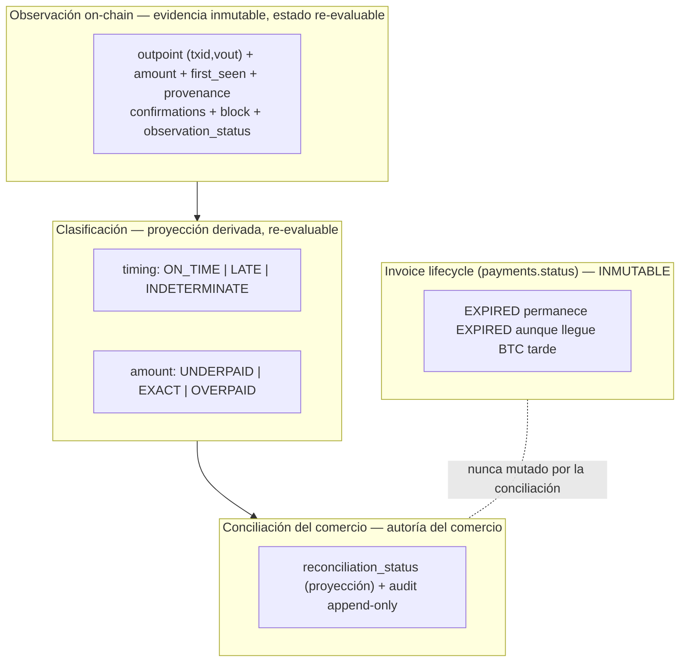
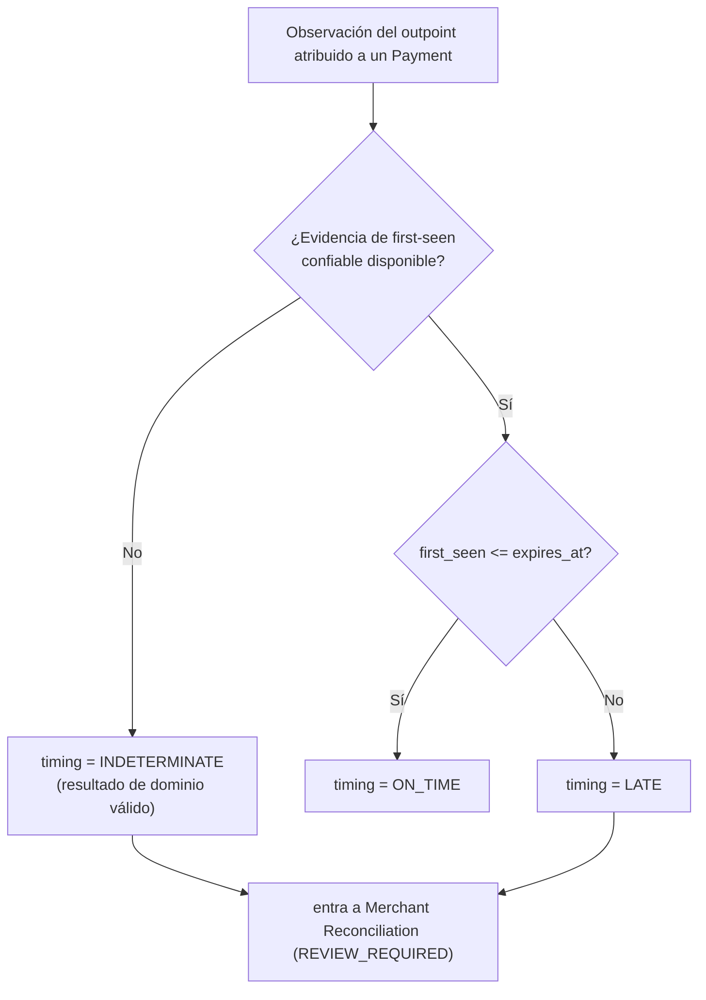
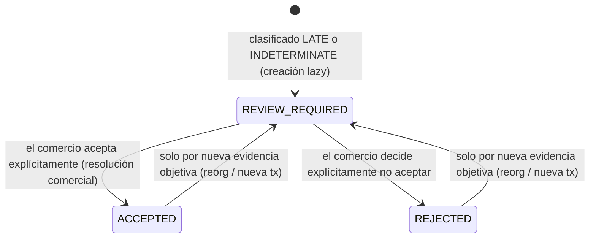
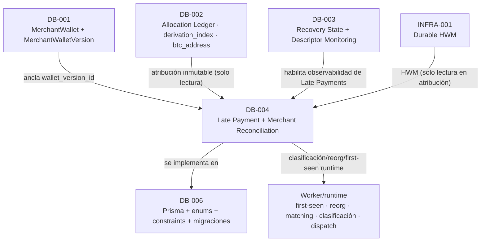

# DB-004 — Late Payment + Merchant Reconciliation

> Documento de diseño de persistencia de base de datos. Consolida las decisiones **D1–D16**, aprobadas por los owners del proyecto (Human Gate final, con refinamiento **FINAL** en D7). Construye sobre las decisiones aprobadas [ARCH-001](./14-architecture-decisions.md) … [ARCH-006](./ARCH-006-late-payments-reconciliation.md), [DB-001](./DB-001-merchant-wallet-wallet-versions.md), [DB-002](./DB-002-allocation-ledger.md), [DB-003](./DB-003-recovery-state-descriptor-monitoring.md) e [INFRA-001](./INFRA-001-durable-hwm.md), y **no** las rediseña.

- **Estado del diseño:** **Aprobado** (D1–D16). *(Aprobado (diseño); implementación pendiente.)*
- **Estado de implementación:** **Pendiente**. La implementación (esquema Prisma, enums, constraints PostgreSQL, migraciones, triggers de inmutabilidad, la unicidad global `UNIQUE(txid, vout_index)`) pertenece a **DB-006**. La captura de first-seen confiable, el manejo de reorg, la migración del matching y la clasificación en runtime pertenecen al **Worker/runtime**. La tecnología del **Durable HWM** pertenece a **INFRA-001**.
- **Área:** Database. **Prioridad:** P0.

> **Distinción obligatoria.** El **diseño** de DB-004 está aprobado. La **implementación** permanece pendiente. Este documento separa explícitamente la **arquitectura target aprobada**, la **implementación actual** y el **trabajo futuro de implementación**. Ninguna afirmación de este documento debe leerse como "las tablas/modelos `PaymentReconciliation` / `ReconciliationAuditEvent` ya existen", "el first-seen confiable ya se captura en runtime", "la unicidad global `(txid, vout_index)` ya está materializada", "la conciliación del comercio ya está activa", "el Worker ya maneja reorgs según este target" o "FloweyPay ejecuta reembolsos".

> **Nota sobre nombres.** Identificadores como `PaymentReconciliation`, `ReconciliationAuditEvent`, `PaymentBtcTx`, `timing_class`, `amount_class`, `reconciliation_status`, `ON_TIME`, `LATE`, `INDETERMINATE`, `UNDERPAID`, `EXACT`, `OVERPAID`, `REVIEW_REQUIRED`, `ACCEPTED`, `REJECTED`, `EXTERNAL_REFUND_RECORDED`, `first_seen_at`, `first_seen_source`, `observation_status` son **nombres conceptuales de dominio**. Los nombres físicos exactos de tablas, columnas y enums son **decisiones de implementación de DB-006**.

---

## 1. Propósito

DB-004 diseña la persistencia mínima P0 necesaria para **clasificar** los pagos Bitcoin por **timing** y **amount**, **persistir** una superficie auditable de **conciliación del comercio** para pagos que requieren revisión, y **persistir la evidencia de observación on-chain** (first-seen confiable + provenance + estado de reorg) que [ARCH-006](./ARCH-006-late-payments-reconciliation.md) D2/D3/D11 requiere pero que ninguna tarea de persistencia previa posee.

DB-004 responde, por cada `Payment`:

1. ¿Cuándo llegó el pago según la **evidencia temporal confiable** disponible (`ON_TIME` / `LATE` / `INDETERMINATE`)?
2. ¿Cuánto se recibió respecto a lo esperado (`UNDERPAID` / `EXACT` / `OVERPAID`), de forma **ortogonal** al timing?
3. Si el pago entró en el dominio de conciliación (por ser `LATE` o `INDETERMINATE`), ¿cuál es la **decisión del comercio** y su **historial auditable**?
4. ¿Qué **evidencia Bitcoin inmutable** respalda esa clasificación, con identidad de outpoint y estado de observación re-evaluable ante reorgs?

DB-004 **no** posee el Allocation Ledger ni `derivation_index` (DB-002), ni el Durable HWM (INFRA-001), ni el `recovery_state` / Descriptor monitoring (DB-003), ni la identidad/Descriptor de wallet (DB-001), ni el esquema Prisma / migraciones (DB-006).

## 2. Alcance

**Dentro de alcance (DB-004, diseño aprobado):**

- La **granularidad de observación on-chain** por **outpoint** `(txid, vout_index)`, y la extensión del concepto existente `payment_btc_txs` con la evidencia temporal y de reorg que la clasificación requiere.
- La **clasificación de timing** (`ON_TIME | LATE | INDETERMINATE`) y de **amount** (`UNDERPAID | EXACT | OVERPAID`), como dimensiones ortogonales.
- El **contrato de persistencia y autoridad del first-seen confiable** y su **provenance**, sin seleccionar el proveedor/mecanismo de runtime.
- La entidad **`PaymentReconciliation`**: proyección de estado de conciliación, **opcional 1:1** con `Payment`, creada **lazily** solo para el dominio de revisión (`LATE` / `INDETERMINATE`).
- La entidad **`ReconciliationAuditEvent`**: **historial append-only** de decisiones/acciones del comercio y eventos dirigidos por evidencia.
- El **invariante de identidad** global `UNIQUE(txid, vout_index)` (materialización física y migración segura en DB-006).
- La preservación de la separación de dominios de ARCH-006 (invoice lifecycle inmutable, evidencia on-chain re-evaluable, conciliación del comercio independiente).

**Fuera de alcance (diferido explícitamente):** ver [§ 26](#26-límites-explícitos-de-alcance). En particular: la tecnología/durabilidad del **Durable HWM** (INFRA-001); el **Allocation Ledger** y `derivation_index` (DB-002); `recovery_state` + Descriptor monitoring (DB-003); la identidad/Descriptor de wallet (DB-001); el **mecanismo/proveedor de runtime del first-seen confiable**, el manejo de reorg en el Worker y la migración del matching (Worker/runtime); el **esquema Prisma + enums + constraints + triggers + migraciones + inspección/remediación de datos legacy** (DB-006); cualquier funcionalidad de **reembolso, custodia, exchange, settlement o contabilidad**.

## 3. Relación con ARCH-006 / DB-001 / DB-002 / DB-003 / INFRA-001

| Fuente | Qué aporta / restringe a DB-004 |
|---|---|
| [ARCH-006 D1/D4](./ARCH-006-late-payments-reconciliation.md#4-decisiones-aprobadas-d1d12) | Separación de ciclos de vida; un invoice `EXPIRED` **permanece** `EXPIRED`. DB-004 **no** muta el lifecycle del `Payment` para representar una resolución comercial tardía. |
| [ARCH-006 D2/D3](./ARCH-006-late-payments-reconciliation.md#d2--payment-arrival-time) | El reloj de negocio es el **first-seen confiable**; evidencia insuficiente ⇒ `INDETERMINATE`; el recovery/offline es **observation-neutral**. |
| [ARCH-006 D5](./ARCH-006-late-payments-reconciliation.md#d5--no-automatic-commercial-acceptance) | Sin aceptación automática: `EXACT` **no** implica `ACCEPTED`; el comercio decide explícitamente. |
| [ARCH-006 D6](./ARCH-006-late-payments-reconciliation.md#d6--multiple-bitcoin-transactions-per-invoice) | N transacciones/outpoints por invoice; DB-004 preserva el **conjunto** y agrega para la clasificación de amount. |
| [ARCH-006 D9](./ARCH-006-late-payments-reconciliation.md#d9--refunds-in-mvp) | Sin reembolsos on-chain. El reembolso externo es a lo sumo una **anotación record-only**, nunca un estado de conciliación. |
| [ARCH-006 D10](./ARCH-006-late-payments-reconciliation.md#d10--late-payment-notifications) | Notificaciones idempotentes de Late Payment; reutilizan el primitivo `(payment_id, event)` existente. |
| [ARCH-006 D11](./ARCH-006-late-payments-reconciliation.md#d11--blockchain-reorganization-vs-commercial-reconciliation) | Un reorg re-evalúa la observación on-chain pero **nunca** borra el historial de conciliación del comercio. |
| [ARCH-006 D12](./ARCH-006-late-payments-reconciliation.md#d12--wallet-version-attribution) | Atribución permanente a invoice + dirección derivada + wallet version original (incl. `RETIRED`). |
| [DB-001 D10/D14](./DB-001-merchant-wallet-wallet-versions.md#18-tabla-de-decisiones-aprobadas-d1d16) | Ciclo de vida `ACTIVE`/`RETIRED`; **sin** wallet versions sintéticas para legacy. DB-004 no crea identidad de wallet. |
| [DB-002 D2/D13/D16/D20/D21](./DB-002-allocation-ledger.md#28-tabla-de-decisiones-aprobadas-d1d17) | `WalletAddressAllocation` provee la **atribución inmutable** (`Payment → Allocation → MerchantWalletVersion`) y la relación de N transacciones en `payment_btc_txs`. DB-004 **lee** esa atribución; **no** la duplica ni añade estados de Late Payment a la Allocation. |
| [DB-002 D10/D11/D17](./DB-002-allocation-ledger.md#28-tabla-de-decisiones-aprobadas-d1d17) | El Durable HWM es la única autoridad de consumo; PostgreSQL **no** es autoridad del HWM. DB-004 **no** persiste HWM ni `safe_next_index`. |
| [DB-003 D6/D7](./DB-003-recovery-state-descriptor-monitoring.md#25-invariantes) | La allocation-safety gate y el monitoring de versiones `RETIRED` **habilitan** la observabilidad de Late Payments. DB-004 **lee** ese estado; no lo autora. |
| [INFRA-001](./INFRA-001-durable-hwm.md) | Durable HWM con durabilidad independiente; **entrada de solo lectura** para DB-004. |

DB-004 **no** reabre ni redefine ninguna decisión ARCH, DB-001, DB-002, DB-003 ni INFRA-001; solo materializa el modelo de clasificación + conciliación + evidencia de observación que ARCH-006 presupone.

## 4. Implementación actual vs arquitectura target

> Verificado en modo solo lectura contra el repositorio durante la Fase 1. **No** se modificó código, esquema ni migraciones.

| Área | Implementación actual (verificada) | Diseño target DB-004 (aprobado) |
|---|---|---|
| Detección de Late Payment | El matching del Worker **descarta** transacciones a un invoice ya `EXPIRED` ([`rawtxHandler.ts`](../../apps/worker/src/handlers/rawtxHandler.ts)). | Detectar y **registrar** el pago tardío; nunca descartarlo (target; runtime). |
| Identidad de observación on-chain | `payment_btc_txs` con `UNIQUE(payment_id, txid, vout_index)`; `detected_at` = **timestamp de observación del Worker**, no first-seen de cadena ([`paymentAccumulator.ts`](../../apps/worker/src/btc/paymentAccumulator.ts)). | Outpoint `(txid, vout_index)` con `UNIQUE(txid, vout_index)` **global**; first-seen confiable + provenance persistidos; `detected_at` solo observabilidad. |
| Confirmaciones / reorg | Incremento **monotónico** (`newConf = confirmations + 1`); **sin** `block_hash`/`block_height` por tx, **sin** detección/reversión por reorg ([`rawblockHandler.ts`](../../apps/worker/src/handlers/rawblockHandler.ts)). | `observation_status` re-evaluable (`MEMPOOL | CONFIRMED | REORG_REVERTED | CONFLICTED`) + asociación de bloque; reorg re-evalúa sin borrar historial de conciliación. |
| Clasificación timing/amount | **Ausente** (no hay enums ni columnas de clasificación). | `timing_class` + `amount_class` como dimensiones ortogonales persistidas/derivadas. |
| Conciliación del comercio | **Ausente** (no hay entidad/estado/auditoría de conciliación). | `PaymentReconciliation` (proyección lazy) + `ReconciliationAuditEvent` (append-only). |
| Notificaciones | Enum `payment_notification_event` = `SEEN_IN_MEMPOOL`, `CONFIRMED`, `EXPIRED` ([`schema.prisma`](../../packages/db/prisma/schema.prisma)). | Añadir eventos idempotentes de Late Payment (diseño; enum físico en DB-006, dispatch en runtime). |

> **No se afirma que estas estructuras ya existan.** DB-004 es **diseño target aprobado**; la implementación (DB-006 / Worker-runtime) permanece pendiente.

## 5. Separación de dominios

DB-004 preserva la separación de dominios **ortogonales** aprobada por [ARCH-006](./ARCH-006-late-payments-reconciliation.md) §3/§5. Colapsarlos es exactamente la causa raíz del error `EXPIRED → PAID`.



- **Invoice lifecycle** — la solicitud comercial; la fija FloweyPay junto con el comercio; `EXPIRED` es historia inmutable.
- **Observación Bitcoin / on-chain** — hechos objetivos de red; los fija la cadena, los observa el Worker; re-evaluables ante reorg.
- **Clasificación** — timing y amount derivados de la evidencia; re-evaluables.
- **Conciliación del comercio** — la respuesta comercial; la fija exclusivamente el comercio; **append-only** para el historial.

## 6. Modelo de datos conceptual

```mermaid
erDiagram
    payments ||--o{ payment_btc_txs : "0..N observaciones (existente, extendido)"
    payments ||--o| payment_reconciliation : "0..1 (lazy · dominio de revisión)"
    payment_reconciliation ||--o{ reconciliation_audit_events : "1..N (append-only)"
    payments }o--o| wallet_address_allocations : "atribución vía DB-002 (solo lectura)"

    payment_btc_txs {
        uuid id PK
        uuid payment_id FK
        text txid "inmutable"
        int vout_index "inmutable"
        bigint amount_sats "inmutable"
        timestamptz first_seen_at "NUEVO nullable · first-seen confiable de cadena"
        enum first_seen_source "NUEVO · provenance estructurado"
        text block_hash "NUEVO nullable"
        bigint block_height "NUEVO nullable"
        int confirmations "proyección mutable"
        enum observation_status "NUEVO: MEMPOOL|CONFIRMED|REORG_REVERTED|CONFLICTED"
        timestamptz detected_at "existente · observación del Worker (no reloj de negocio)"
    }
    payment_reconciliation {
        uuid payment_id PK_FK "1:1 · lazy"
        enum timing_class "ON_TIME|LATE|INDETERMINATE (proyección mutable)"
        enum amount_class "UNDERPAID|EXACT|OVERPAID (proyección mutable)"
        enum reconciliation_status "REVIEW_REQUIRED|ACCEPTED|REJECTED"
        timestamptz business_first_seen_at "nullable → INDETERMINATE cuando null"
        int lock_version
        timestamptz created_at
        timestamptz updated_at
    }
    reconciliation_audit_events {
        uuid id PK
        uuid payment_id FK
        enum action "DETECTED|CONFIRMED|ACCEPTED|REJECTED|NOTE_ADDED|EXTERNAL_REFUND_RECORDED|REORG_REVERTED|REOPENED"
        enum actor_type "MERCHANT|SYSTEM"
        uuid actor_user_id "nullable"
        text note "nullable · redactado de telemetría"
        timestamptz created_at
    }
```

Las tres separaciones conceptuales mínimas exigidas:

```text
Payment 1 --N PaymentBtcTx (payment_btc_txs)   → identidad de outpoint + amount + evidencia de cadena + first-seen + provenance + detected_at (observabilidad)
Payment 1 --0..1 PaymentReconciliation         → estado/proyección de conciliación; existe solo para el dominio de revisión LATE/INDETERMINATE
PaymentReconciliation 1 --N ReconciliationAuditEvent → historial append-only del comercio/evidencia
```

> **Modelo conceptual, no implementación.** Los nombres de tablas/columnas/enums son ilustrativos; la forma exacta en Prisma/PostgreSQL es trabajo de **DB-006**. El `expected_amount` (`payments.btc_amount_sats`) y el recibido (`payments.btc_received_sats`) **no** se duplican en la fila de conciliación.

## 7. Semántica de `PaymentBtcTx` / outpoint

DB-004 **extiende** el concepto existente `payment_btc_txs` (B1 resuelto): **no** se crea una segunda entidad paralela para representar el mismo outpoint Bitcoin. DB-002 ya establece la relación de N transacciones por `Payment`.

- **Unidad mínima de atribución on-chain:** un **outpoint** `(txid, vout_index)` (D1). Un `Payment` puede tener **N** outpoints atribuidos.
- **No se colapsan** N outpoints en una transacción sintética; el conjunto se preserva individualmente (D12).
- **Idempotencia:** observar el mismo outpoint repetidamente (mempool, reinicio del Worker, rescan, tras confirmación, durante conciliación) **no** crea atribución económica duplicada (D10); se reutiliza el upsert idempotente existente por outpoint.

## 8. Identidad global de outpoint

- **Invariante target (D9):** **`UNIQUE(txid, vout_index)` global**. El mismo outpoint Bitcoin **nunca** puede atribuirse a dos `Payment` distintos.
- **No** se debilita a `UNIQUE(payment_id, txid, vout_index)`. Un outpoint es un **UTXO único** que paga exactamente un script/monto, por lo que puede pertenecer a lo sumo a un `Payment` bajo **cualquier** modelo de custodia; por eso la unicidad global es correcta a nivel Bitcoin y **fortalece** (no contradice) la unicidad por `Payment` de [DB-002 § 20](./DB-002-allocation-ledger.md#20-múltiples-transacciones-bitcoin).
- **DB-006** posee la **inspección de datos existentes/legacy**, la **estrategia de migración segura**, la **remediación de duplicados** si fuera necesaria y la **creación física** de la constraint. Este documento **no** afirma que la constraint global ya exista.

## 9. Clasificación de timing

`timing_class ∈ { ON_TIME, LATE, INDETERMINATE }` (D3), dimensión de dominio **explícita** y **proyección re-evaluable** (un reorg puede exigir re-derivarla).

- Se deriva del **first-seen confiable mínimo** entre los outpoints contribuyentes vs `payment.expires_at` (ver [§ 10](#10-contrato-de-first-seen-confiable)).
- La **magnitud** del retraso (minutos, horas, días) **no** crea estados distintos: todo retraso es `LATE`.
- **`INDETERMINATE` es un resultado de dominio conservador válido**, **no** un fallo técnico: significa que FloweyPay tiene evidencia del pago pero evidencia temporal insuficiente para afirmar con verdad `ON_TIME` o `LATE`.

## 10. Contrato de first-seen confiable

**Regla de clasificación autoritativa (fijada por el Human Gate):**

```text
evidencia de first-seen confiable disponible
    first_seen <= payment.expires_at   -> ON_TIME
    first_seen >  payment.expires_at   -> LATE

evidencia temporal confiable no disponible o insuficiente
                                       -> INDETERMINATE
```

Un `detected_at` local del Worker es **metadata de observabilidad útil** pero **NO** es automáticamente evidencia autoritativa de first-seen (D6). Ejemplo que **debe** representarse correctamente:

```text
invoice expira        14:00
BTC aparece de hecho  13:58
FloweyPay indisponible 13:50–14:10
Worker observa la tx  14:11   (detected_at = 14:11)
```

`detected_at = 14:11` **por sí solo NO** puede clasificar el `Payment` como `LATE`. Si no existe evidencia temporal suficientemente confiable que establezca si la transacción apareció antes o después de la expiración, el resultado conservador correcto es **`INDETERMINATE`**. El recovery/offline es **observation-neutral** (ARCH-006 D3): FloweyPay **nunca** fabrica lateness por haber estado offline.



> **El proveedor/mecanismo de runtime** para obtener el first-seen confiable (p. ej. tiempo de entrada al mempool, `timereceived` de wallet, evidencia ZMQ) se **defiere** al trabajo posterior de Worker/runtime. DB-004 **no** selecciona ni acopla la persistencia a un proveedor externo específico. Los detalles físicos de esquema/migración permanecen en **DB-006**.

## 11. First-seen provenance

DB-004 debe persistir, además del timestamp de first-seen confiable **cuando exista**, su **provenance/source** estructurada y suficiente metadata para que la clasificación de timing sea **auditable y reproducible** (D6). Principios:

- **No** reemplazar silenciosamente evidencia más fuerte por detección local más débil: la provenance debe preservarse.
- La ausencia de first-seen confiable se representa explícitamente (nullable) y produce `INDETERMINATE`, nunca un `LATE` por defecto.
- Los nombres/tipos físicos exactos de los campos de provenance y sus constraints son **DB-006**.

## 12. Clasificación de amount

`amount_class ∈ { UNDERPAID, EXACT, OVERPAID }` (D4), **independiente** del timing (no se sobrecarga una dimensión con la otra).

- Se deriva del `expected_amount` **inmutable** (`payments.btc_amount_sats`) vs el **agregado atribuido** (`payments.btc_received_sats`), reutilizando el acumulador existente.
- El `expected_amount` **nunca** se reescribe; una segunda transacción que completa el monto mueve `UNDERPAID → EXACT` sin tocar el esperado.
- **Underpayment tardío:** `LATE` + `UNDERPAID` con `remaining` computado. **Overpayment tardío:** `LATE` + `OVERPAID` con excedente registrado, **sin** reembolso automático (D16).

## 13. Agregación de múltiples outpoints

Un `Payment` puede recibir **múltiples** outputs Bitcoin atribuidos (D12). DB-004 **preserva cada outpoint individualmente** en `payment_btc_txs` y deriva la clasificación de amount a nivel `Payment` desde el **monto agregado atribuido**, según las reglas aprobadas. **No** se colapsan N outpoints en una única transacción sintética. La separación de dominios de DB-002 se conserva: una Allocation/dirección puede recibir 0..N transacciones.

## 14. Ciclo de vida de `PaymentReconciliation`

`PaymentReconciliation` es la **proyección de estado actual** de la conciliación del comercio. Máquina de estados mínima P0 **FINAL** (D7):



| Estado | Semántica |
|---|---|
| **`REVIEW_REQUIRED`** | La conciliación existe; la revisión del comercio/negocio sigue **pendiente**; **no** se ha tomado una decisión final. **"Sin acción" permanece `REVIEW_REQUIRED`.** |
| **`ACCEPTED`** | El comercio **acepta explícitamente** el Late/Indeterminate Payment como resolución comercial. |
| **`REJECTED`** | El comercio **decide explícitamente no aceptar** el Late/Indeterminate Payment como resolución comercial. |

Reglas críticas:

- **"Sin acción / sin decisión" NUNCA se representa como `REJECTED`**: es `REVIEW_REQUIRED`.
- **No** se usa `DISMISSED`. **No** se usa `REFUNDED_EXTERNALLY` como estado de conciliación. **No** existe la transición `ACCEPTED -> REFUNDED_EXTERNALLY` ni equivalente.
- `EXACT` **no** implica `ACCEPTED`; la aceptación es siempre una decisión explícita del comercio (ARCH-006 D5).
- Si evidencia objetiva posterior invalida la base de una decisión terminal, la **proyección actual** puede volver a `REVIEW_REQUIRED` **solo** bajo la semántica aprobada de evidencia/reorg, mientras el **historial append-only preserva la decisión previa** (ver [§ 16](#16-historial-de-conciliación-append-only) y [§ 18](#18-comportamiento-ante-reorg)).

## 15. Semántica de creación lazy

- `PaymentReconciliation` es una relación **opcional 1:1** con `Payment`, creada **lazily** solo cuando el `Payment` **entra** al dominio de Merchant Reconciliation de DB-004 porque el timing requiere revisión humana/de negocio: **`LATE`** o **`INDETERMINATE`** (D2).
- La **ausencia** de una fila `PaymentReconciliation` significa **únicamente**: *"este Payment nunca entró al workflow de conciliación."*
- La ausencia **NO** significa: aceptado automáticamente, rechazado automáticamente, ya conciliado, un estado de conciliación oculto, ni un estado persistido de "no requiere conciliación". La ausencia **no tiene** ningún significado de dominio adicional.
- **Excepciones de amount ON_TIME no entran** al workflow (ver [§ 7 de OQ3 / § 26](#26-límites-explícitos-de-alcance)): `ON_TIME + UNDERPAID` y `ON_TIME + OVERPAID` **no** crean una `PaymentReconciliation` solo por la clasificación de amount. DB-004 **puede** persistir/derivar el `amount_class`, pero el workflow de conciliación existe por **incertidumbre/lateness de timing** (`LATE` / `INDETERMINATE`), no por una excepción de monto. DB-004 **no** es un workflow general de excepciones de pago.

## 16. Historial de conciliación append-only

- Las decisiones/acciones de conciliación del comercio se registran en `ReconciliationAuditEvent`, **append-only** (D8).
- El historial preserva al menos: **acción**, **actor**, **timestamp**, **razón/contexto** cuando esté aprobado, y **eventos de reapertura/re-evaluación dirigidos por evidencia** cuando apliquen.
- El **estado de conciliación actual** (`reconciliation_status`) es una **proyección**; el **historial de auditoría** es evidencia histórica y **no** se sobrescribe.
- Aceptar/rechazar dos veces es un **no-op** idempotente sobre la proyección; el historial conserva la secuencia. Una decisión histórica del comercio **nunca** se borra ni se reescribe.

## 17. Boundary del reembolso externo

- El **reembolso externo NO es un estado de `PaymentReconciliation`**.
- Si P0 o una funcionalidad futura registra uno, pertenece al **historial de auditoría append-only** independiente, conceptualmente `EXTERNAL_REFUND_RECORDED`. Pero:
  - registrar este evento es **opcional** para P0;
  - representa una **declaración del comercio/operador** salvo que una funcionalidad futura lo **verifique** on-chain;
  - **no** reemplaza `ACCEPTED`/`REJECTED`;
  - **no** implica que FloweyPay ejecutó el reembolso;
  - **no** implica verificación on-chain;
  - **no** introduce monto de reembolso, txid de reembolso, settlement, contabilidad ni custodia salvo que se diseñe por separado en trabajo futuro.
- **No** se expande DB-004 meramente para soportar funcionalidad de reembolso.

## 18. Comportamiento ante reorg

- Un reorg puede cambiar la **observación/proyección on-chain objetiva** (D11): conteo de confirmaciones, asociación de bloque, estado confirmado/no confirmado y otra metadata mutable de observación aprobada (`observation_status`).
- Un reorg **NUNCA** borra el **historial append-only** de conciliación del comercio. La evidencia objetiva de cadena y el historial de conciliación del comercio permanecen en **dimensiones separadas**.
- `REORG_REVERTED` es un estado de observación **no terminal y re-evaluable** (una tx reorganizada puede volver a confirmar); **no** se modela como un estado Bitcoin terminal permanente si ello contradijera [ARCH-006](./ARCH-006-late-payments-reconciliation.md) §5/§16.
- **RBF/conflicto:** la identidad de outpoint distingue el reemplazo (nuevo `txid`); el outpoint superado se marca `CONFLICTED`; el timing se toma del first-seen de la tx superviviente; un fee-bump **no** es una nueva obligación comercial.
- Cuando una decisión terminal previa quede sin base por el reorg, la proyección puede volver a `REVIEW_REQUIRED` preservando el historial (ver [§ 14](#14-ciclo-de-vida-de-paymentreconciliation)).

## 19. Wallet Rotation / comportamiento RETIRED

La atribución se **lee vía DB-002**; DB-004 **no** duplica campos de wallet version:

```text
Payment → WalletAddressAllocation → MerchantWalletVersion (original, posiblemente RETIRED) → derivation_index → btc_address → outpoint
```

- La atribución histórica permanece válida cuando la `MerchantWalletVersion` asociada pasa a `RETIRED` (D13).
- `RETIRED` **impide nuevas asignaciones** ([DB-001](./DB-001-merchant-wallet-wallet-versions.md)) pero **no** invalida direcciones históricas, outpoints, Late Payments ni conciliación.
- Un Late Payment a una dirección de una versión `RETIRED` se detecta gracias al monitoring de versiones históricas de [ARCH-005 D5](./ARCH-005-index-reconciliation-recovery.md#d5--reconciliation-per-wallet-version) / [DB-003](./DB-003-recovery-state-descriptor-monitoring.md), y se atribuye al `Payment` y versión **originales**. La rotación **no** cambia la clasificación de timing ni de amount (ARCH-006 D12).
- DB-004 **no** almacena `wallet_version_id` en las entidades de conciliación.

## 20. Comportamiento legacy `SHARED_CUSTODIAL`

| Dimensión | Legacy `SHARED_CUSTODIAL` | Non-custodial `NON_CUSTODIAL_DERIVED` |
|---|---|---|
| Clasificación timing/amount | Soportada (por `payment_id`) | Soportada |
| `PaymentReconciliation` + auditoría | Soportada | Soportada |
| Atribución por wallet version | **No disponible** (sin Allocation; sin versión sintética) | Disponible vía DB-002 |
| Dirección autoritativa | `payments.btc_address` | `WalletAddressAllocation.btc_address` |

- Los pagos legacy `SHARED_CUSTODIAL` **solo** pueden usar evidencia que **realmente existe** (D15). **No** se sintetizan `MerchantWalletVersion`, `WalletAddressAllocation`, `derivation_index` ni atribución de descriptor para datos legacy con tal de encajar en el modelo target (preserva [DB-001 D14](./DB-001-merchant-wallet-wallet-versions.md#18-tabla-de-decisiones-aprobadas-d1d16) / [DB-002 D14](./DB-002-allocation-ledger.md#28-tabla-de-decisiones-aprobadas-d1d17)).
- La atribución legacy puede permanecer basada en la `payments.btc_address` histórica autoritativa donde la arquitectura upstream aprobada lo requiera.
- La detección de Late Payments legacy depende además de que el Worker **deje de descartar** transacciones a invoices `EXPIRED` (gap de runtime).

## 21. Idempotencia

- **Ingesta de observación:** el mismo outpoint `(txid, vout_index)` observado repetidamente **no** crea atribución económica duplicada; upsert idempotente por outpoint (D10).
- **Clasificación:** `timing_class`/`amount_class` son **recomputables** de forma segura desde la evidencia; una reejecución produce el mismo resultado dado el mismo estado de evidencia.
- **Conciliación:** a lo sumo una `PaymentReconciliation` por `Payment` (PK `payment_id`); una acción terminal repetida es no-op; los eventos de sistema (`DETECTED`, `CONFIRMED`) se emiten una vez mediante guarda/upsert.
- **Notificaciones:** idempotencia por el primitivo existente `UNIQUE(payment_id, event)`, extendido con eventos de Late Payment (diseño; enum físico en DB-006).
- DB-004 **no** introduce ninguna unicidad que pueda leerse como autoridad de índice/HWM.

## 22. Evidencia inmutable vs mutable

| Clase | Datos | Propiedad |
|---|---|---|
| **Identidad/evidencia inmutable** | `txid`, `vout_index`, `amount_sats`, atribución del outpoint una vez válidamente establecida, first-seen confiable más temprano (una vez capturado) + provenance, identidad/historial de eventos de auditoría | Nunca se reescribe |
| **Proyección de cadena mutable/recomputable** | `confirmations`, `block_hash`/`block_height`, estado confirmado/no confirmado, `observation_status` afectado por reorg | Re-evaluable |
| **Proyección de conciliación** | `timing_class`, `amount_class`, `reconciliation_status` | Mutable (proyección) |
| **Historial de decisiones del comercio** | `ReconciliationAuditEvent` | **Append-only**; el estado actual es una proyección |

- La **provenance** de first-seen debe preservarse; **no** reemplazar silenciosamente evidencia más fuerte por detección local más débil.
- Los campos/constraints físicos exactos permanecen en **DB-006**.

## 23. Seguridad / privacidad / boundary non-custodial

- **Boundary non-custodial:** FloweyPay **registra** evidencia, clasificación y decisiones del comercio; **no** obtiene autoridad de gasto sobre los BTC del comercio. DB-004 **no** introduce private keys, custodia, reembolsos automáticos, exchange, conversión fiat, settlement, contabilidad del comercio ni un ledger financiero general (D16).
- **Códigos estructurados:** las acciones/eventos de auditoría y cualquier `reason` usan enums estructurados (siguiendo el patrón de [DB-003 D17](./DB-003-recovery-state-descriptor-monitoring.md#24-seguridad--privacidad)); **no** texto libre como autoridad.
- **Notas del comercio:** `note` es texto libre → se **redacta** de telemetría/logs no seguros; acceso a la DB con **privilegio mínimo**; backups cifrados (postura de [DB-002 D17](./DB-002-allocation-ledger.md#23-seguridad--privacidad-d17) / [DB-003 § 24](./DB-003-recovery-state-descriptor-monitoring.md#24-seguridad--privacidad)).
- **Retención/privacidad:** las direcciones/outpoints Bitcoin son públicas pero privacy-sensitive; las notas del comercio son datos sensibles nuevos. Se aplica la misma postura MVP: cifrado en reposo, backups cifrados, exclusión de telemetría, redacción de diagnósticos. **No** se requiere cifrado a nivel de columna en DB-004.

## 24. Escenarios de falla / recuperación

Para cada caso: comportamiento de persistencia esperado, estado de negocio, idempotencia, si se requiere conciliación del comercio y si debe fallar-cerrado. Donde el caso pertenezca a la autoridad de recovery de ARCH-005/INFRA-001, se **referencia** en vez de rediseñarlo.

| # | Caso | Persistencia | Estado de negocio | Idempotencia | ¿Conciliación? | ¿Fail-closed? |
|---|---|---|---|---|---|---|
| 1 | Pago antes de expirar con first-seen confiable | outpoint + `timing=ON_TIME` | flujo normal | upsert outpoint | No (ON_TIME) | No |
| 2 | Pago después de expirar con first-seen confiable | outpoint + `timing=LATE`; `PaymentReconciliation` lazy | invoice `EXPIRED` inmutable | `UNIQUE(txid,vout)` | Sí (`REVIEW_REQUIRED`) | No |
| 3 | Downtime del Worker abarcando la expiración | sin first-seen confiable ⇒ `timing=INDETERMINATE` | `EXPIRED` | idempotente | Sí (revisión) | No (observation-neutral) |
| 4 | first-seen no disponible | `timing=INDETERMINATE` (resultado válido) | `EXPIRED` | idempotente | Sí | No |
| 5 | Observación duplicada del mismo outpoint | upsert no-op | sin cambio | `UNIQUE(txid,vout)` | sin ítem nuevo | No |
| 6 | Múltiples outpoints | conjunto preservado; agregación de amount | sin cambio | por outpoint | una conciliación | No |
| 7 | Underpayment | `amount=UNDERPAID`, `remaining` computado | sin cambio | acumulador | según timing | No |
| 8 | Overpayment | `amount=OVERPAID`, excedente registrado, sin reembolso | sin cambio | acumulador | según timing | No |
| 9 | Reorg **antes** de la decisión del comercio | `observation_status=REORG_REVERTED`; re-evaluar clasificación | `EXPIRED` | idempotente | permanece/actualiza `REVIEW_REQUIRED` | No |
| 10 | Reorg **después** de `ACCEPTED` | proyección vuelve a `REVIEW_REQUIRED`; **historial de `ACCEPTED` preservado** | `EXPIRED` | idempotente | reabrir por evidencia | No |
| 11 | Reorg **después** de `REJECTED` | proyección vuelve a `REVIEW_REQUIRED`; **historial de `REJECTED` preservado** | `EXPIRED` | idempotente | reabrir por evidencia | No |
| 12 | La wallet version pasa a `RETIRED` | atribución histórica válida vía DB-002 | `EXPIRED` | idempotente | según timing | No |
| 13 | Pago legacy `SHARED_CUSTODIAL` | clasificar/conciliar por `payment_id`; **sin** atribución de versión | `EXPIRED` | idempotente | según timing | No |
| 14 | Restore de PostgreSQL operativo | filas de conciliación/clasificación **recomputables** desde evidencia | `EXPIRED` | recomputar | reabrir si aplica | La autoridad de asignación permanece fail-closed vía [DB-002](./DB-002-allocation-ledger.md)/[DB-003](./DB-003-recovery-state-descriptor-monitoring.md)/[INFRA-001](./INFRA-001-durable-hwm.md); **no** DB-004 |
| 15 | Late Payment tras rotación de dirección/wallet | detectado vía monitoring de versión `RETIRED`; atribuido al original | `EXPIRED` | idempotente | Sí | No |

> Los casos de autoridad de reconciliación de índice / Durable HWM (restore del HWM, `HWM(V) >= ledger_max(V)`, Safety Range Burning) pertenecen a [ARCH-005](./ARCH-005-index-reconciliation-recovery.md) / [DB-002](./DB-002-allocation-ledger.md) / [INFRA-001](./INFRA-001-durable-hwm.md) y **no** se rediseñan aquí. DB-004 nunca se convierte en otra autoridad de asignación/HWM.

## 25. Invariantes

- **I1.** Una observación Bitcoin persistida identifica un `(txid, vout_index)` concreto.
- **I2.** La arquitectura target **nunca** atribuye el mismo outpoint a dos `Payment`.
- **I3.** Un `Payment` puede tener N outpoints atribuidos.
- **I4.** Las clasificaciones de timing y amount son **ortogonales**.
- **I5.** `LATE`/`INDETERMINATE` pueden crear `PaymentReconciliation` de forma **lazy**.
- **I6.** La **ausencia** de `PaymentReconciliation` no tiene ningún estado de conciliación implícito.
- **I7.** Sin decisión del comercio ⇒ `REVIEW_REQUIRED`.
- **I8.** `ACCEPTED` y `REJECTED` requieren decisiones explícitas del comercio/negocio.
- **I9.** El reembolso externo **no** es un estado de conciliación.
- **I10.** El historial de auditoría es **append-only**.
- **I11.** Un reorg puede cambiar la proyección de cadena objetiva pero **no** puede borrar el historial de auditoría del comercio.
- **I12.** El `detected_at` del Worker por sí solo **no** es necesariamente first-seen autoritativo.
- **I13.** Evidencia temporal confiable insuficiente produce `INDETERMINATE`.
- **I14.** El BTC tardío **no** reescribe el estado histórico `EXPIRED` del lifecycle del `Payment`.
- **I15.** Las wallet versions `RETIRED` conservan la validez de la atribución histórica.
- **I16.** DB-004 **nunca** se convierte en autoridad de Allocation Ledger ni de Durable HWM.
- **I17.** Los datos legacy **no** se "upgradean" mediante wallet versions o allocations sintéticas.
- **I18.** DB-004 **no** introduce custodia ni autoridad de gasto.
- **I19.** Las excepciones de amount `ON_TIME` **no** entran por sí solas a Merchant Reconciliation.
- **I20.** La provenance de first-seen se preserva; no se sustituye silenciosamente evidencia fuerte por detección local débil.

## 26. Límites explícitos de alcance



| Tarea | Posee (fuera de DB-004) |
|---|---|
| **DB-001** | `MerchantWallet` / `MerchantWalletVersion`, Descriptor, ciclo de vida. |
| **DB-002** | Allocation Ledger, `derivation_index`, `btc_address` autoritativa, `receiving_model`. DB-004 **lee** la atribución. |
| **DB-003** | `recovery_state`, Descriptor monitoring/lookahead. |
| **INFRA-001** | Tecnología/durabilidad del Durable HWM. |
| **DB-006** | Modelos Prisma, enums, migraciones, `UNIQUE(txid, vout_index)` físico + inspección/remediación legacy, FKs, CHECK, triggers de inmutabilidad, índices. |
| **Worker/runtime** | Mecanismo/proveedor del first-seen confiable, dejar de descartar tx a invoices `EXPIRED`, manejo de reorg, migración del matching a `Allocation.btc_address`, motor de clasificación, dispatch de notificaciones. |
| **DB-005** | **Sin responsabilidades inventadas.** Se definirá desde el roadmap del repositorio cuando corresponda. |
| **Post-MVP** | Ejecución de reembolsos, disputas, workflows de deep-reorg, política de decommission de wallet versions, contabilidad. |

`ON_TIME + UNDERPAID/OVERPAID` **no** entra a Merchant Reconciliation solo por la clasificación de amount; DB-004 **no** es un workflow general de excepciones de pago.

## 27. Brecha de implementación actual (Current Implementation Gap)

Estado **verificado** contra el repositorio (solo lectura; **no** se modificó código ni esquema). Hoy FloweyPay todavía:

- recibe direcciones desde el mecanismo existente de **wallet compartida** de Bitcoin Core (custodial hoy);
- el manejo actual de transacciones Bitcoin **no** implementa el modelo de persistencia target de DB-004 (sin clasificación timing/amount, sin conciliación, sin auditoría);
- **no** implementa autoridad/provenance de **first-seen confiable** como el target aprobado (`payment_btc_txs.detected_at` es tiempo de observación del Worker, no reloj de negocio);
- **no** implementa el modelo de persistencia/estado/auditoría de **Merchant Reconciliation**;
- **no** materializa la unicidad target global `UNIQUE(txid, vout_index)` (hoy `UNIQUE(payment_id, txid, vout_index)`);
- el Worker **descarta** transacciones a invoices `EXPIRED` y hace matching por **dirección exacta**; el manejo de reorg incrementa confirmaciones de forma **monotónica** sin reversión;
- el esquema físico / migraciones de **DB-006** permanecen como trabajo futuro.

Etiquetado claro: lo anterior es **CURRENT IMPLEMENTATION**; el resto de este documento es **APPROVED TARGET DESIGN**. **No** debe afirmarse que el comportamiento target ya existe.

## 28. Trabajo futuro de implementación / boundary de DB-006

DB-004 es **diseño**, **no** implementación física de esquema. **DB-006** posee la materialización posterior, incluyendo según aplique:

- modelos Prisma / enums (`timing_class`, `amount_class`, `reconciliation_status`, `observation_status`, `first_seen_source`, `action`, `actor_type`, nuevos `payment_notification_event`);
- tipos de columna exactos, índices, foreign keys, CHECK constraints, triggers de inmutabilidad;
- la unicidad global **`UNIQUE(txid, vout_index)`** con **inspección de datos existentes/legacy**, **estrategia de remediación de duplicados** y **secuenciación de migración** segura + backfill + seguridad de despliegue.

El trabajo de **Worker/runtime** (first-seen confiable, reorg, migración de matching, clasificación, dispatch de notificaciones) precede/acompaña la habilitación funcional pero es **externo** a DB-004 y a DB-006. **No** se crean esos artefactos ahora.

## 29. Tabla de decisiones aprobadas D1–D16

> **Estado:** Aprobado (diseño); implementación pendiente. Refinamiento **FINAL** del Human Gate en **D7**.

| # | Decisión | Resumen aprobado |
|---|---|---|
| **D1** | Bitcoin observation granularity | Una observación de pago Bitcoin persistida representa un **outpoint** concreto `(txid, vout_index)`, la unidad mínima de atribución on-chain; un `Payment` puede tener **N** outpoints. |
| **D2** | Optional lazy PaymentReconciliation | `PaymentReconciliation` opcional **1:1** con `Payment`, creada **lazily** solo al entrar a conciliación por timing (`LATE` / `INDETERMINATE`). La **ausencia** significa **solo** "nunca entró al workflow"; **sin** estado implícito (aceptado/rechazado/conciliado/oculto/"no requerido"). |
| **D3** | Persist timing classification | Timing es una dimensión de dominio **explícita**: `ON_TIME | LATE | INDETERMINATE`. `INDETERMINATE` es un resultado conservador **válido**, no un fallo técnico. |
| **D4** | Amount classification orthogonal | Amount independiente del timing: `UNDERPAID | EXACT | OVERPAID`; para múltiples outpoints usa el **agregado atribuido**; **no** se sobrecarga timing con amount. |
| **D5** | Immutable Payment lifecycle history | La conciliación es una dimensión separada del lifecycle; un invoice que llegó a `EXPIRED` **permanece** `EXPIRED` (ARCH-006) aunque llegue BTC después. |
| **D6** | Reliable first-seen evidence + provenance | Persistir first-seen confiable **cuando exista** + **provenance/source** + metadata para clasificación auditable/reproducible; `detected_at` local del Worker **no** es first-seen autoritativo automático; el mecanismo/proveedor de runtime se defiere; **sin** acople a proveedor; físico en DB-006. |
| **D7** | FINAL PaymentReconciliation state machine | Estados **exactos**: `REVIEW_REQUIRED → { ACCEPTED, REJECTED }`. "Sin acción" = `REVIEW_REQUIRED` (nunca `REJECTED`). **Sin** `DISMISSED`; **sin** `REFUNDED_EXTERNALLY` como estado; **sin** `ACCEPTED → REFUNDED_EXTERNALLY`. Reapertura a `REVIEW_REQUIRED` solo por evidencia/reorg, preservando el historial. |
| **D8** | Append-only audit history | Decisiones/acciones de conciliación en historial **append-only** (acción, actor, timestamp, razón/contexto, reaperturas por evidencia); estado actual = proyección; historial **no** se sobrescribe. |
| **D9** | Global outpoint uniqueness | Invariante target **`UNIQUE(txid, vout_index)` global**; **no** se debilita a `UNIQUE(payment_id, txid, vout_index)`; DB-006 posee inspección legacy + migración segura + remediación + creación física; **no** existe aún. |
| **D10** | Idempotent processing | Ingesta de observación, clasificación y actualización de la proyección de conciliación **idempotentes/recomputables**; observar el mismo outpoint repetidamente **no** crea atribución económica duplicada. |
| **D11** | Reorg orthogonal to merchant history | Un reorg puede cambiar la proyección on-chain objetiva (confirmaciones, bloque, confirmado/no confirmado, metadata mutable) pero **no** borra el historial append-only; `REORG_REVERTED` **no** es un estado Bitcoin terminal permanente; dimensiones separadas. |
| **D12** | Multiple outpoints aggregate | Un `Payment` puede recibir múltiples outputs; se **preserva cada outpoint** individualmente y se deriva el amount a nivel `Payment` desde el agregado atribuido; **no** se colapsan en una tx sintética. |
| **D13** | Wallet rotation preserves attribution | La atribución histórica permanece válida cuando la `MerchantWalletVersion` pasa a `RETIRED`; `RETIRED` impide nuevas asignaciones (DB-001) pero **no** invalida direcciones/outpoints/late payments/conciliación históricos. |
| **D14** | No allocation authority | DB-004 **no** es autoridad de: asignación de `derivation_index`, `WalletAddressAllocation`, Durable HWM, `safe_next_index`, Recovery State, Descriptor monitoring. Esos boundaries permanecen en la arquitectura aprobada. |
| **D15** | Legacy boundary | Legacy `SHARED_CUSTODIAL` **solo** usa evidencia que existe; **no** se sintetizan `MerchantWalletVersion`/`WalletAddressAllocation`/`derivation_index`/atribución de descriptor; la atribución legacy puede basarse en `payments.btc_address` histórica donde lo requiera la arquitectura upstream. |
| **D16** | Non-custodial / financial scope | DB-004 introduce persistencia de evidencia, timing, amount, conciliación y auditoría; **no** introduce private keys, autoridad de gasto, custodia, reembolsos automáticos, exchange, conversión fiat, settlement, contabilidad ni ledger financiero general. |

---

**Relacionado:** [README.md](./README.md) · [ADR.md § DB-004](./ADR.md#db-004--late-payment--merchant-reconciliation) · [DECISIONS.md](./DECISIONS.md) · [CHANGELOG.md](./CHANGELOG.md) · [14 — Decisiones de arquitectura](./14-architecture-decisions.md) · [15 — Roadmap futuro](./15-future-roadmap.md) · [16 — Glosario](./16-glossary.md) · [ARCH-006 — Late Payments & Reconciliation](./ARCH-006-late-payments-reconciliation.md) · [DB-001 — Merchant Wallet + Wallet Versions](./DB-001-merchant-wallet-wallet-versions.md) · [DB-002 — Allocation Ledger](./DB-002-allocation-ledger.md) · [DB-003 — Recovery State + Descriptor Monitoring](./DB-003-recovery-state-descriptor-monitoring.md) · [INFRA-001 — Durable HWM](./INFRA-001-durable-hwm.md) · [05 — Flujo de pago del cliente](./05-customer-payment-flow.md) · [06 — Procesamiento Bitcoin](./06-bitcoin-processing.md) · [07 — Dashboard del comercio](./07-merchant-dashboard.md).
