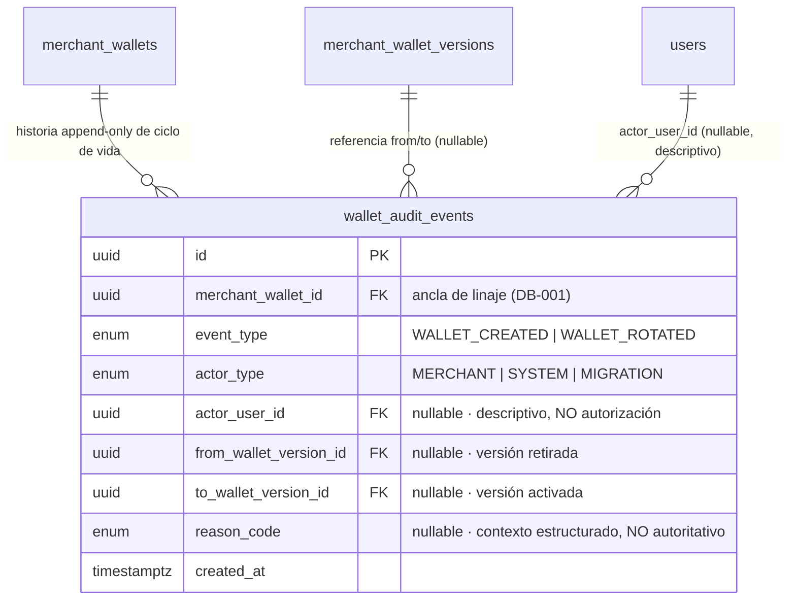
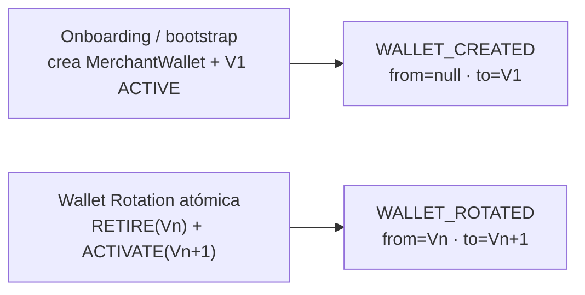
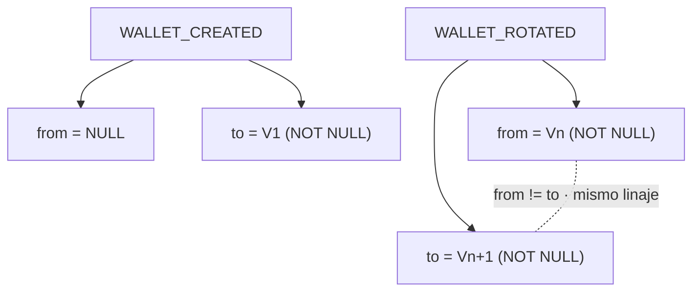
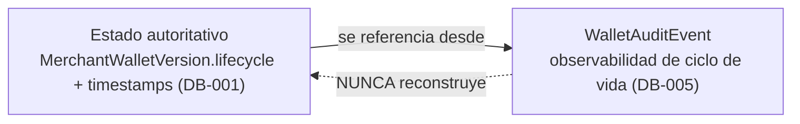
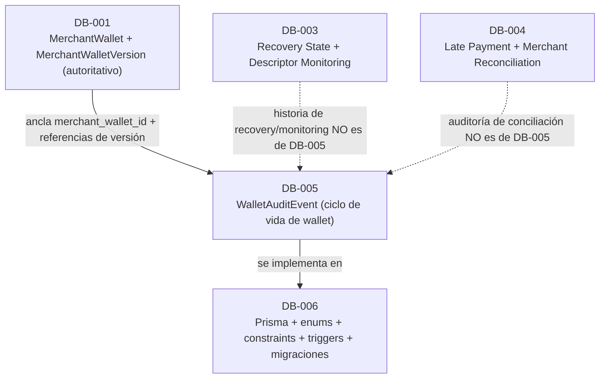

# DB-005 — Wallet Audit / Wallet Lifecycle Change-History

> Documento de diseño de persistencia de base de datos. Consolida las decisiones **D1–D12**, aprobadas por los owners del proyecto (Human Gate FINAL). Construye sobre las decisiones aprobadas [ARCH-001](./14-architecture-decisions.md) … [ARCH-006](./ARCH-006-late-payments-reconciliation.md), [DB-001](./DB-001-merchant-wallet-wallet-versions.md), [DB-002](./DB-002-allocation-ledger.md), [DB-003](./DB-003-recovery-state-descriptor-monitoring.md), [DB-004](./DB-004-late-payment-merchant-reconciliation.md) e [INFRA-001](./INFRA-001-durable-hwm.md), y **no** las rediseña.

- **Estado del diseño:** **Aprobado** (D1–D12). *(Aprobado (diseño); implementación pendiente.)*
- **Estado de implementación:** **Pendiente**. La implementación (esquema Prisma, enums, constraints PostgreSQL, triggers de append-only, migraciones) pertenece a **DB-006**. La emisión de eventos en runtime (onboarding / rotación) pertenece a las tareas de runtime/aplicación.
- **Área:** Database. **Prioridad:** P1.

> **Distinción obligatoria.** El **diseño** de DB-005 está aprobado. La **implementación** permanece pendiente. Este documento separa explícitamente la **arquitectura target aprobada**, la **implementación actual** y el **trabajo futuro de implementación**. Ninguna afirmación de este documento debe leerse como "la tabla/modelo `WalletAuditEvent` ya existe en el esquema Prisma" ni como "la emisión de eventos de auditoría de wallet ya está implementada".

> **Nota sobre nombres.** Identificadores como `WalletAuditEvent`, `event_type`, `actor_type`, `actor_user_id`, `from_wallet_version_id`, `to_wallet_version_id`, `reason_code`, `WALLET_CREATED`, `WALLET_ROTATED`, `MERCHANT`, `SYSTEM`, `MIGRATION` son **nombres conceptuales de dominio**. Los nombres físicos exactos de tablas, columnas y enums son **decisiones de implementación de DB-006**.

---

## 1. Propósito / problema

FloweyPay es **non-custodial** y modela la identidad de wallet del comercio como `MerchantWallet` (identidad lógica / linaje de rotación) → `MerchantWalletVersion` (identidad de derivación pública **inmutable** + ciclo de vida `ACTIVE`/`RETIRED`) ([DB-001](./DB-001-merchant-wallet-wallet-versions.md)). DB-001 persiste el **estado actual** de cada versión (`lifecycle`, `activated_at`, `retired_at`) pero **no** persiste una **historia append-only** de las operaciones de ciclo de vida de la wallet: quién/qué originó una creación o una rotación, cuándo, y con qué versiones de origen/destino.

DB-005 diseña la persistencia mínima P1 necesaria para responder, por cada `MerchantWallet`:

1. ¿Cuándo se **creó** el linaje de wallet y su primera versión, y con qué **procedencia** (onboarding vs migración/bootstrap)?
2. ¿Cuándo ocurrió cada **Wallet Rotation**, retirando qué versión y activando cuál?
3. ¿Qué **actor/origen** (comercio, sistema, migración) fue responsable de cada operación?

DB-005 introduce **una** entidad append-only: **`WalletAuditEvent`** — la **historia semántica de ciclo de vida de la wallet**. Es **observabilidad**, no una autoridad de estado.

DB-005 **no** posee el ciclo de vida autoritativo de la wallet (eso es [DB-001](./DB-001-merchant-wallet-wallet-versions.md)), ni el Allocation Ledger (DB-002), ni el `recovery_state` / Descriptor monitoring (DB-003), ni la clasificación/conciliación de pagos (DB-004), ni el Durable HWM (INFRA-001), ni el esquema Prisma / migraciones (DB-006).

## 2. Alcance

**Dentro de alcance (DB-005, diseño aprobado):**

- La entidad conceptual **`WalletAuditEvent`**: **historia append-only** de las operaciones de ciclo de vida de `MerchantWallet` / `MerchantWalletVersion`.
- La **taxonomía semántica mínima** de eventos: `WALLET_CREATED`, `WALLET_ROTATED`.
- La **taxonomía de actor**: `MERCHANT`, `SYSTEM`, `MIGRATION` (+ `actor_user_id` descriptivo, nullable).
- Las **referencias** `from_wallet_version_id` / `to_wallet_version_id` a las entidades inmutables de DB-001.
- El `reason_code` **estructurado** opcional como contexto no autoritativo.
- Los invariantes de **append-only**, de **referencia (no duplicación)** y de **autoridad (observabilidad only)**.
- La **expectativa transaccional** (emisión en la misma transacción PostgreSQL que la mutación de ciclo de vida de DB-001).

**Fuera de alcance (diferido explícitamente):** ver [§ 17](#17-límites-explícitos-de-alcance). En particular: el ciclo de vida autoritativo de wallet/versión y el Descriptor (DB-001); el Allocation Ledger y `derivation_index` (DB-002); la historia de transiciones de `recovery_state` y de Descriptor monitoring (DB-003); la clasificación/conciliación de pagos (DB-004); el Durable HWM (INFRA-001); el esquema Prisma + enums + constraints + triggers + migraciones (DB-006); la emisión de eventos en runtime.

## 3. Relación con DB-001 … DB-004 / INFRA-001

| Fuente | Qué aporta / restringe a DB-005 |
|---|---|
| [DB-001 D1/D9/D10](./DB-001-merchant-wallet-wallet-versions.md#18-tabla-de-decisiones-aprobadas-d1d16) | Ancla estable `merchant_wallet_id`; identidad de versión inmutable; ciclo de vida **solo** `ACTIVE`/`RETIRED`; **sin** estado persistido pre-activación; rotación atómica RETIRE(`Vₙ`)+ACTIVATE(`Vₙ₊₁`). DB-005 **referencia** estas entidades; **no** las duplica ni añade columnas. |
| [DB-001 §10](./DB-001-merchant-wallet-wallet-versions.md#10-wallet-rotation-atómica) | Una rotación es **una** operación lógica atómica sobre dos versiones. DB-005 la registra como **un** `WALLET_ROTATED`. |
| [DB-001 D14/D15](./DB-001-merchant-wallet-wallet-versions.md#18-tabla-de-decisiones-aprobadas-d1d16) | Legacy sin wallet versions sintéticas; versiones nunca borradas. DB-005 **no** fabrica historia legacy y retiene permanentemente. |
| [DB-002](./DB-002-allocation-ledger.md) | Allocation Ledger append-only de **hechos terminales** de índice; **no** es event-sourced. DB-005 **no** registra eventos de allocation ni de índice. |
| [DB-003 §7](./DB-003-recovery-state-descriptor-monitoring.md#7-modelo-conceptual-merchantwalletrecoverystate) | La **historia de transiciones** de `recovery_state` / Descriptor monitoring está **diferida al dominio DB-003**. DB-005 **no** la posee (ver [§ 16](#16-boundary-con-db-003)). |
| [DB-004 D8](./DB-004-late-payment-merchant-reconciliation.md#29-tabla-de-decisiones-aprobadas-d1d16) | `ReconciliationAuditEvent` establece el patrón append-only (acción/actor/timestamp; el estado actual es proyección). DB-005 reutiliza ese **patrón** para el dominio de ciclo de vida de wallet, no la misma entidad. |
| [INFRA-001 §7](./INFRA-001-durable-hwm.md#7-consumo-atómico) | El `operation_id` del Durable HWM es una autoridad de idempotencia de consumo. DB-005 **nunca** reutiliza ni equipara su idempotencia con ese `operation_id`. |

DB-005 **no** reabre ni redefine ninguna decisión ARCH, DB-001…DB-004 ni INFRA-001; solo materializa la historia de auditoría de ciclo de vida de wallet que DB-001 no persiste.

## 4. Implementación actual vs arquitectura target

> Verificado en modo solo lectura contra el repositorio. **No** se modificó código, esquema ni migraciones.

| Área | Implementación actual (verificada) | Diseño target DB-005 (aprobado) |
|---|---|---|
| Identidad de wallet | No existe entidad de wallet; el merchant es `users` (`creator_id`). **No** hay `MerchantWallet`/`MerchantWalletVersion`. | Historia de auditoría anclada a `merchant_wallet_id` (DB-001). |
| Historia de ciclo de vida | **No existe**; no hay registro de creación/rotación de wallet. | `WalletAuditEvent` append-only con `WALLET_CREATED` / `WALLET_ROTATED`. |
| Actor / procedencia | Solo un pointer `payments.confirmed_by_user_id` para pagos. Sin actor de operaciones de wallet. | `actor_type` (`MERCHANT`/`SYSTEM`/`MIGRATION`) + `actor_user_id` nullable descriptivo. |
| Patrón de auditoría existente | `payment_notifications` idempotente por `UNIQUE(payment_id, event)`; **sin** tabla de auditoría de wallet. | Entidad de auditoría semántica dedicada, append-only. |

> **No se afirma que estas estructuras ya existan.** DB-005 es **diseño target aprobado**; la implementación (DB-006 / runtime) permanece pendiente.

## 5. Modelo conceptual

DB-005 persiste **una** entidad append-only, anclada al linaje de wallet, que **referencia** (nunca duplica) las versiones inmutables de DB-001.

> **Modelo conceptual, no implementación.** Los nombres de tablas/columnas/enums son ilustrativos; la forma exacta en Prisma/PostgreSQL es trabajo de **DB-006**. **No** aparecen `updated_at`, `before_json`/`after_json`, `correlation_id` ni `operation_id`: por diseño **no** existen (ver [§ 10](#10-append-only), [§ 11](#11-expectativa-transaccional) y [§ 17](#17-límites-explícitos-de-alcance)).

## 6. Entidad `WalletAuditEvent`

Representa **un hecho semántico terminal** de una operación de ciclo de vida de la wallet. Cada fila es inmutable y append-only.

| Campo | Descripción | Nullability |
|---|---|---|
| `id` | UUID. Identidad estable de la fila de auditoría. | No nulo |
| `merchant_wallet_id` | FK → `merchant_wallets(id)` (DB-001). **Ancla estable de linaje** de todo evento. | No nulo |
| `event_type` | `WALLET_CREATED` / `WALLET_ROTATED` (ver [§ 7](#7-taxonomía-de-eventos)). | No nulo |
| `actor_type` | `MERCHANT` / `SYSTEM` / `MIGRATION` (ver [§ 8](#8-semántica-de-actor)). | No nulo |
| `actor_user_id` | FK → `users(id)`. Identidad **descriptiva** del usuario cuando el actor es un comercio. **Nunca** es fuente de autorización. | Nullable |
| `from_wallet_version_id` | FK → `merchant_wallet_versions(id)` (DB-001). Versión **retirada** por la operación. | Nullable |
| `to_wallet_version_id` | FK → `merchant_wallet_versions(id)` (DB-001). Versión **activada** por la operación. | Nullable |
| `reason_code` | Código **estructurado** de contexto (por qué). **No** autoritativo; **no** se inventan valores obligatorios solo para poblar el campo. | Nullable |
| `created_at` | Timestamp de emisión del evento (commit de la operación de ciclo de vida). | No nulo |

**No pertenecen a DB-005** (ver [§ 17](#17-límites-explícitos-de-alcance)): `updated_at`, snapshots `before_json`/`after_json`, `correlation_id`, `operation_id`, `note` de texto libre, y cualquier duplicado de material de wallet (Descriptor, xpub/zpub, checksum, master fingerprint, derivation path, dirección) o de material privado (Seed, Private Key, signing material).

## 7. Taxonomía de eventos

La taxonomía MVP es **exactamente** dos eventos semánticos (D3), cada uno correspondiente a **una** operación lógica de ciclo de vida de DB-001:

| `event_type` | Operación de DB-001 | Semántica |
|---|---|---|
| **`WALLET_CREATED`** | Onboarding / bootstrap: creación del `MerchantWallet` + primera `MerchantWalletVersion` (`V1`) `ACTIVE`. | Génesis del linaje y su primera versión activa, en **una** operación lógica. |
| **`WALLET_ROTATED`** | Wallet Rotation atómica ([DB-001 §10](./DB-001-merchant-wallet-wallet-versions.md#10-wallet-rotation-atómica)): RETIRE(`Vₙ`) + ACTIVATE(`Vₙ₊₁`). | Rotación registrada como **un** único evento con versión de origen y destino. |

**No** se introducen (D3):

- `VERSION_CREATED` — **DB-001 no tiene estado persistido pre-activación**: la verificación de Address #0 ocurre **antes** de persistir/activar la versión permanente y el ciclo de vida es **solo** `ACTIVE`/`RETIRED` ([DB-001 §9/D10](./DB-001-merchant-wallet-wallet-versions.md#9-versionado-y-ciclo-de-vida)). Una versión nunca existe creada-pero-no-activada; por tanto no hay un hecho distinto que auditar.
- `VERSION_ACTIVATED` — la única activación sin retiro concurrente es la **génesis**, ya cubierta por `WALLET_CREATED`; cualquier activación posterior es una rotación (`WALLET_ROTATED`).
- `VERSION_RETIRED` (standalone) — en el MVP el retiro ocurre **solo** como parte de una rotación, ya representada por `WALLET_ROTATED`. El **decommission** independiente de una versión se **difiere** hasta que exista un requisito funcional real (post-MVP).

**Excluidos por boundary de dominio:** eventos de allocation, de Durable HWM, de transición de `recovery_state`, de Descriptor monitoring, de pago y de conciliación del comercio (ver [§ 12](#12-autoridad--observabilidad-only-invariante-duro) y [§ 16](#16-boundary-con-db-003)).

## 8. Semántica de actor

`actor_type` describe el **origen/responsabilidad** de la operación (D4), no el componente técnico que la ejecuta:

| `actor_type` | Semántica | `actor_user_id` |
|---|---|---|
| **`MERCHANT`** | La operación fue originada por el comercio (p. ej. rotación solicitada por el comercio). | Normalmente presente. |
| **`SYSTEM`** | Operación automatizada de FloweyPay. | Normalmente `NULL`. |
| **`MIGRATION`** | Operación de bootstrap/migración que crea una wallet/versión **real** (ver [§ 14](#14-legacy--bootstrap)). | Normalmente `NULL`. |

**No** se introducen (D4):

- `ADMIN` — **no** existe hoy ninguna operación de wallet iniciada por un administrador en FloweyPay; se **difiere** (su adición futura es aditiva y no rompe el enum).
- `WORKER` — el Worker es un **componente de implementación**, no una clase de actor; una operación ejecutada por el Worker es `SYSTEM`.
- `RECOVERY` — la recuperación es **contexto/razón** (`reason_code`), no una identidad de actor.

`actor_user_id` es **descriptivo** y **nunca** debe convertirse en una fuente de autorización.

## 9. Matriz evento → referencias `from`/`to`

| `event_type` | `from_wallet_version_id` | `to_wallet_version_id` | Combinaciones inválidas (DB-006 debe rechazar) |
|---|---|---|---|
| `WALLET_CREATED` | `NULL` (requerido) | **NOT NULL** (requerido: `V1`) | `from` no nulo; `to` nulo |
| `WALLET_ROTATED` | **NOT NULL** (requerido: `Vₙ`) | **NOT NULL** (requerido: `Vₙ₊₁`) | `from` nulo; `to` nulo; `from = to` |

Reglas transversales (para toda referencia no nula):

- La `MerchantWalletVersion` referenciada por `from`/`to` **debe pertenecer** a `merchant_wallet_id` (mismo linaje).
- `from_wallet_version_id ≠ to_wallet_version_id` cuando ambas son no nulas.
- `to` (cuando existe) es la versión **activada** por la operación; `from` (cuando existe) es la versión **retirada** por la operación.

## 10. Append-only

- `WalletAuditEvent` es **estrictamente append-only** (D7): **nunca** se hace `UPDATE` ni `DELETE` de una fila histórica.
- **No** existe `updated_at`: una fila de auditoría no se modifica tras su inserción.
- Una operación de wallet emite **una** fila por operación lógica (D8): una creación emite un `WALLET_CREATED`; una rotación emite un `WALLET_ROTATED`.
- DB-005 **define** el invariante conceptual; la **imposición física** (representación Prisma, triggers/constraints PostgreSQL que bloquean `UPDATE`/`DELETE`, índices, migraciones) pertenece a **DB-006**.

## 11. Expectativa transaccional

- La inserción del `WalletAuditEvent` se **espera** que ocurra en la **misma transacción PostgreSQL** que la mutación autoritativa de ciclo de vida de DB-001 (creación de `MerchantWallet`+`V1`, o la rotación atómica RETIRE+ACTIVATE).
- Por ello la auditoría comparte la **atomicidad** de esa transacción: si la operación de ciclo de vida no se committea, tampoco existe su evento de auditoría. La prevención de operaciones de ciclo de vida duplicadas pertenece al flujo autoritativo de DB-001/runtime; DB-005 no introduce un mecanismo de idempotencia independiente.
- En consecuencia **no** se requiere `operation_id` ni `correlation_id` en el modelo conceptual MVP (D8). Esto es **distinto** del Durable HWM (INFRA-001), donde `consumeNext` es una mutación durable fuera de la transacción operativa y sí requiere `operation_id`.
- Si en el futuro se introduce un **emisor asíncrono / fuera de transacción**, su idempotencia podrá diseñarse entonces; **nunca** reutilizando ni equiparando el `operation_id` del Durable HWM de INFRA-001.

## 12. Autoridad / observabilidad only (invariante duro)

`WalletAuditEvent` es **OBSERVABILIDAD ÚNICAMENTE** (D9). **Nunca** es autoritativa para:

- el estado actual de `MerchantWallet`,
- el `lifecycle` de `MerchantWalletVersion`,
- la identidad de derivación (Descriptor),
- el **Allocation Ledger** (DB-002),
- el **Durable HWM** (INFRA-001),
- el **Recovery State** (DB-003),
- el **Descriptor Monitoring** (DB-003),
- el estado de `Payment`,
- la **Merchant Reconciliation** (DB-004).

El estado autoritativo permanece en el dominio que lo posee. El estado actual **nunca** debe reconstruirse a partir de `WalletAuditEvent`: la historia de auditoría se lee para trazabilidad/observabilidad, **no** como fuente de verdad de estado.

## 13. Wallet Rotation

Una Wallet Rotation es **una** operación lógica atómica en DB-001 (RETIRE `Vₙ` + ACTIVATE `Vₙ₊₁` en una transacción). DB-005 la registra como **un** único `WALLET_ROTATED` con `from_wallet_version_id = Vₙ` y `to_wallet_version_id = Vₙ₊₁` (D8). Un solo evento es **suficiente** para auditar la rotación:

- registra el hecho semántico completo (qué versión se retiró, cuál se activó, actor, razón, timestamp);
- **no** almacena estado de ciclo de vida (autoritativo en `MerchantWalletVersion`), evitando una segunda fuente de verdad (D9);
- no requiere reconstrucción por `correlation_id` de dos filas separadas.

## 14. Legacy / bootstrap

- Los pagos legacy `SHARED_CUSTODIAL` **no** tienen `MerchantWallet`/`MerchantWalletVersion` ([DB-001 D14](./DB-001-merchant-wallet-wallet-versions.md#18-tabla-de-decisiones-aprobadas-d1d16), [DB-002 D14](./DB-002-allocation-ledger.md#28-tabla-de-decisiones-aprobadas-d1d17), [DB-004 D15](./DB-004-late-payment-merchant-reconciliation.md#29-tabla-de-decisiones-aprobadas-d1d16)). DB-005 **no** fabrica historia de auditoría de wallet para datos legacy (D11).
- Si el bootstrap/migración de **DB-006** crea un `MerchantWallet` y una `V1` **reales**, la auditoría **comienza** en esa operación real, con procedencia `MIGRATION` o `SYSTEM` según corresponda.
- **No** se hace back-dating ni se sintetiza historia de wallet/versión inexistente.

## 15. Seguridad / privacidad

- **Sin material sensible (D6):** `WalletAuditEvent` **nunca** persiste Descriptor, xpub/zpub, checksum, master fingerprint, derivation path, dirección de recepción, Seed, Private Key ni signing material. El contexto de identidad proviene **exclusivamente** de las referencias a `MerchantWalletVersion`.
- **Códigos estructurados (D12):** `reason_code` es un vocabulario **estructurado** y **no autoritativo**; **no** se inventan valores obligatorios solo para poblar el campo. **No** hay `note` de texto libre en el MVP.
- **Privilegio mínimo:** acceso a la DB con privilegio mínimo, siguiendo la postura de [DB-001 §13](./DB-001-merchant-wallet-wallet-versions.md#13-seguridad--privacidad) / [DB-002 §23](./DB-002-allocation-ledger.md#23-seguridad--privacidad-d17) / [DB-003 §24](./DB-003-recovery-state-descriptor-monitoring.md#24-seguridad--privacidad) / [DB-004 §23](./DB-004-late-payment-merchant-reconciliation.md#23-seguridad--privacidad--boundary-non-custodial).
- **Postura de infraestructura:** el cifrado en reposo y los backups cifrados son postura **de infraestructura/seguridad de plataforma** ya establecida; DB-005 **no** introduce un requisito de seguridad propio y **no** los presenta como una decisión específica de DB-005 (D12).

## 16. Boundary con DB-003

DB-005 posee **únicamente** la historia de ciclo de vida de `MerchantWallet` / `MerchantWalletVersion`. **No** posee:

- la historia de transiciones de **Recovery State** (`RECOVERY_REQUIRED`/`RECONCILING`/`READY`/`RECOVERY_FAILED`),
- la historia de transiciones de **Descriptor Monitoring**.

Esas permanecen en el dominio de **DB-003** (y su implementación/observabilidad post-MVP; ver [DB-003 §7](./DB-003-recovery-state-descriptor-monitoring.md#7-modelo-conceptual-merchantwalletrecoverystate)). **No** se crea un "wallet-everything event log" unificado.

## 17. Límites explícitos de alcance

| Tarea | Posee (fuera de DB-005) |
|---|---|
| **DB-001** | `MerchantWallet` / `MerchantWalletVersion`, Descriptor, ciclo de vida autoritativo y sus timestamps. |
| **DB-002** | Allocation Ledger, `derivation_index`, `btc_address` autoritativa, `receiving_model`. |
| **DB-003** | `recovery_state`, Descriptor monitoring/lookahead y su **historia de transiciones**. |
| **DB-004** | Clasificación timing/amount, `PaymentReconciliation`, `ReconciliationAuditEvent`. |
| **INFRA-001** | Durable HWM y su `operation_id`. |
| **DB-006** | Modelos Prisma, enums, FKs, CHECK por `event_type`, triggers de append-only, índices y migraciones. |
| **Runtime/aplicación** | Emisión de eventos de auditoría en onboarding/rotación dentro de la transacción de ciclo de vida. |

## 18. Brecha de implementación actual (Current Implementation Gap)

Estado **verificado** contra el repositorio (solo lectura; **no** se modificó código ni esquema). Hoy FloweyPay todavía:

- obtiene direcciones desde una **única wallet compartida** de Bitcoin Core (`getnewaddress`; custodial hoy),
- **no** tiene tabla `MerchantWallet` ni `MerchantWalletVersion`,
- **no** tiene ninguna historia de auditoría de ciclo de vida de wallet,
- **no** tiene modelo de actor para operaciones de wallet,
- **no** tiene tabla/modelo `WalletAuditEvent`.

Esto es **implementación actual**. DB-005 es **diseño target aprobado**. **No** debe afirmarse que estas estructuras ya están implementadas.

## 19. Obligaciones de implementación de DB-006

DB-005 es **diseño**, **no** implementación física. **DB-006** posee la materialización posterior, incluyendo según aplique:

- el modelo Prisma `WalletAuditEvent` y los enums `event_type` (`WALLET_CREATED`, `WALLET_ROTATED`) y `actor_type` (`MERCHANT`, `SYSTEM`, `MIGRATION`), más el enum de `reason_code`;
- las FKs (`merchant_wallet_id`, `from_wallet_version_id`, `to_wallet_version_id`, `actor_user_id`) y la validación de que las referencias de versión pertenecen al mismo linaje;
- los **CHECK constraints por `event_type`** que imponen la matriz de [§ 9](#9-matriz-evento--referencias-fromto) (null-ness de `from`/`to`, `from ≠ to`);
- los **triggers/constraints de append-only** que bloquean `UPDATE`/`DELETE`;
- índices, tipos de columna exactos y migraciones **aditivas** (sin tocar `Payment` ni las entidades de DB-001…DB-004).

El **trabajo de runtime/aplicación** (emitir `WALLET_CREATED`/`WALLET_ROTATED` dentro de la transacción de ciclo de vida) precede/acompaña la habilitación funcional pero es **externo** a DB-005 y a DB-006.

## 20. Invariantes de base de datos

- **I1.** Todo `WalletAuditEvent` pertenece exactamente a un `MerchantWallet` (`merchant_wallet_id` no nulo).
- **I2.** `event_type ∈ { WALLET_CREATED, WALLET_ROTATED }` en el MVP.
- **I3.** `actor_type ∈ { MERCHANT, SYSTEM, MIGRATION }` en el MVP.
- **I4.** `WALLET_CREATED` ⇒ `from_wallet_version_id IS NULL` **y** `to_wallet_version_id IS NOT NULL`.
- **I5.** `WALLET_ROTATED` ⇒ `from_wallet_version_id IS NOT NULL` **y** `to_wallet_version_id IS NOT NULL` **y** `from ≠ to`.
- **I6.** Toda referencia de versión no nula pertenece al `merchant_wallet_id` del evento.
- **I7.** `WalletAuditEvent` es **append-only**: sin `UPDATE`, sin `DELETE`, sin `updated_at`.
- **I8.** `actor_user_id` es descriptivo y **nunca** una fuente de autorización.
- **I9.** Un `WalletAuditEvent` **nunca** persiste Descriptor/xpub/zpub/checksum/fingerprint/derivation path/dirección/Seed/Private Key/signing material.
- **I10.** DB-005 es **observabilidad**; **nunca** es autoritativa para wallet/versión/allocation/HWM/recovery/monitoring/payment/reconciliation.
- **I11.** El estado autoritativo actual **nunca** se reconstruye desde `WalletAuditEvent`.
- **I12.** Una operación de ciclo de vida emite **una** fila de auditoría (creación → un `WALLET_CREATED`; rotación → un `WALLET_ROTATED`).
- **I13.** DB-005 **no** fabrica historia de auditoría para datos legacy ni hace back-dating.
- **I14.** DB-005 **no** posee la historia de transiciones de `recovery_state` ni de Descriptor monitoring (DB-003).

## 21. Tabla de decisiones aprobadas D1–D12

> **Estado:** Aprobado (diseño); implementación pendiente. Human Gate FINAL.

| # | Decisión | Resumen aprobado |
|---|---|---|
| **D1** | Modelo de auditoría semántico específico de wallet | **Una** entidad append-only wallet-scoped (`WalletAuditEvent`); **sin** audit log genérico/global ni framework de auditoría polimórfico. DB-005 posee **solo** la auditoría de ciclo de vida de `MerchantWallet`/`MerchantWalletVersion`. |
| **D2** | Ancla estable de linaje | Todo evento se ancla a `merchant_wallet_id`; la semántica de versión usa `from_wallet_version_id`/`to_wallet_version_id` (nullable), **referencias** a entidades inmutables de DB-001; **nunca** se duplica identidad/material público de derivación. |
| **D3** | Taxonomía de eventos MVP FINAL | **Exactamente** `WALLET_CREATED` y `WALLET_ROTATED`. **Sin** `VERSION_CREATED` (DB-001 no tiene estado pre-activación), `VERSION_ACTIVATED` (génesis ⊂ `WALLET_CREATED`) ni `VERSION_RETIRED` standalone (retiro ⊂ `WALLET_ROTATED`; decommission diferido). |
| **D4** | Taxonomía de actor | `MERCHANT` / `SYSTEM` / `MIGRATION`; `actor_user_id` nullable y descriptivo. **Sin** `ADMIN` (sin operación MVP), `WORKER` (componente, no actor) ni `RECOVERY` (contexto/razón). El actor **nunca** es fuente de autorización. |
| **D5** | Sin snapshots before/after | **Sin** `before_json`/`after_json` ni snapshots genéricos de fila; se registra **solo** la operación semántica. |
| **D6** | Sin material de wallet duplicado | **Nunca** persistir Descriptor, xpub/zpub, checksum, master fingerprint, derivation path, dirección, Seed, Private Key ni signing material; el contexto proviene de las referencias a `MerchantWalletVersion`. |
| **D7** | Append-only | `WalletAuditEvent` estrictamente append-only: sin `UPDATE`, sin `DELETE`, sin `updated_at`. DB-005 define el invariante; DB-006 impone la aplicación física. |
| **D8** | Una fila por operación lógica | Una creación → un `WALLET_CREATED`; una rotación → un `WALLET_ROTATED`. **Sin** `correlation_id` ni `operation_id`. Inserción esperada en la **misma transacción** que la mutación de DB-001; **nunca** reutilizar/equiparar el `operation_id` del Durable HWM (INFRA-001). |
| **D9** | Invariante duro de autoridad | `WalletAuditEvent` es **observabilidad únicamente**; **nunca** autoritativa para wallet/versión/derivación/Allocation Ledger/Durable HWM/Recovery State/Descriptor Monitoring/Payment/Merchant Reconciliation. El estado actual **nunca** se reconstruye desde la auditoría. |
| **D10** | Retención | Retención **permanente** en el MVP; **sin** sistema de purge/archive/TTL/tiering en DB-005. |
| **D11** | Legacy / bootstrap | **No** fabricar historia para legacy `SHARED_CUSTODIAL`; si DB-006 crea una wallet/`V1` real, la auditoría comienza en esa operación real con procedencia `MIGRATION`/`SYSTEM`; sin back-dating ni historia sintética. |
| **D12** | Seguridad / privacidad | `reason_code` estructurado nullable y **no** autoritativo (sin valores obligatorios inventados); **sin** `note` de texto libre en MVP; privilegio mínimo; cifrado en reposo/backups = postura de infraestructura de plataforma, **no** una decisión específica de DB-005. |

---

**Relacionado:** [README.md](./README.md) · [ADR.md](./ADR.md) · [DECISIONS.md](./DECISIONS.md) · [CHANGELOG.md](./CHANGELOG.md) · [DB-001-merchant-wallet-wallet-versions.md](./DB-001-merchant-wallet-wallet-versions.md) · [DB-002-allocation-ledger.md](./DB-002-allocation-ledger.md) · [DB-003-recovery-state-descriptor-monitoring.md](./DB-003-recovery-state-descriptor-monitoring.md) · [DB-004-late-payment-merchant-reconciliation.md](./DB-004-late-payment-merchant-reconciliation.md) · [INFRA-001-durable-hwm.md](./INFRA-001-durable-hwm.md) · [09 — Wallet Rotation](./09-wallet-rotation.md) · [14 — Decisiones de arquitectura](./14-architecture-decisions.md) · [15 — Roadmap futuro](./15-future-roadmap.md) · [16 — Glosario](./16-glossary.md).

