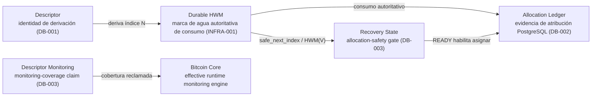
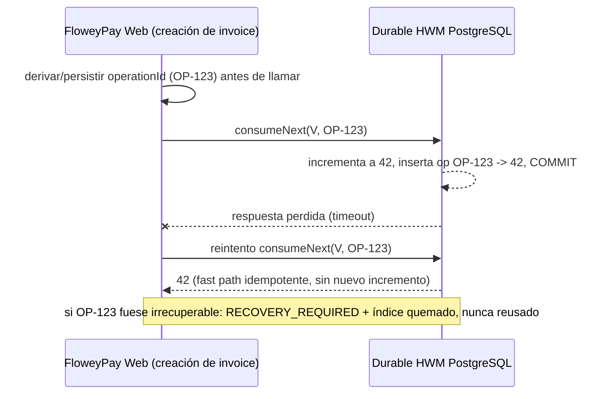
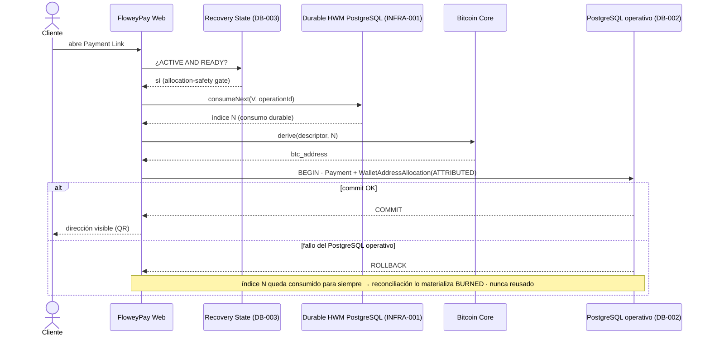
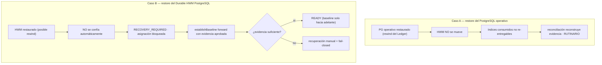
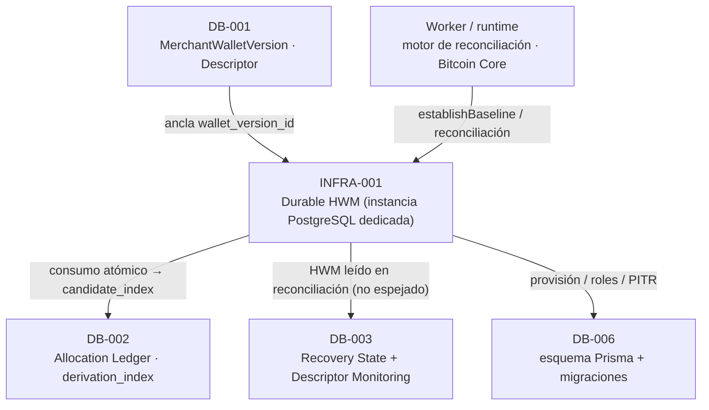

# INFRA-001 — Durable HWM (High-Water Mark)

> Documento de diseño de infraestructura/seguridad. Consolida las decisiones **D1–D24**, **aprobadas por los owners del proyecto con refinamientos** (D2/D4/D7/D10/D11 en su forma **FINAL**). Construye sobre las decisiones aprobadas [ARCH-001](./14-architecture-decisions.md) … [ARCH-006](./ARCH-006-late-payments-reconciliation.md), [DB-001](./DB-001-merchant-wallet-wallet-versions.md), [DB-002](./DB-002-allocation-ledger.md) y [DB-003](./DB-003-recovery-state-descriptor-monitoring.md), y **no** las rediseña.

- **Estado del diseño:** **Aprobado** (D1–D24, con refinamientos FINAL). *(Aprobado (diseño); implementación pendiente.)*
- **Estado de implementación:** **Pendiente**. La provisión de la instancia PostgreSQL dedicada del Durable HWM, la abstracción `DurableHwmStore`, las tablas, roles, PITR/backups independientes, el runbook de recovery y los tests pertenecen a trabajo futuro de infraestructura/runtime.
- **Área:** Infra / Security. **Prioridad:** P0.

> **Distinción obligatoria.** El **diseño** de INFRA-001 está aprobado. La **implementación** permanece pendiente. Este documento separa explícitamente la **arquitectura target aprobada**, la **implementación actual** y el **trabajo futuro de implementación**. Ninguna afirmación de este documento debe leerse como "el Durable HWM ya existe", "ya hay una instancia PostgreSQL dedicada" ni como "la asignación non-custodial derivada ya está activa en producción".

---

## 1. Propósito

INFRA-001 diseña el mecanismo de **Durable HWM (High-Water Mark)**: la **marca de agua autoritativa de consumo** de índices de derivación, **por cada `MerchantWalletVersion`**, con un **ciclo de vida independiente del PostgreSQL operativo** (*Operational PostgreSQL*).

El Durable HWM responde a una única pregunta con autoridad:

> ¿Cuál es el **índice de derivación más alto que fue durablemente consumido** para esta wallet version, de modo que **nunca** vuelva a asignarse (*never-reuse*)?

El contrato de never-reuse aprobado en [ARCH-005 D2](./ARCH-005-index-reconciliation-recovery.md#d2--allocation-ledger--durable-high-water-mark) exige que **restaurar el PostgreSQL operativo desde un backup antiguo no pueda mover el HWM hacia atrás**. INFRA-001 materializa esa exigencia como un componente de infraestructura autoritativo y separado.

INFRA-001 **no** rediseña ninguna decisión de ARCH-005, DB-002 ni DB-003: provee el mecanismo durable que esas decisiones presuponen.

## 2. Alcance

**Dentro de alcance (INFRA-001, diseño aprobado):**

- El **modelo de aislamiento** del Durable HWM respecto al PostgreSQL operativo (dominio de fallo/restore independiente).
- La **operación de consumo atómico** `consumeNext(walletVersionId, operationId) -> consumedIndex`, su idempotencia y su semántica de concurrencia.
- El **modelo conceptual de registro** (`DurableHwmRecord` + registro de operación de consumo idempotente) y el rol de `generation`.
- La **política de restore** (Caso A vs Caso B), la **detección de rollback** del propio store del HWM, la interacción con **Safety Range Burning** y la recuperación ante **pérdida total**.
- Los **requisitos de durabilidad P0**, la **postura de seguridad/roles**, la **propiedad de componentes**, la **abstracción `DurableHwmStore`**, el desarrollo local y la observabilidad.
- La **separación P0 vs post-MVP hardening** y la **decisión tecnológica** (PostgreSQL dedicado como primario; alternativas evaluadas y rechazadas).

**Fuera de alcance (diferido explícitamente):** el **esquema Prisma / enums / constraints / migraciones** (DB-006 y trabajo de infraestructura); la **provisión** real de la instancia PostgreSQL; el **Allocation Ledger** y `derivation_index` (DB-002); la **Recovery State Machine** y el monitoring de Descriptor (DB-003); la identidad de wallet y el `descriptor` canónico (DB-001); la clasificación de **Late Payment** (ARCH-006 → DB-004); el motor de reconciliación en runtime y las llamadas de Bitcoin Core (Worker/runtime). Ver [§ 24](#24-límites-explícitos-de-alcance).

## 3. Relación con ARCH-005 / DB-002 / DB-003 / DB-001

| Fuente | Qué aporta / restringe a INFRA-001 |
|---|---|
| [ARCH-005 D2](./ARCH-005-index-reconciliation-recovery.md#d2--allocation-ledger--durable-high-water-mark) | El **Durable HWM** es la autoridad de consumo con **persistencia independiente**; la tecnología es decisión de infraestructura. INFRA-001 la decide. |
| [ARCH-005 D3](./ARCH-005-index-reconciliation-recovery.md#d3--safety-range-burning) | **Safety Range Burning**: avanzar el baseline más allá de índices inciertos; nunca reemplaza al HWM ni evita el fail-closed. INFRA-001 lo integra en recovery. |
| [ARCH-005 D4](./ARCH-005-index-reconciliation-recovery.md#d4--fail-closed-recovery-policy) | **Fail-closed**: sin `safe_next_index` probado, se bloquea la asignación. INFRA-001 falla-closed cuando el HWM no está disponible o es incierto. |
| [ARCH-005 D8](./ARCH-005-index-reconciliation-recovery.md#d8--recovery-package) | El **Recovery Package** es evidencia condicional; nunca mueve el HWM hacia atrás. INFRA-001 lo usa como una de las fuentes de evidencia de recovery. |
| [ARCH-005 D10](./ARCH-005-index-reconciliation-recovery.md#d10--implementation-order) | Orden de implementación: el mecanismo del HWM es un paso previo obligatorio a la asignación non-custodial en producción. |
| [DB-002 D10/D11/D17](./DB-002-allocation-ledger.md) | Consumo **atómico monotónico** que avanza **antes** del commit PostgreSQL y de la visibilidad de la dirección; `MAX(ledger)+1` **no** es autoridad; `HWM(V) >= ledger_max(V)`; PostgreSQL **no** es prueba autoritativa del HWM; **no** se persiste `hwm_confirmed_at`. |
| [DB-003 D7/D14](./DB-003-recovery-state-descriptor-monitoring.md#29-tabla-de-decisiones-aprobadas-d1d17) | La **compuerta** `recovery_state == READY` debe permitir asignar; DB-003 **lee** el HWM en reconciliación y usa `HWM(V)` como boundary de monitoring RETIRED; **nunca** lo espeja. |
| [DB-001 D12](./DB-001-merchant-wallet-wallet-versions.md#18-tabla-de-decisiones-aprobadas-d1d16) | Provee el ancla `wallet_version_id` y **no** reintroduce `next_index`/cursor/HWM como autoridad. INFRA-001 usa `wallet_version_id` como namespace del HWM. |

INFRA-001 **no** reabre ninguna decisión ARCH ni DB; materializa el mecanismo durable que todas ellas asumen.

## 4. Implementación actual vs arquitectura target

> Verificado en modo solo lectura contra el repositorio. **No** se modificó código, esquema, migraciones ni infraestructura.

| Área | Implementación actual (verificada) | Diseño target INFRA-001 (aprobado) |
|---|---|---|
| Origen de índices/direcciones | Una **única wallet compartida** de Bitcoin Core vía `getnewaddress` ([`bitcoinRpc.ts`](../../apps/web/app/api/_lib/bitcoinRpc.ts)); custodial hoy; **sin** consumo de índice de derivación por wallet version. | `consumeNext(walletVersionId, operationId)` contra una instancia PostgreSQL dedicada del HWM, previo a derivar la dirección. |
| Autoridad de consumo | **No existe** ningún Durable HWM. | `DurableHwmRecord.highest_ever_allocated_index` como autoridad monotónica por wallet version. |
| Aislamiento de dominio de fallo | Un **único** PostgreSQL operativo (Docker) para todo. | Instancia PostgreSQL **dedicada** para el HWM, con volumen/WAL/PITR/backups/credenciales separados. |
| Idempotencia de consumo | **No existe** log de operación de consumo. | Registro `hwm_consume_ops` con `UNIQUE(wallet_version_id, operation_id)`. |
| Roles / privilegios | Sin roles dedicados de HWM. | Tres clases de privilegio: consume, reconciliation, recovery-admin. |
| PITR/backup del HWM | Inexistente (no hay store de HWM). | PITR/backups **independientes** con política **never-backward restore** y deletion protection. |
| Abstracción de aplicación | Inexistente. | `DurableHwmStore` (interfaz estrecha), consumida por el path de creación de invoices. |

> **No se afirma que estas estructuras ya existan.** INFRA-001 es **diseño target aprobado**; la implementación (provisión de PostgreSQL, `DurableHwmStore`, tablas, roles, PITR, runbook, tests) permanece pendiente.

## 5. Modelo de autoridad (debe permanecer exacto)

INFRA-001 posee **exclusivamente** la marca de agua autoritativa de consumo. Los demás límites permanecen intactos:

| Concepto | Autoridad | Postura de INFRA-001 |
|---|---|---|
| **Descriptor** | Identidad de derivación (DB-001) | INFRA-001 **no** almacena descriptors ni claves. |
| **Durable HWM** | **Marca de agua autoritativa de consumo** (INFRA-001) | Este documento. |
| **Allocation Ledger** | Evidencia de atribución en PostgreSQL (DB-002) | Cross-check de reconciliación; **no** es autoridad del HWM. |
| **Recovery State** | Allocation-safety gate (DB-003) | El HWM alimenta la prueba de `safe_next_index`; la compuerta permanece en DB-003. |
| **Descriptor Monitoring** | Monitoring-coverage claim (DB-003) | Ajeno al HWM. |
| **Bitcoin Core** | Effective runtime monitoring engine | Ajeno al HWM. |

> El **PostgreSQL operativo NO** es la autoridad del Durable HWM. El **Durable HWM PostgreSQL** es un componente de infraestructura autoritativo **separado**.



## 6. Semántica del HWM

Por cada `MerchantWalletVersion` **V**:

$$\text{HWM}(V) = \text{índice de derivación más alto jamás durablemente consumido para } V$$

Propiedades requeridas:

- **Monotónico**; **nunca decrece**.
- **Namespace por wallet version** (V1/index 0 y V2/index 0 coexisten independientes).
- **Concurrency-safe** y **consumido atómicamente**.
- **Independiente del restore del PostgreSQL operativo**.
- **Fail-closed** cuando no está disponible o es incierto.
- **Reconciliable** contra la evidencia aprobada (Allocation Ledger, índice fondeado on-chain, Recovery Package).

Baseline inicial normal:

$$\text{HWM} = -1 \quad\Rightarrow\quad \text{primer } \texttt{consumeNext} \text{ devuelve } 0$$

El **establecimiento explícito** (`establishBaseline`) es preferible a la recreación implícita e insegura de un registro de HWM de producción faltante. Un registro faltante en producción **no** se interpreta como cero: se trata como estado no probado ⇒ **fail-closed** (ver [§ 15](#15-corrupción-de-registro)).

Rango válido: $-1 \le \text{HWM} < 2^{31}$ (chain de recepción externa BIP84 `0/*`). Al alcanzar $2^{31}-1$ se **fail-closed**; no hay más índices en esta chain y se requiere **Wallet Rotation** (nueva versión), nunca reutilización.

## 7. Consumo atómico

Operación conceptual (autoridad de asignación):

```text
consumeNext(walletVersionId, operationId) -> consumedIndex
```

- **`operationId` es REQUERIDO.** El mismo `wallet_version_id + operation_id` **debe** devolver **exactamente el mismo** índice consumido **para siempre**.
- El llamador **deriva/persiste `operationId` antes** de invocar (por ejemplo, a partir del intento de allocation), de modo que un reintento siempre pueda repetir el mismo `operationId`.

El store conceptual del HWM contiene dos registros:

```mermaid
erDiagram
    durable_hwm ||--o{ hwm_consume_ops : "log de idempotencia"
    durable_hwm {
        uuid wallet_version_id PK "ancla DB-001"
        bigint highest_ever_allocated_index ">= -1 · monotónico"
        bigint generation "token monotónico (ver §10)"
        text environment_network "guard de namespace"
        timestamptz updated_at
    }
    hwm_consume_ops {
        uuid wallet_version_id PK_FK
        text operation_id PK "token de idempotencia"
        bigint consumed_index "índice devuelto"
        timestamptz created_at
    }
```

Constraint requerido: **`UNIQUE(wallet_version_id, operation_id)`**. El **incremento del HWM** y el **INSERT de la operación de consumo** ocurren en la **MISMA transacción PostgreSQL**.

> **Modelo conceptual, no implementación.** Los nombres de tablas/columnas son ilustrativos; la forma exacta en Prisma/PostgreSQL es trabajo futuro. No se persisten campos ajenos (Seed, descriptors, direcciones, `safe_next_index`, `ledger_max`, `hwm_confirmed_at`).

## 8. Prueba de concurrencia (D7 FINAL)

Una secuencia **naive** de tres pasos:

```text
SELECT operation
UPDATE HWM
INSERT operation
```

**no** es suficiente por sí sola bajo requests duplicados concurrentes: dos transacciones con el mismo `operationId` pueden ambas observar inicialmente que no existe fila de operación. La corrección **no** depende del `SELECT` inicial (que es solo un *fast path*), sino de **`UNIQUE(wallet_version_id, operation_id)` + incremento e INSERT en la MISMA transacción**.

Algoritmo aprobado (READ COMMITTED, con reintento acotado):

```text
consumeNext(v, op):
  for attempt in 1..maxRetries:
    row := SELECT consumed_index FROM hwm_consume_ops WHERE (v, op)
    if row: return row.consumed_index                 -- fast path idempotente
    BEGIN
      idx := UPDATE durable_hwm
                SET highest_ever_allocated_index = highest_ever_allocated_index + 1,
                    generation = generation + 1, updated_at = now()
              WHERE wallet_version_id = v
              RETURNING highest_ever_allocated_index    -- el row lock serializa la versión
      INSERT INTO hwm_consume_ops(v, op, idx)           -- UNIQUE(v, op) es la garantía
    COMMIT  ->  return idx
    ON unique_violation(hwm_consume_ops):
      ROLLBACK           -- deshace también el incremento transitorio
      continue           -- el siguiente SELECT devuelve el índice del ganador
```

Para **dos llamadas simultáneas con el MISMO `operationId`**:

1. ambas pueden observar inicialmente **ninguna** fila de operación;
2. el `UPDATE` de la **misma** fila del HWM **serializa** vía **row locking** de PostgreSQL;
3. la primera transacción incrementa a **N**, inserta `operationId -> N` y **commitea**;
4. la segunda transacción puede incrementar **transitoriamente** a **N+1**;
5. su INSERT de operación **viola `UNIQUE(wallet_version_id, operation_id)`**;
6. la transacción entera hace **ROLLBACK**;
7. el rollback **también elimina** el incremento transitorio a N+1 (el HWM vuelve a N);
8. el reintento **lee** la fila de operación del ganador;
9. el reintento devuelve **N**.

**Invariante:**

$$\text{mismo } \texttt{wallet\_version\_id} + \text{mismo } \texttt{operation\_id} \;\Rightarrow\; \text{exactamente un } \texttt{consumed\_index} \text{ committeado para siempre}$$

**READ COMMITTED + row locking + UNIQUE constraint + misma transacción + reintento acotado** es aceptable para P0. `SERIALIZABLE` con reintento es una alternativa válida pero **no** requerida. **No** se introduce ningún **lock distribuido**.

## 9. Timeout ambiguo

Escenario obligatorio de documentar:

```text
consumeNext(V, OP-123)   →  el HWM commitea el índice 42
la respuesta se pierde (timeout de red)
el llamador reintenta:
consumeNext(V, OP-123)   →  DEBE devolver 42  (NO 43)
```

El resultado **debe** ser **42**, no 43. Esta es la razón por la que `operationId` es **obligatorio**: sin él, un timeout es irresoluble y forzaría a quemar el índice.



Si el resultado **aún no puede probarse** (por ejemplo, se perdió el `operationId`), la asignación permanece **fail-closed**: la wallet version pasa a `RECOVERY_REQUIRED` y el índice ambiguo se materializa como **BURNED** ([DB-002](./DB-002-allocation-ledger.md)); **nunca** se reutiliza.

## 10. `generation` — semántica FINAL (D4 FINAL)

Refinamiento **obligatorio**. **NO** se afirma que:

> ~~`generation` detecta el rollback del propio store del HWM.~~

Esa afirmación es **incorrecta**: un rollback del store del HWM **también** revierte `generation` hacia atrás, de modo que un `generation` leído del **mismo** store no puede detectar un rollback de ese mismo store (el store restaurado luce internamente consistente, con índice **y** generation menores).

`generation` **sí** puede usarse para:

1. **Optimistic-concurrency / CAS** en futuros adapters de KV transaccional gestionado (no en el path PostgreSQL primario).
2. **Guard monotónico-forward** para `establishBaseline` **dentro** del store (rechazar un baseline con `generation` no mayor).
3. **Metadata de cross-check opcional** que el PostgreSQL operativo puede registrar en el momento de la allocation.

`generation` **NO** es un detector independiente de rollback. **No** se introduce un journal externo de `generation` como **segunda autoridad oculta** del HWM.

## 11. Detección de rollback del HWM (D11 FINAL)

El rollback del **propio store del HWM** se detecta mediante **reconciliación contra evidencia independiente ya aprobada**, **no** mediante `generation`. Como mínimo:

- evidencia del **Allocation Ledger** ([DB-002](./DB-002-allocation-ledger.md));
- **índice fondeado on-chain** más alto;
- evidencia del **Recovery Package** cuando aplique ([ARCH-005 D8](./ARCH-005-index-reconciliation-recovery.md#d8--recovery-package)).

Se preserva la invariante aprobada:

$$\text{HWM}(V) \ge \text{ledger\_max}(V)$$

y la evidencia de seguridad equivalente de ARCH-005/DB-002. Si un HWM restaurado **contradice** una evidencia más fuerte (queda por detrás del ledger o de la cadena):

$$\textbf{FAIL-CLOSED} \;\rightarrow\; \texttt{RECOVERY\_REQUIRED} \;\rightarrow\; \text{reconciliación}$$

No se reanuda la asignación automáticamente. **No** se introduce una segunda autoridad de HWM: la detección usa la evidencia del Allocation Ledger/on-chain que ya es parte del diseño aprobado.

## 12. Ordenamiento con el PostgreSQL operativo

Se preserva el orden de [DB-002](./DB-002-allocation-ledger.md):

1. **Recovery State** debe permitir la asignación (`READY`, DB-003).
2. La **Web** llama a `consumeNext()` del Durable HWM.
3. El **HWM** consume durablemente el índice.
4. La **Web** deriva la dirección.
5. La transacción del **PostgreSQL operativo** crea `Payment` + `WalletAddressAllocation`.
6. El **PostgreSQL operativo** commitea.
7. La dirección se hace **visible al cliente** (solo entonces).



Si el **HWM avanza pero el PostgreSQL operativo falla**, el índice **permanece consumido para siempre**; la reconciliación puede materializarlo como **BURNED**; **nunca** se reutiliza.

## 13. Semántica de restore — dos casos distintos

### Caso A — restore del PostgreSQL operativo (rutinario / seguro)

Es **esperado y seguro** desde la perspectiva del HWM. El PostgreSQL operativo **puede** moverse hacia atrás (rewind del Allocation Ledger), pero el **Durable HWM NO** se mueve (vive en una instancia separada). Por tanto, los índices **ya consumidos no pueden volver a entregarse**: la asignación siempre consume del HWM (forward-only, no afectado). La reconciliación repara/reconstruye la evidencia operativa según sea necesario. **Este es el propósito central de [§ 5](#5-modelo-de-autoridad-debe-permanecer-exacto) y de D2.**

### Caso B — restore del Durable HWM PostgreSQL (excepcional / fail-closed)

Es **excepcional**. Un snapshot antiguo del HWM **nunca** se confía automáticamente (puede estar por detrás de la realidad). Las wallet versions afectadas **entran/permanecen** en `RECOVERY_REQUIRED`; la asignación **queda bloqueada**. La recuperación debe **establecer un baseline forward provablemente seguro** usando evidencia aprobada:

$$\text{safe\_baseline} = \max\big(\text{restored\_hwm},\ \text{allocation\_ledger\_evidence},\ \text{highest\_funded\_on\_chain\_index},\ \text{recovery\_package\_evidence}\big) + \text{safety\_margin}_{\text{si aplica}}$$

> **Precedencia de ARCH-005.** Si [ARCH-005](./ARCH-005-index-reconciliation-recovery.md) define una semántica de reconciliación más precisa, **prevalece**; la fórmula anterior es conceptual, no una fórmula de implementación.

Invariante esencial: **el baseline solo puede moverse HACIA ADELANTE, nunca hacia atrás.** Evidencia insuficiente ⇒ **recuperación manual + fail-closed**.



## 14. Safety Range Burning y recovery

Si el HWM previo exacto **no puede probarse** pero **sí** puede establecerse un lower bound seguro, la recuperación puede **avanzar el baseline más allá** de los índices inciertos ([ARCH-005 D3](./ARCH-005-index-reconciliation-recovery.md#d3--safety-range-burning)). Esos índices quedan **permanentemente consumidos/quemados**. **Nunca** se intenta recuperar capacidad reutilizando índices inciertos. Safety Range Burning **nunca** reemplaza al HWM ni evita el fail-closed; solo convierte incertidumbre en un salto forward seguro y auditado (vía `establishBaseline`, monotónico-forward).

### Pérdida total del HWM

Si el store del HWM se pierde por completo:

- **NO** se reconstruye usando el Allocation Ledger **solo** (el Ledger puede no contener todos los índices consumidos/quemados);
- se usa la evidencia aprobada de [ARCH-005](./ARCH-005-index-reconciliation-recovery.md), incluyendo cuando aplique: **Allocation Ledger**, evidencia **derivada del Descriptor**, **índice fondeado on-chain** más alto, **Recovery Package** y **Safety Range Burning**;
- la asignación permanece **fail-closed** hasta que se pruebe un baseline forward seguro;
- evidencia **ambigua** ⇒ **recuperación manual**.

## 15. Corrupción de registro

Manejo **fail-closed** para, al menos:

- registro de HWM de producción **faltante** inesperadamente;
- valor **malformado** (no entero);
- $\text{HWM} < -1$;
- $\text{HWM} \ge 2^{31}$;
- **registros lógicos duplicados** para una misma wallet version;
- **environment/network** incorrecto;
- `generation` inválida, fuera de rango o inconsistente con las invariantes internas de la operación (CAS/optimistic concurrency); **no** se interpreta como una autoridad durable de "última generation observada" capaz de detectar rollback (ver [§ 10](#10-generation--semántica-final-d4-final) / [§ 11](#11-detección-de-rollback-del-hwm-d11-final));
- **restore** inesperado.

**No** se recrean silenciosamente registros de HWM de producción faltantes. Cada caso bloquea la asignación y eleva `RECOVERY_REQUIRED`.

## 16. Política de borrado

- Los registros de HWM de **producción no se borran** durante el ciclo de vida normal.
- Las **wallet versions RETIRED** retienen su HWM **indefinidamente**, porque DB-003 usa $\text{monitored\_through\_index}(V) \ge \text{HWM}(V)$ como **boundary de monitoring RETIRED** ([DB-003 D7](./DB-003-recovery-state-descriptor-monitoring.md#29-tabla-de-decisiones-aprobadas-d1d17)).
- El borrado de merchant/cuenta **no** implica automáticamente el borrado de la **evidencia de seguridad autoritativa** del HWM.
- La limpieza de test/dev puede seguir procedimientos controlados **específicos de entorno**.

## 17. Aislamiento de entornos

DEV / QA / SIGNET / MAINNET **nunca** deben compartir accidentalmente un namespace de HWM. Se prefiere **ambos**:

- **aislamiento de infraestructura/credenciales** (store de HWM separado por entorno);
- **namespacing explícito por environment/network** (`environment_network` como guard; rechazar cross-tag).

**No** se depende solo de convenciones de aplicación.

## 18. Seguridad / roles

Privilegio mínimo mediante **tres clases de rol conceptuales**:

| Rol | Puede | No puede |
|---|---|---|
| **Runtime consume** | leer estado de runtime requerido; `consumeNext` | reset/decrement/delete arbitrario; `establishBaseline` |
| **Reconciliation** | leer el HWM; comparar evidencia | reset/delete arbitrario |
| **Recovery-admin** | `establishBaseline` monotónico-forward (auditado) | mover hacia atrás; borrar |

El código de aplicación normal **no** tiene capacidades arbitrarias de `SET HWM = X`, `DELETE HWM` ni `DECREMENT HWM`. Un **CHECK/trigger a nivel de base de datos** refuerza la monotonicidad-forward, de modo que incluso un rol `consume` comprometido no puede mover el HWM hacia atrás.

Requisitos: **conectividad privada** (nunca exposición pública), **TLS**, **cifrado en reposo**, **credenciales/identidad de servicio dedicadas**, **audit logging** de cada establecimiento de baseline, **deletion protection**, **alarmas** y **privilegio mínimo**.

## 19. Propiedad de componentes

Para P0:

- El **path de creación de pagos de la Web/backend** es el **único** consumidor normal autorizado a **avanzar** el HWM.
- El **Worker NO** consume índices de derivación normalmente (observa; no asigna).
- La **reconciliación** puede **leer** el HWM.
- Solo la capacidad **recovery-admin** puede establecer un baseline recuperado forward.

**No** se crea un microservicio de HWM independiente para P0. Se usa una **abstracción de aplicación estrecha**, `DurableHwmStore`, sin filtrar lógica específica de PostgreSQL por el código de negocio:

```text
interface DurableHwmStore {
  read(walletVersionId): { index, generation } | NONE
  consumeNext(walletVersionId, operationId): consumedIndex   -- atómico, idempotente
  establishBaseline(walletVersionId, newBaseline, recoveryContext): void   -- solo monotónico-forward
  verifyHealth(): HealthStatus
}
```

## 20. Desarrollo local

Enfoque aprobado:

- una **instancia/contenedor PostgreSQL separado** para el HWM;
- **volumen de datos separado** del PostgreSQL operativo;
- la **misma semántica** de `DurableHwmStore`.

Los **unit tests** pueden usar una implementación **fake/in-memory** determinista donde sea apropiado. Los **tests de integración de concurrencia/idempotencia DEBEN** usar una implementación **transaccional real** capaz de reproducir la semántica de PostgreSQL. **No** se trata un fake in-memory como prueba suficiente de seguridad de concurrencia.

## 21. Observabilidad

Métricas/logs para: **consume** éxito/fallo, **latencia** de consume, **reintento por operación duplicada**, **reintento por unique-conflict**, **HWM no disponible**, registro **inválido/faltante**, **transición a recovery-required**, ejecución de **establishBaseline** e **intento de mutación no autorizado**.

Evitar loggear descriptors, direcciones o datos de merchant innecesarios. Los **valores crudos del HWM no** se emiten ampliamente (son señal de actividad privacy-relevante); se usan solo en contextos de diagnóstico/auditoría controlados donde sea necesario.

## 22. Costo operativo — redacción correcta

INFRA-001 **no** se describe como *"zero new ops"*. Caracterización correcta:

> **No** introduce **nueva tecnología de base de datos**, porque FloweyPay **reutiliza PostgreSQL**, pero introduce una **superficie operativa dedicada no despreciable**.

Esa superficie incluye: **provisión**, **credenciales/roles dedicados**, **monitoring**, **ciclo de PITR/backup independiente**, **runbook de recovery**, **patching/upgrades** y **deletion protection**. El costo incremental de MVP puede ser **bajo**; la **propiedad operativa es real** y, por ser autoritativa, su rigor debe **igualar o superar** el del PostgreSQL operativo.

## 23. P0 vs post-MVP hardening

| P0 (requerido) | Post-MVP hardening |
|---|---|
| Instancia PostgreSQL **separada** (D2 FINAL) | **Standby síncrono / HA** (D10 FINAL) |
| Volumen / data directory separado | **Host físico** separado |
| WAL / PITR / backups separados | Región / cuenta separada |
| Credenciales separadas | Adapter de **KV transaccional gestionado** cuando la dirección cloud lo justifique |
| `synchronous_commit=on` + almacenamiento durable | Detección de tamper más fuerte |
| Deletion protection | Aprobación multi-parte para recovery-admin |
| Política **never-backward restore** | Mecanismos avanzados de audit inmutable |
| Idempotencia por `operationId` | |
| `UNIQUE(wallet_version_id, operation_id)` | |
| Consumo atómico en la misma transacción | |
| **Fail-closed** | |
| Tres clases de privilegio | |
| Aislamiento de entornos | |
| Monitoring / alarmas | |
| Runbook de recovery | |

> **No** se introduce un journal externo de HWM como **segunda autoridad**. El standby síncrono mejora disponibilidad y durabilidad **zero-RPO** si el almacenamiento primario se pierde por completo; **sin** él, la pérdida total del store causa un **fail-closed seguro** y recuperación basada en evidencia — **no** autoriza reutilización.

## 24. Límites explícitos de alcance



| Tarea | Posee (fuera de INFRA-001) |
|---|---|
| **DB-001** | `MerchantWalletVersion`, `descriptor`, ciclo de vida. INFRA-001 usa `wallet_version_id` como namespace; no añade columnas a la versión. |
| **DB-002** | Allocation Ledger, `derivation_index`, `btc_address`, `receiving_model`. INFRA-001 provee el consumo atómico que DB-002 registra como evidencia. |
| **DB-003** | Recovery State + monitoring; **lee** el HWM y usa `HWM(V)` como boundary RETIRED; **no** lo espeja. |
| **DB-006 / infra** | Esquema Prisma, enums, constraints, migraciones; provisión real de la instancia PostgreSQL, roles y PITR. |
| **Worker / runtime** | Motor de reconciliación/establecimiento, llamadas de Bitcoin Core, Safety Range Burning en ejecución. |

## 25. Current Implementation Gap

Estado **verificado** contra el repositorio (solo lectura; **no** se modificó código, esquema ni infraestructura). Hoy FloweyPay:

- obtiene direcciones desde **una única wallet compartida** de Bitcoin Core usando `getnewaddress` ([`bitcoinRpc.ts`](../../apps/web/app/api/_lib/bitcoinRpc.ts)); opera de forma **custodial**; **no** consume índices de derivación por wallet version;
- **no** tiene la abstracción `DurableHwmStore`;
- **no** tiene una **instancia PostgreSQL dedicada** del HWM (existe una única instancia PostgreSQL operativa en Docker);
- **no** tiene tablas de HWM (`durable_hwm`) ni log de operaciones de consumo (`hwm_consume_ops`);
- **no** tiene roles de HWM (consume / reconciliation / recovery-admin) ni un path de recovery-admin;
- **no** tiene un ciclo de PITR/backup independiente para el HWM;
- **no** tiene ningún mecanismo de `consumeNext`/`establishBaseline`.

> El único locking PostgreSQL presente hoy es un `pg_advisory_xact_lock` en el path de creación de invoice ([`start/route.ts`](../../apps/web/app/api/public/payment-links/%5Btoken%5D/start/route.ts)); es **serialización operativa**, **no** el mecanismo de never-reuse del Durable HWM.

Esto es **implementación actual**. INFRA-001 es **diseño target aprobado**. **No** debe afirmarse que estas estructuras ya están implementadas.

## 26. Implicaciones de implementación / trabajo futuro

Trabajo de implementación que **probablemente** se derive de INFRA-001 (no se implementa aquí; orden/número de PRs puede variar), gobernado por el orden de [ARCH-005 D10](./ARCH-005-index-reconciliation-recovery.md#d10--implementation-order):

1. **Provisionar** la instancia PostgreSQL dedicada del HWM (volumen/WAL/PITR/backups/credenciales separados; deletion protection; `synchronous_commit=on`).
2. Materializar `durable_hwm` y `hwm_consume_ops` con `UNIQUE(wallet_version_id, operation_id)` y CHECK/trigger de monotonicidad-forward.
3. Implementar la abstracción `DurableHwmStore` (`read`/`consumeNext`/`establishBaseline`/`verifyHealth`) e integrarla en el path de creación de invoices.
4. Definir los **tres roles** y las políticas de conectividad privada/TLS/cifrado/audit/alarmas.
5. Definir el **runbook de recovery** (Caso B, pérdida total, Safety Range Burning) y la política **never-backward restore**.
6. Suite de **tests** ([§ 27](#27-contrato-de-tests-obligatorio-para-la-implementación-futura)).

Precede obligatoriamente a la habilitación de la asignación de direcciones non-custodial en producción (ARCH-005 D10).

## 27. Contrato de tests obligatorio para la implementación futura

| # | Test |
|---|---|
| 1 | la primera allocation devuelve el índice **0** |
| 2 | monotonicidad de allocation secuencial |
| 3 | **100 consumidores concurrentes** producen índices únicos |
| 4 | `operationId` duplicado concurrente devuelve **un** índice |
| 5 | reintento con respuesta perdida devuelve el **mismo** índice |
| 6 | HWM no disponible ⇒ **fail-closed** |
| 7 | **restore del PostgreSQL operativo NO afecta** al HWM |
| 8 | restore del HWM ⇒ `RECOVERY_REQUIRED` |
| 9 | HWM faltante/corrupto ⇒ **fail-closed** |
| 10 | namespaces de Wallet Version **aislados** |
| 11 | RETIRED **no** puede consumir |
| 12 | overflow de índice cerca de $2^{31}$ ⇒ fail-closed |
| 13 | decrement/reset/delete **rechazados** |
| 14 | fallo de commit del PostgreSQL operativo tras consumo **nunca** causa reutilización |
| 15 | `establishBaseline` es **solo monotónico-forward** |
| 16 | aislamiento de entornos |
| 17 | tests de **frontera de privilegios** |

## 28. Tabla de decisiones aprobadas D1–D24

> **D2, D4, D7, D10 y D11 se listan en su forma FINAL** (aprobadas con refinamientos). Cualquier redacción previa que sugiera "otra base de datos en la misma instancia es suficiente", "`generation` detecta rollback", "réplica síncrona requerida en P0", "zero new ops", "`INCR` simple es suficiente" u "`operationId` opcional" queda **superada**.

| # | Decisión | Resumen aprobado |
|---|---|---|
| **D1** | Tecnología de almacenamiento | **Instancia PostgreSQL dedicada** como primario P0; **KV transaccional gestionado** (CAS/conditional writes + idempotencia) como segunda opción/futuro; **Redis no** seleccionado como autoridad. |
| **D2 (FINAL)** | Dominio de fallo independiente | Instancia PostgreSQL **dedicada** con **data directory, volumen de almacenamiento, timeline WAL/PITR, backups y credenciales** propios. Una **segunda base de datos en la instancia operativa es explícitamente insuficiente**. Host/región separados = **post-MVP hardening**. Residual MVP (mismo host físico) mitigado con volúmenes/restore/deletion-protection/never-backward/fail-closed. |
| **D3** | Modelo de consistencia | Fuerte/linealizable; incremento atómico en **una sola sentencia** (`UPDATE … RETURNING`) con row lock; **READ COMMITTED** suficiente (`SERIALIZABLE` opcional, no requerido). |
| **D4 (FINAL)** | Modelo de registro + `generation` | `DurableHwmRecord` = `{ wallet_version_id, highest_ever_allocated_index (≥ -1), generation, environment_network, updated_at }`. `generation` es para **CAS/optimistic concurrency**, **guard monotónico-forward** de `establishBaseline` y **metadata de cross-check opcional**; **NO** detecta el rollback del propio store del HWM. |
| **D5** | Valor inicial | `HWM = -1` vía `establishBaseline` **explícito**; primer consume devuelve `0`. La **recreación implícita** de un registro faltante en producción se **rechaza** (fail-closed). |
| **D6** | Consumo atómico | `UPDATE … RETURNING` (incremento + retorno del índice) dentro de una transacción. |
| **D7 (FINAL)** | Idempotencia por `operationId` | `operationId` **obligatorio**; **`UNIQUE(wallet_version_id, operation_id)`**; incremento del HWM + INSERT de operación en la **MISMA transacción**; duplicados concurrentes convergen a un índice vía rollback/retry; el `SELECT` inicial es solo *fast path*, **no** la garantía de corrección. |
| **D8** | Timeout ambiguo | Reintento con el mismo `operationId` ⇒ **mismo** índice; si el `operationId` es irrecuperable ⇒ `RECOVERY_REQUIRED` + índice **quemado**, nunca reusado. |
| **D9** | Concurrencia | Serialización por **row lock** del store atómico; **sin lock distribuido**. |
| **D10 (FINAL)** | Durabilidad | P0 = `synchronous_commit=on` + almacenamiento durable + PITR/backups independientes + deletion protection + **never-backward restore** + **fail-closed**. Un **standby síncrono es post-MVP hardening**, **no** requerido para la corrección de never-reuse en P0. |
| **D11 (FINAL)** | Detección de rollback | El rollback del store del HWM **NO** lo detecta `generation`; se detecta por **reconciliación contra evidencia independiente aprobada** (Allocation Ledger / on-chain / Recovery Package), preservando `HWM(V) ≥ ledger_max(V)`. **No** se introduce una segunda autoridad oculta. |
| **D12** | Recuperación por pérdida total | Reconstruir un lower bound seguro con evidencia de ARCH-005; `establishBaseline` forward; **fail-closed** si la evidencia es insuficiente (recuperación manual). No usar el Allocation Ledger **solo**. |
| **D13** | Safety Range Burning | Avanzar el baseline más allá de índices inciertos (índices quemados); monotónico-forward; nunca reutilizar capacidad incierta; nunca reemplaza al HWM ni evita el fail-closed. |
| **D14** | Enforcement monotónico-forward | CHECK/trigger a nivel de base de datos; sin decrement/reset para runtime. |
| **D15** | Política de borrado | Los registros de producción **nunca** se borran; **RETIRED** conserva el HWM indefinidamente (boundary de monitoring RETIRED de DB-003). |
| **D16** | Namespace por environment/network | Store de HWM **separado por entorno** + tag `environment_network`; no depender solo de convenciones de aplicación. |
| **D17** | Seguridad / roles | Tres clases (consume / reconciliation / recovery-admin); privilegio mínimo; conectividad privada; TLS; cifrado en reposo; audit; deletion protection; alarmas. |
| **D18** | Propiedad de consumo | Solo el **path de creación de pagos** avanza el HWM; el **Worker** es solo lectura; la reconciliación **lee**; solo recovery-admin establece baseline. |
| **D19** | Abstracción de API | Interfaz estrecha `DurableHwmStore`; sin filtrar lógica de PostgreSQL por el código de negocio; un único punto de migración a un adapter de KV. |
| **D20** | Librería, no microservicio | Adapter/librería para P0; **sin** microservicio de HWM independiente. |
| **D21** | Desarrollo local / tests | PostgreSQL local separado (volumen separado) + fake in-memory para unit tests; concurrencia/idempotencia **debe** probarse con una implementación transaccional real. |
| **D22** | Observabilidad | Métricas de consume/latencia/retry/unavailable/recovery/baseline/mutación no autorizada; **no** emitir valores crudos del HWM ampliamente; sin descriptors/direcciones en logs. |
| **D23** | Controles de seguridad / IaC (futuro) | La IaC futura debe garantizar store aislado, roles, cifrado, deletion protection, backups never-backward, alarmas y aislamiento de entornos. **No** implementado aún. |
| **D24** | Split P0 vs hardening | P0 vs post-MVP según [§ 23](#23-p0-vs-post-mvp-hardening); evitar sobre-ingeniería; sin segunda autoridad de HWM. |

## 29. Invariantes

- **I1.** El Durable HWM es la **única** autoridad de consumo; el PostgreSQL operativo **no** es autoridad del HWM.
- **I2.** El HWM es **monotónico** y **nunca decrece**.
- **I3.** El HWM tiene **namespace por wallet version**.
- **I4.** El consumo es **atómico** e **idempotente** por `operationId` (`UNIQUE(wallet_version_id, operation_id)`, misma transacción).
- **I5.** Mismo `wallet_version_id` + mismo `operation_id` ⇒ exactamente un `consumed_index` para siempre.
- **I6.** El primer baseline normal es `-1`; el primer consume devuelve `0`; `-1` se establece **explícitamente**.
- **I7.** Restaurar el PostgreSQL operativo **no puede** mover el HWM hacia atrás.
- **I8.** Una **segunda base de datos en la instancia operativa NO** es aislamiento suficiente.
- **I9.** `generation` **no** detecta el rollback del propio store del HWM.
- **I10.** El rollback del HWM se detecta por **reconciliación contra evidencia aprobada** (`HWM(V) ≥ ledger_max(V)`, on-chain, Recovery Package).
- **I11.** El restore del HWM (Caso B) es **excepcional** y **fail-closed**; nunca se confía un snapshot antiguo automáticamente.
- **I12.** El baseline solo se mueve **hacia adelante** (Safety Range Burning quema índices inciertos; nunca reutiliza).
- **I13.** El HWM es **fail-closed** cuando no está disponible, corrupto, faltante o incierto.
- **I14.** Un **standby síncrono NO** es requerido para la corrección de never-reuse en P0.
- **I15.** **No** se introduce ninguna **segunda autoridad de HWM** (ni journal externo de `generation`).
- **I16.** Las wallet versions **RETIRED** conservan su HWM **indefinidamente**.
- **I17.** El runtime **no** tiene capacidad de `SET`/`DELETE`/`DECREMENT` arbitrarios del HWM.
- **I18.** El **Worker no** consume índices; solo el path de creación de pagos avanza el HWM.

---

**Relacionado:** [README.md](./README.md) · [ADR.md](./ADR.md) · [DECISIONS.md](./DECISIONS.md) · [CHANGELOG.md](./CHANGELOG.md) · [14 — Decisiones de arquitectura](./14-architecture-decisions.md) · [15 — Roadmap futuro](./15-future-roadmap.md) · [16 — Glosario](./16-glossary.md) · [ARCH-005](./ARCH-005-index-reconciliation-recovery.md) · [DB-001](./DB-001-merchant-wallet-wallet-versions.md) · [DB-002](./DB-002-allocation-ledger.md) · [DB-003](./DB-003-recovery-state-descriptor-monitoring.md) · [08 — Wallet Recovery](./08-wallet-recovery.md) · [12 — Flujo operativo](./12-operational-flow.md).
