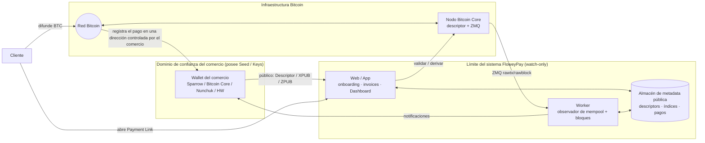

# FloweyPay — Documentación de Arquitectura

**FloweyPay** es una plataforma de procesamiento de pagos Bitcoin **no custodial** (*non-custodial*). Permite a los comercios aceptar pagos on-chain sin que FloweyPay controle nunca los fondos del comercio. FloweyPay deriva **una dirección de recepción única por invoice** a partir de la información pública de la wallet del comercio.

> FloweyPay **no es** una wallet. **No es** un custodio. **Nunca** firma transacciones. El comercio siempre es el único propietario de su seed y de sus private keys.

Este repositorio de documentación describe la arquitectura **aprobada** (ARCH-001, ARCH-002, ARCH-003, ARCH-004, y el **diseño** de ARCH-005). Su objetivo es servir como fuente única de referencia para desarrolladores, arquitectos, QA, revisión de seguridad, auditores y futuros colaboradores.

---

## Visión general de la arquitectura

---

## Índice de documentación

### Documentos de gobernanza

| Documento | Descripción |
|---|---|
| [ADR.md](./ADR.md) | Índice de Architecture Decision Records (ARCH-001 → ARCH-006). |
| [DECISIONS.md](./DECISIONS.md) | Resumen conciso de todas las decisiones de arquitectura actuales. |
| [CHANGELOG.md](./CHANGELOG.md) | Historial de versiones de la arquitectura. |
| [ARCH-005-index-reconciliation-recovery.md](./ARCH-005-index-reconciliation-recovery.md) | Decisión ARCH-005 (D1–D10): Index Reconciliation & Backup Recovery. Diseño **aprobado**; implementación pendiente. |

### Especificación funcional (ARCH-004)

| # | Sección | Documento |
|---|---|---|
| 01 | Resumen ejecutivo | [01-executive-summary.md](./01-executive-summary.md) |
| 02 | Arquitectura de alto nivel | [02-high-level-architecture.md](./02-high-level-architecture.md) |
| 03 | Onboarding del comercio | [03-merchant-onboarding.md](./03-merchant-onboarding.md) |
| 04 | Creación de Payment Link | [04-payment-link-creation.md](./04-payment-link-creation.md) |
| 05 | Flujo de pago del cliente | [05-customer-payment-flow.md](./05-customer-payment-flow.md) |
| 06 | Procesamiento Bitcoin | [06-bitcoin-processing.md](./06-bitcoin-processing.md) |
| 07 | Dashboard del comercio | [07-merchant-dashboard.md](./07-merchant-dashboard.md) |
| 08 | Wallet Recovery | [08-wallet-recovery.md](./08-wallet-recovery.md) |
| 09 | Wallet Rotation | [09-wallet-rotation.md](./09-wallet-rotation.md) |
| 10 | Modelo de negocio | [10-business-model.md](./10-business-model.md) |
| 11 | Modelo de seguridad | [11-security-model.md](./11-security-model.md) |
| 12 | Flujo operativo | [12-operational-flow.md](./12-operational-flow.md) |
| 13 | Diagramas de secuencia | [13-sequence-diagrams.md](./13-sequence-diagrams.md) |
| 14 | Decisiones de arquitectura | [14-architecture-decisions.md](./14-architecture-decisions.md) |
| 15 | Roadmap futuro | [15-future-roadmap.md](./15-future-roadmap.md) |
| 16 | Glosario | [16-glossary.md](./16-glossary.md) |

---

## Referencias a los ARCH

| ADR | Título | Estado |
|---|---|---|
| **ARCH-001** | Arquitectura Non-Custodial y Output Descriptor | Aprobado |
| **ARCH-002** | Estrategia de derivación de direcciones | Aprobado |
| **ARCH-003** | Wallets soportadas y estrategia de recuperación | Aprobado |
| **ARCH-004** | Especificación de arquitectura funcional | Aprobado |
| **ARCH-005** | Reconciliación de índices y Backup Recovery | Aprobado (diseño); implementación pendiente |
| **ARCH-006** | Política de Late Payment | Planificado |

Ver el detalle completo en [ADR.md](./ADR.md).

---

## Filosofía Non-Custodial

| FloweyPay **sí** hace | FloweyPay **nunca** hace |
|---|---|
| Almacenar material **público** de la wallet (Descriptor, Fingerprint, path, network) | Almacenar seeds ni private keys |
| Derivar direcciones de recepción a partir de claves públicas | Firmar o difundir transacciones de gasto |
| Observar la blockchain en modo Watch-only | Mover, barrer (*sweep*) o retener fondos |
| Registrar el estado de invoices/pagos | Ser una parte requerida para recuperar fondos |

---

## Convenciones de la documentación

- Idioma: **español técnico profesional**.
- Terminología Bitcoin y de ingeniería en inglés cuando es el estándar internacional (Output Descriptor, Watch-only, Recovery Package, Wallet Rotation, Gap Limit, XPUB, ZPUB, Fingerprint, Derivation Path, Dashboard, Worker, Payment Link, Bitcoin Core).
- Enlaces internos mediante rutas relativas de Markdown.
- Los diagramas usan **Mermaid**.
- Las diferencias entre la arquitectura aprobada y la implementación actual se documentan como **Observaciones**, nunca como rediseño.

> **Observación global.** El código actual del repositorio todavía asigna direcciones desde una única wallet compartida de Bitcoin Core (`getnewaddress`), es decir, hoy opera de forma custodial. Esta documentación describe el modelo **non-custodial aprobado** hacia el que el producto está migrando. En particular, la arquitectura de reconciliación de índices y backup recovery de [ARCH-005](./ARCH-005-index-reconciliation-recovery.md) tiene su **diseño aprobado** pero su **implementación pendiente** (no existen aún Allocation Ledger, Durable HWM, Recovery State Machine ni motor de reconciliación). Ver [12-operational-flow.md](./12-operational-flow.md) y [14-architecture-decisions.md](./14-architecture-decisions.md).
